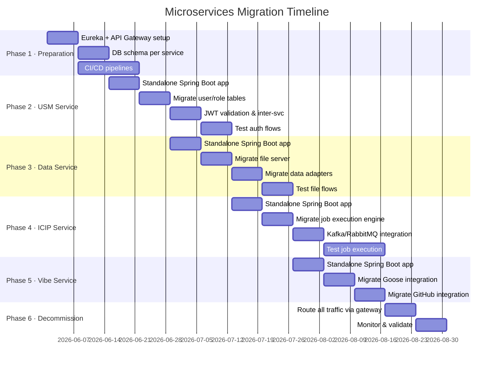

# ESSEDUM Platform - Microservices Decomposition Strategy

## Executive Summary

This document outlines a strategy to decompose the current ESSEDUM monolithic application into **4 microservices** based on bounded contexts and domain-driven design principles.

---

## Current Monolithic Architecture

### Module Overview

```
essedum-platform/sv/
├── common-app/                    # Main application entry point
├── comm-lib-util/                 # Common utilities
├── comm-lib-secrets/              # Secrets management library
├── comm-secrets-app/              # Secrets application
├── common-lib-rest/               # Common REST utilities
│
├── iamp-lib-usm/                  # User & Security Management
│
├── icip-lib-iai/                  # AI/ML Pipeline Core
├── icip-lib-jobs/                 # Job Scheduling & Execution
├── icip-lib-evt/                  # Event Management
├── icip-lib-mod/                  # Model Management
├── icip-lib-mlops/                # MLOps Features
├── icip-lib-search/               # Search Functionality
│
├── icip-lib-fsvr/                 # File Server
├── icip-lib-adp/                  # Data Adapter Library
├── icip-adp-rest/                 # REST Adapter
├── icip-adp-s3/                   # S3 Adapter
├── icip-adp-mysql/                # MySQL Adapter
├── icip-adp-postgresql/           # PostgreSQL Adapter
├── icip-adp-azure/                # Azure Adapter
├── icip-adp-aicloud/              # AI Cloud Adapter
├── icip-adp-aws-sagemaker/        # AWS SageMaker Adapter
├── icip-adp-gcp-vertex/           # GCP Vertex AI Adapter
├── icip-adp-remote/               # Remote Adapter
│
└── icip-lib-vibe/                 # Vibe AI Coding Assistant
```

### Current Pain Points

1. **Single Point of Failure** - All functionality in one deployable unit
2. **Scaling Limitations** - Cannot scale individual components independently
3. **Database Connection Exhaustion** - Multiple datasources compete for connections (624+ potential connections)
4. **Deployment Risk** - Any change requires full application deployment
5. **Technology Lock-in** - Difficult to use different tech stacks for different features

---

## Proposed Microservices Architecture

### Service Decomposition

```mermaid
graph TB
    subgraph Clients["Clients"]
        UI["Angular Shell UI"]
        EXT["External REST Clients"]
    end

    subgraph Infra["Infrastructure Layer"]
        GW["API Gateway :8080\nSpring Cloud Gateway"]
        EUR["Eureka Discovery\n:8761"]
    end

    subgraph Services["Microservices Layer"]
        USM["USM Service :8081\nUser & Security Mgmt\n─────────────────\n• Authentication\n• Authorization\n• User Management\n• Roles & Permissions\n• Organizations"]
        ICIP["ICIP Service :8082\nAI/ML Pipelines & Jobs\n─────────────────\n• Job Execution\n• Pipelines\n• Events\n• Models\n• MLOps"]
        DATA["Data Service :8083\nFiles & Data Adapters\n─────────────────\n• File Storage\n• Data Adapters\n• Dataset Mgmt\n• Search"]
        VIBE["Vibe Service :8084\nAI-Assisted Coding\n─────────────────\n• Goose API\n• Sessions\n• GitHub Sync\n• Code Gen"]
    end

    subgraph Databases["Database Layer"]
        DB_USM[("essedum_usm\nusers · roles · orgs\nprojects · permissions")]
        DB_ICIP[("essedum_coredb\nicip_jobs · pipelines\nevents · models")]
        DB_QUARTZ[("essedum_quartzdb\nqrtz_* tables")]
        DB_DATA[("essedum_data\nfiles · datasets\nadapters · search_index")]
        DB_VIBE[("essedum_vibe\nvibe_sessions · prompts\ngoose_configs · recipes")]
    end

    subgraph Messaging["Messaging"]
        KAFKA["Apache Kafka\n:9092"]
        RABBIT["RabbitMQ"]
    end

    subgraph ExternalStorage["External Storage"]
        S3["AWS S3 / MinIO"]
        AZURE["Azure Blob Storage"]
        LOCAL["Local Filesystem"]
    end

    subgraph ExternalAPIs["External APIs"]
        GOOSE["Goose AI\n:30132"]
        GITHUB["GitHub API"]
        SAGEMAKER["AWS SageMaker"]
        VERTEX["GCP Vertex AI"]
        AZUREML["Azure ML"]
    end

    UI & EXT -->|HTTP / WebSocket| GW

    GW -->|"/api/users/**\n/api/roles/**\n/api/authenticate/**\n/api/organisations/**"| USM
    GW -->|"/api/aip/**\n/api/event/**\n/api/webhook/**\n/api/modelservice/**"| ICIP
    GW -->|"/api/file/**\n/api/datasets/**\n/api/adapters/**"| DATA
    GW -->|"/api/vibe/**\n/api/goose/**\n/api/github/**"| VIBE

    GW <-->|register/discover| EUR
    USM <-->|register/discover| EUR
    ICIP <-->|register/discover| EUR
    DATA <-->|register/discover| EUR
    VIBE <-->|register/discover| EUR

    USM --- DB_USM
    ICIP --- DB_ICIP
    ICIP --- DB_QUARTZ
    DATA --- DB_DATA
    VIBE --- DB_VIBE

    ICIP -->|publish events| KAFKA
    ICIP -->|publish events| RABBIT

    DATA --> S3 & AZURE & LOCAL

    ICIP --> SAGEMAKER & VERTEX & AZUREML

    VIBE -->|AI code relay| GOOSE
    VIBE -->|push/pull/PR| GITHUB

    classDef gateway  fill:#f4a261,stroke:#e76f51,color:#000,font-weight:bold
    classDef service  fill:#457b9d,stroke:#1d3557,color:#fff
    classDef infra    fill:#2a9d8f,stroke:#264653,color:#fff,font-weight:bold
    classDef db       fill:#e9c46a,stroke:#f4a261,color:#000
    classDef external fill:#a8dadc,stroke:#457b9d,color:#000
    classDef client   fill:#e8e8e8,stroke:#888,color:#000
    classDef msg      fill:#d4a5a5,stroke:#c77d7d,color:#000

    class GW gateway
    class USM,ICIP,DATA,VIBE service
    class EUR infra
    class DB_USM,DB_ICIP,DB_QUARTZ,DB_DATA,DB_VIBE db
    class S3,AZURE,LOCAL,GOOSE,GITHUB,SAGEMAKER,VERTEX,AZUREML external
    class UI,EXT client
    class KAFKA,RABBIT msg
```



---

## Microservice #1: USM Service (User & Security Management)

### Responsibility
Handles all user authentication, authorization, and organizational management.

### Modules to Include
```
iamp-lib-usm/
├── web/rest/
│   ├── UsersResource.java
│   ├── RoleResource.java
│   ├── RoleProcessResource.java
│   ├── OrganisationResource.java
│   ├── OrgUnitResource.java
│   ├── ProjectResource.java
│   ├── UserApiPermissionsResource.java
│   ├── UserProcessMappingResource.java
│   ├── UserProjectRoleResource.java
│   ├── UserUnitResource.java
│   ├── UsmModuleResource.java
│   ├── UsmModuleOrganisationResource.java
│   ├── UsmNotificationsResource.java
│   ├── UsmPermissionApiResource.java
│   ├── UsmPermissionsResource.java
│   ├── UsmPortfolioResource.java
│   ├── UsmRolePermissionsResource.java
│   ├── UsmRoletoRoleResource.java
│   ├── UsmStageResource.java
│   ├── UsmUsertoUserResource.java
│   ├── DelegateResource.java
│   ├── EmailResource.java
│   ├── CountryTimeZoneResource.java
│   ├── FileExtensionKeysResource.java
│   ├── IcmsProcessResource.java
│   └── DashConstantResource.java
├── service/
├── repository/
├── domain/
├── dto/
├── notification/
└── config/
```

### API Endpoints
| Method | Endpoint | Description |
|--------|----------|-------------|
| POST | `/api/authenticate` | User authentication |
| POST | `/api/users` | Create user |
| GET | `/api/users` | List users |
| GET | `/api/users/{id}` | Get user details |
| PUT | `/api/users/{id}` | Update user |
| DELETE | `/api/users/{id}` | Delete user |
| GET | `/api/roles` | List roles |
| POST | `/api/roles` | Create role |
| GET | `/api/permissions` | List permissions |
| GET | `/api/organisations` | List organizations |
| POST | `/api/organisations` | Create organization |

### Database Schema
- **Database**: `essedum_usm`
- **Tables**: `users`, `roles`, `permissions`, `user_roles`, `role_permissions`, `organisations`, `org_units`, `projects`, `user_project_roles`, `notifications`, `delegates`

### Technology Stack
- **Framework**: Spring Boot 3.4.x
- **Security**: Spring Security + JWT
- **Database**: MySQL/PostgreSQL
- **Cache**: Redis (for session/token caching)

### Configuration
```yaml
server:
  port: 8081

spring:
  application:
    name: usm-service
  datasource:
    url: jdbc:mysql://localhost:3306/essedum_usm
    maximum-pool-size: 20
    minimum-idle: 5

jwt:
  secret: ${JWT_SECRET}
  expiration: 86400
```

---

## Microservice #2: ICIP Service (AI/ML Pipeline & Jobs)

### Responsibility
Core AI/ML pipeline management, job execution, event handling, and model management.

### Modules to Include
```
icip-lib-iai/
├── rest/
│   ├── ICIPJobsController.java
│   ├── ICIPPipelineNewController.java
│   ├── ICIPAppsController.java
│   ├── ICIPServicesController.java
│   ├── ICIPStreamingServicesController.java
│   ├── ICIPAgentDirectoryController.java
│   ├── ICIPPluginController.java
│   ├── ICIPMLFederatedRuntimeController.java
│   ├── DeploymentFormController.java
│   ├── SSEController.java
│   └── WebSocketController.java
├── jobmodel/
├── executor/
├── factory/
└── service/

icip-lib-jobs/
├── job/
│   ├── quartz/
│   ├── service/
│   ├── repository/
│   ├── model/
│   └── config/

icip-lib-evt/
├── event/
│   ├── publisher/
│   ├── listener/
│   ├── service/
│   └── factory/

icip-lib-mod/
├── rest/
│   └── ICIPGroupModelController.java
├── service/
├── repository/
└── model/

icip-lib-mlops/
├── rest/
│   └── ICIPMlopsController.java
└── service/
```

### API Endpoints
| Method | Endpoint | Description |
|--------|----------|-------------|
| GET | `/api/aip/jobs` | List all jobs |
| POST | `/api/aip/jobs` | Create new job |
| GET | `/api/aip/jobs/{id}` | Get job details |
| POST | `/api/aip/jobs/{id}/execute` | Execute job |
| DELETE | `/api/aip/jobs/{id}` | Delete job |
| GET | `/api/aip/pipelines` | List pipelines |
| POST | `/api/aip/pipelines` | Create pipeline |
| GET | `/api/aip/models` | List models |
| POST | `/api/aip/models/deploy` | Deploy model |
| GET | `/api/aip/events` | Get events |
| POST | `/api/aip/events/trigger` | Trigger event |

### Database Schema
- **Database**: `essedum_coredb`
- **Quartz DB**: `essedum_quartzdb`
- **Tables**: `icip_jobs`, `icip_pipelines`, `icip_job_runs`, `icip_models`, `icip_events`, `qrtz_*` (Quartz tables)

### Technology Stack
- **Framework**: Spring Boot 3.4.x
- **Job Scheduling**: Quartz Scheduler
- **Messaging**: Kafka/RabbitMQ
- **WebSocket**: Spring WebSocket + STOMP
- **Database**: MySQL/PostgreSQL

### Configuration
```yaml
server:
  port: 8082

spring:
  application:
    name: icip-service
  datasource:
    url: jdbc:mysql://localhost:3306/essedum_coredb
    maximum-pool-size: 30
    minimum-idle: 5
  quartz:
    job-store-type: jdbc
    properties:
      org.quartz.jobStore.isClustered: true
  kafka:
    bootstrap-servers: localhost:9092

icip:
  pythonpath: /usr/bin/python3
  sparkhome: /opt/spark
```

---

## Microservice #3: Data Service (Files & Data Adapters)

### Responsibility
File storage, data source connectivity, dataset management, and search functionality.

### Modules to Include
```
icip-lib-fsvr/
├── fileserver/
│   ├── rest/
│   │   └── FileServerController.java
│   ├── service/
│   ├── servers/
│   │   ├── LocalFileServer.java
│   │   ├── MinioFileServer.java
│   │   ├── AzureBlobFileServer.java
│   │   └── S3FileServer.java
│   └── factory/

icip-lib-adp/
├── adapter/
├── dataset/
└── reader/

icip-adp-rest/
icip-adp-s3/
icip-adp-mysql/
icip-adp-postgresql/
icip-adp-azure/
icip-adp-remote/
icip-adp-aicloud/
icip-adp-aws-sagemaker/
icip-adp-gcp-vertex/

icip-lib-search/
├── model/
├── repository/
└── v1/
```

### API Endpoints
| Method | Endpoint | Description |
|--------|----------|-------------|
| POST | `/api/file/upload` | Upload file |
| GET | `/api/file/{id}` | Download file |
| DELETE | `/api/file/{id}` | Delete file |
| GET | `/api/file/list` | List files |
| GET | `/api/datasets` | List datasets |
| POST | `/api/datasets` | Create dataset |
| POST | `/api/datasets/upload` | Upload dataset |
| POST | `/api/datasets/search` | Search datasets |
| GET | `/api/adapters` | List available adapters |
| POST | `/api/adapters/test` | Test adapter connection |
| POST | `/api/adapters/query` | Execute adapter query |

### Database Schema
- **Database**: `essedum_data`
- **Tables**: `files`, `file_metadata`, `datasets`, `dataset_columns`, `adapters`, `adapter_configs`, `search_index`

### Technology Stack
- **Framework**: Spring Boot 3.4.x
- **File Storage**: Local/MinIO/S3/Azure Blob
- **Search**: Lucene/Elasticsearch
- **Database**: MySQL/PostgreSQL

### Configuration
```yaml
server:
  port: 8083

spring:
  application:
    name: data-service
  datasource:
    url: jdbc:mysql://localhost:3306/essedum_data
    maximum-pool-size: 20
    minimum-idle: 5

fileserver:
  local:
    path: /app/files
  minio:
    url: http://localhost:9000
    access-key: ${MINIO_ACCESS_KEY}
    secret-key: ${MINIO_SECRET_KEY}
  s3:
    region: us-east-1
    bucket: essedum-files
```

---

## Microservice #4: Vibe Service (AI-Assisted Coding)

### Responsibility
AI-assisted code generation using Goose, session management, and GitHub integration.

### Modules to Include
```
icip-lib-vibe/
├── vibecoding/
│   ├── rest/
│   │   ├── VibeCodingController.java
│   │   ├── GooseSessionController.java
│   │   ├── GooseConfigController.java
│   │   ├── GooseRecipeController.java
│   │   ├── GooseScheduleController.java
│   │   └── GooseSystemController.java
│   ├── service/
│   │   ├── GooseApiService.java
│   │   ├── VibeCodingService.java
│   │   ├── GitHubService.java
│   │   └── SessionService.java
│   └── config/

common-app/ (GitHub controllers)
├── controller/
│   ├── GitHubController.java
│   └── GitHubOAuthController.java
```

### API Endpoints
| Method | Endpoint | Description |
|--------|----------|-------------|
| POST | `/api/vibe/sessions` | Create coding session |
| GET | `/api/vibe/sessions/{id}` | Get session |
| POST | `/api/vibe/sessions/{id}/prompt` | Send prompt to Goose |
| GET | `/api/vibe/sessions/{id}/history` | Get session history |
| DELETE | `/api/vibe/sessions/{id}` | Delete session |
| GET | `/api/goose/config` | Get Goose configuration |
| PUT | `/api/goose/config` | Update Goose configuration |
| GET | `/api/goose/recipes` | List available recipes |
| POST | `/api/github/push` | Push code to GitHub |
| GET | `/api/github/repos` | List repositories |

### Database Schema
- **Database**: `essedum_vibe`
- **Tables**: `vibe_sessions`, `vibe_prompts`, `vibe_responses`, `goose_configs`, `goose_recipes`, `github_repos`, `github_commits`

### Technology Stack
- **Framework**: Spring Boot 3.4.x
- **AI Integration**: Goose API, WebClient
- **Git**: JGit for GitHub operations
- **Database**: MySQL/PostgreSQL

### Configuration
```yaml
server:
  port: 8084

spring:
  application:
    name: vibe-service
  datasource:
    url: jdbc:mysql://localhost:3306/essedum_vibe
    maximum-pool-size: 15
    minimum-idle: 3

vibe:
  goose:
    service:
      url: http://localhost:30132
      connect-timeout-ms: 10000
      response-timeout-seconds: 300
      secret-key: ${GOOSE_SECRET_KEY}
    working-dir: /app/goose
  github:
    enabled: true
    token: ${GITHUB_TOKEN}
    work-dir: /tmp/vibe-github
```

---

## Shared Infrastructure

### Service Discovery
```yaml
# Eureka Server Configuration
spring:
  application:
    name: discovery-service

eureka:
  client:
    register-with-eureka: false
    fetch-registry: false
  server:
    enable-self-preservation: false
```

### API Gateway
```yaml
# Spring Cloud Gateway Configuration
spring:
  application:
    name: api-gateway
  cloud:
    gateway:
      routes:
        - id: usm-service
          uri: lb://usm-service
          predicates:
            - Path=/api/users/**,/api/roles/**,/api/authenticate/**,/api/organisations/**
        - id: icip-service
          uri: lb://icip-service
          predicates:
            - Path=/api/aip/**,/api/jobs/**,/api/pipelines/**,/api/models/**
        - id: data-service
          uri: lb://data-service
          predicates:
            - Path=/api/file/**,/api/datasets/**,/api/adapters/**
        - id: vibe-service
          uri: lb://vibe-service
          predicates:
            - Path=/api/vibe/**,/api/goose/**,/api/github/**
```

### Shared Libraries
```
comm-lib-util/          # Common utilities (keep shared)
comm-lib-secrets/       # Secrets management (keep shared)
common-lib-rest/        # REST utilities (keep shared)
```

---

## Migration Strategy



### Phase 1: Preparation (2-3 weeks)
1. Set up service discovery (Eureka)
2. Set up API Gateway (Spring Cloud Gateway)
3. Create database schemas for each service
4. Set up CI/CD pipelines for each service

### Phase 2: Extract USM Service (3-4 weeks)
1. Create standalone Spring Boot application
2. Migrate user/role/permission tables
3. Implement JWT token validation
4. Set up inter-service communication
5. Test authentication flows

### Phase 3: Extract Data Service (3-4 weeks)
1. Create standalone Spring Boot application
2. Migrate file server functionality
3. Migrate data adapters
4. Test file upload/download flows

### Phase 4: Extract ICIP Service (4-5 weeks)
1. Create standalone Spring Boot application
2. Migrate job execution engine
3. Migrate pipeline management
4. Set up Kafka/RabbitMQ integration
5. Test job execution flows

### Phase 5: Extract Vibe Service (2-3 weeks)
1. Create standalone Spring Boot application
2. Migrate Goose integration
3. Migrate GitHub integration
4. Test AI coding flows

### Phase 6: Decommission Monolith (2 weeks)
1. Route all traffic through API Gateway
2. Monitor for issues
3. Decommission common-app

---

## Database Connection Distribution

```mermaid
xychart-beta
    title "DB Connections: Monolith vs Microservices"
    x-axis ["Main", "ICIP", "SJS", "Model", "Quartz", "Exp", "USM Svc", "ICIP Svc", "Data Svc", "Vibe Svc"]
    y-axis "Max Connections" 0 --> 320
    bar [100, 300, 200, 8, 8, 8, 0, 0, 0, 0]
    bar [0, 0, 0, 0, 0, 0, 20, 30, 20, 15]
```



### Before (Monolith)
| Datasource | Max Connections |
|------------|-----------------|
| Main | 100 |
| ICIP | 300 |
| SJS | 200 |
| Model | 8 |
| Quartz | 8 |
| Exp | 8 |
| **Total** | **624** |

### After (Microservices)
| Service | Max Connections |
|---------|-----------------|
| USM Service | 20 |
| ICIP Service | 30 |
| Data Service | 20 |
| Vibe Service | 15 |
| **Total** | **85** |

---

## Benefits

1. **Independent Scaling** - Scale AI/ML jobs independently from user management
2. **Technology Flexibility** - Use Python for ML, Java for business logic
3. **Fault Isolation** - Failure in Vibe service doesn't affect core ICIP functionality
4. **Faster Deployments** - Deploy individual services without full system downtime
5. **Team Autonomy** - Different teams can own different services
6. **Resource Optimization** - Reduced database connection requirements (624 → 85)

---

## Risks & Mitigations

| Risk | Mitigation |
|------|------------|
| Network latency | Use service mesh (Istio) for optimized routing |
| Data consistency | Implement saga pattern for distributed transactions |
| Service discovery failure | Use multiple Eureka instances with peer awareness |
| Authentication across services | Use JWT tokens validated at gateway level |
| Debugging complexity | Implement distributed tracing (Zipkin/Jaeger) |

---

## Recommended Tools

| Category | Tool |
|----------|------|
| Service Discovery | Spring Cloud Eureka |
| API Gateway | Spring Cloud Gateway |
| Configuration | Spring Cloud Config |
| Messaging | Apache Kafka / RabbitMQ |
| Distributed Tracing | Zipkin / Jaeger |
| Monitoring | Prometheus + Grafana |
| Container Orchestration | Kubernetes |
| Service Mesh | Istio (optional) |

---

## Conclusion

This microservices decomposition strategy transforms the monolithic ESSEDUM platform into 4 focused, independently deployable services:

1. **USM Service** - User & Security Management
2. **ICIP Service** - AI/ML Pipeline & Jobs
3. **Data Service** - Files & Data Adapters
4. **Vibe Service** - AI-Assisted Coding

The migration can be executed incrementally over 14-17 weeks, with each phase delivering value while minimizing risk.

---

*Document Version: 1.0*
*Created: May 19, 2026*
*Author: Architecture Team*

