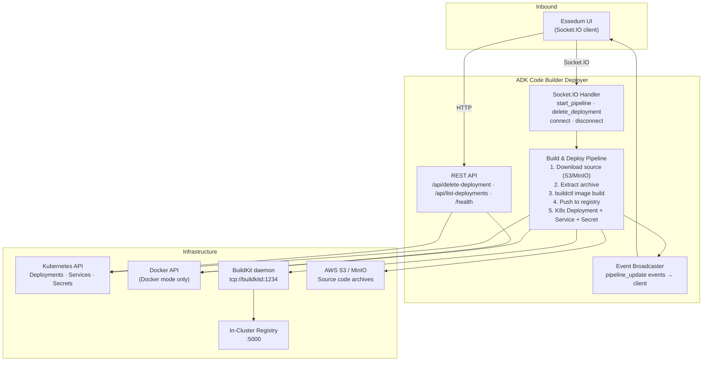
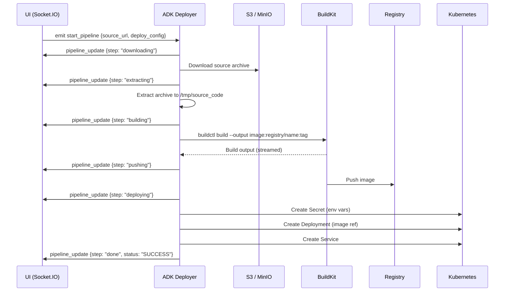

# ADK Code Builder Deployer — Architecture

---

## 1. Service Architecture

A Flask + Socket.IO service with a single long-running Socket.IO pipeline handler. REST endpoints handle quick management operations; the build-and-deploy workflow is driven entirely over a persistent Socket.IO connection so the caller can receive streaming progress events throughout the multi-step pipeline.

---

## 2. Dependency Map

| Dependency | Type | Purpose |
|---|---|---|
| Kubernetes API | Internal (in-cluster) | Create/delete Deployments, Services, Secrets |
| BuildKit daemon | Internal (TCP) | Build container images from source |
| In-cluster registry | Internal (HTTP) | Store and serve built container images |
| AWS S3 / MinIO | External (HTTP/SDK) | Download agent source code archives |
| Docker API | Local (socket) | Docker mode — container create/stop/remove |

---

## 3. Architectural Decisions

### AD-ADK1 — Socket.IO for build pipeline (not REST)
**Decision:** The build-and-deploy pipeline is triggered via a Socket.IO event, not a REST endpoint. Progress events are streamed back over the same connection.
**Reason:** Container builds can take minutes. A REST call cannot stream incremental progress. Socket.IO allows the pipeline to push timestamped step updates as they happen, giving users live visibility into each build stage.

### AD-ADK2 — BuildKit as the image builder
**Decision:** Container images are built using `buildctl` (BuildKit CLI) against a remote BuildKit daemon, not Docker's build API.
**Reason:** BuildKit supports rootless, daemonless builds inside Kubernetes pods — Docker daemon is not available in the cluster. BuildKit also supports concurrent builds and advanced caching that Docker build does not.

### AD-ADK3 — Deployment name sanitization before K8s API calls
**Decision:** All deployment names from callers are normalized to valid DNS-label format (lowercase, alphanumeric + hyphens) before any Kubernetes API call.
**Reason:** Kubernetes rejects resource names that do not comply with RFC 1123 DNS-label rules. Sanitizing upfront prevents runtime 422 errors from the K8s API and ensures predictable naming across create and delete operations.

---

## 4. Architecturally Significant Flows

### Flow 1 — Build and Deploy Agent Container

