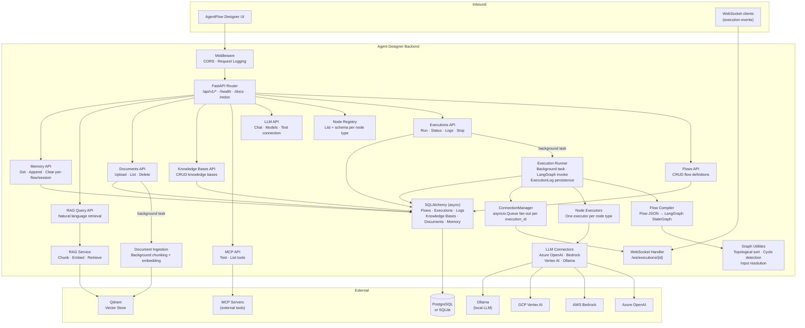
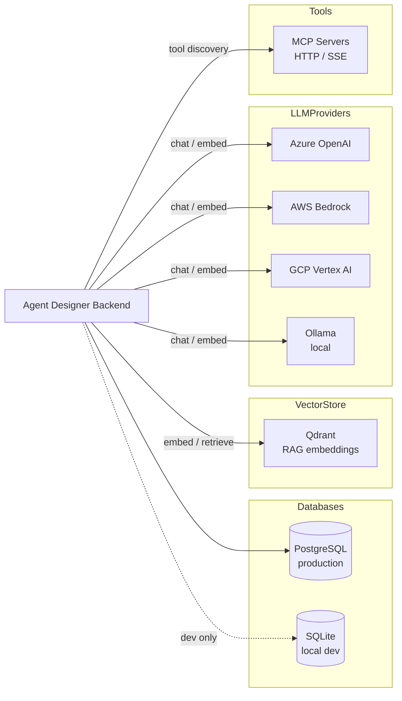
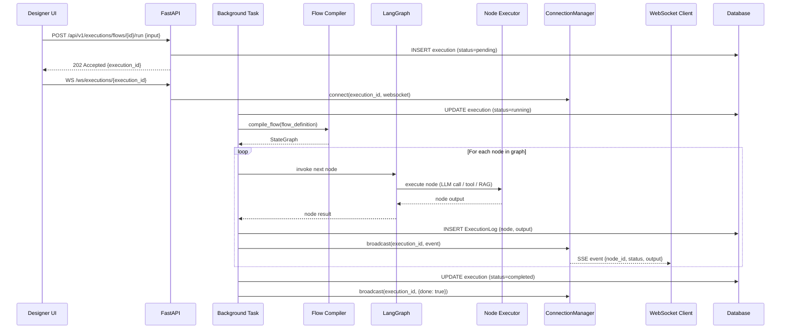
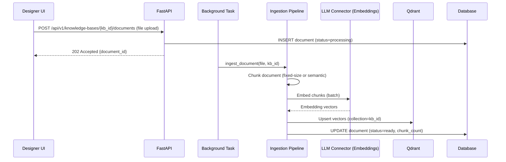
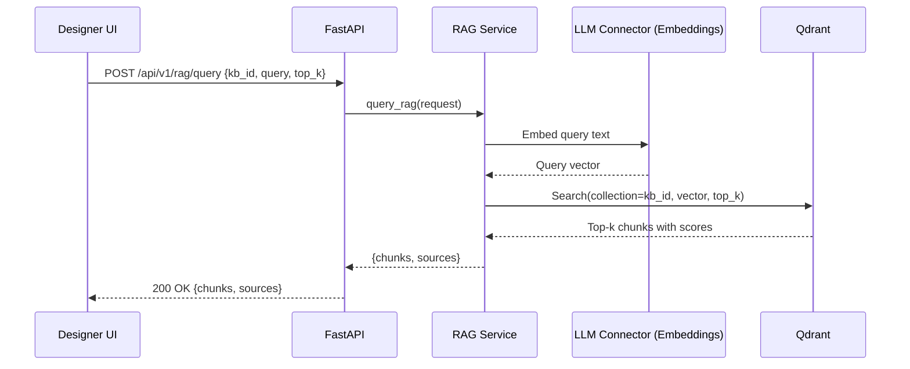
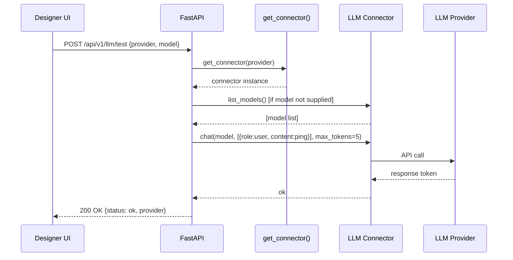

# Agent Designer Backend — Architecture

---

## 1. Service Architecture

The service is a **fully async FastAPI application**. The API layer handles HTTP and WebSocket connections; execution is handed off to background tasks immediately so API calls never block on LLM or vector store latency. The LangGraph compiler translates a stored flow JSON into a runnable state graph, which is executed by the runner. Real-time events are fanned out to WebSocket clients via in-process asyncio queues.

**Key subsystems:**
- **Execution Runner** — orchestrates the full lifecycle of a flow run: compiles the graph, invokes LangGraph, persists per-node logs, broadcasts WebSocket events, and writes the final execution status.
- **Flow Compiler** — converts a stored flow definition (nodes + edges JSON) into a `LangGraph StateGraph`. Each node type maps to an executor function. Conditional edges are wired from the graph's edge list.
- **Graph Utilities** — provides topological sort (Kahn's algorithm) and cycle detection for validation paths. The compiler delegates ordering to LangGraph natively to support agent-loop cycles.
- **Node Executors** — one executor per node type (LLM, tool, input, output, RAG, memory, etc.). Called by LangGraph during graph traversal.
- **LLM Connectors** — thin async adapters wrapping each provider's SDK. A single `get_connector(provider)` factory selects the right implementation at runtime.
- **ConnectionManager** — maintains a dictionary of `execution_id → [(WebSocket, asyncio.Queue)]`. The runner calls `broadcast()` after each node; queues fan out to all connected WebSocket clients without blocking execution.
- **RAG Service** — embeds the query, retrieves top-k chunks from Qdrant, and assembles context for the response.
- **Document Ingestion** — runs as a `BackgroundTask`; chunks the uploaded file, generates embeddings via the configured LLM connector, and upserts vectors into Qdrant.

---

## 2. Dependency Map

 Production relational store for flows, executions, logs, knowledge bases, documents, memory |
| SQLite (`aiosqlite`) | Local file | Default DB for local development — same schema, no external service required |
| Qdrant | External (HTTP/gRPC) | Vector store for document embeddings and RAG retrieval |
| Azure OpenAI | External (HTTPS) | LLM chat and embedding via Azure-hosted OpenAI models |
| AWS Bedrock | External (HTTPS/SDK) | LLM chat via AWS-hosted foundation models |
| GCP Vertex AI | External (HTTPS/SDK) | LLM chat via Google Gemini models |
| Ollama | External (HTTP, local) | Local open-source LLM inference (no cloud dependency) |
| MCP Servers | External (HTTP/SSE) | Tool discovery and invocation via Model Context Protocol |
| Alembic | Build-time | Database schema migrations |

---

## 3. Architectural Decisions

### AD-ADB1 — LangGraph as the execution engine
**Decision:** Flow execution is powered by LangGraph's `StateGraph`, not a custom graph traversal loop.
**Reason:** LangGraph natively handles agent-loop patterns (cycles), conditional branching, and multi-step tool-calling workflows that a plain topological sort cannot represent. This makes the execution engine robust for real agentic workloads without custom control-flow code.

### AD-ADB2 — Execution runs as a FastAPI BackgroundTask
**Decision:** `POST /run` creates an execution record, enqueues the run as a `BackgroundTask`, and returns `202 Accepted` with the `execution_id` immediately.
**Reason:** LLM calls can take seconds to minutes. Holding an HTTP connection open for that duration is unreliable and wastes server resources. The caller polls status or subscribes via WebSocket.

### AD-ADB3 — In-process asyncio.Queue for WebSocket fan-out (no Redis)
**Decision:** WebSocket event delivery uses an in-process `asyncio.Queue` per client connection, managed by a `ConnectionManager` singleton.
**Reason:** Eliminates a Redis dependency for single-instance deployments (the primary deployment target). The runner's `broadcast()` is a simple queue `put` — no serialisation overhead for local connections. For multi-instance deployments, the architecture can be extended by replacing the in-process queues with a pub/sub backend.

### AD-ADB4 — SQLite default, PostgreSQL in production, same codebase
**Decision:** The database URL is read from `DATABASE_URL` env var. SQLite (`aiosqlite`) is used by default; PostgreSQL (`asyncpg`) is used in production. No code changes are needed to switch.
**Reason:** Developers can run the service with zero external dependencies (`python run.py`). Production deployments use the same binary with a different env var. Alembic manages schema for both dialects.

### AD-ADB5 — LLM connectors as pluggable adapters behind a factory
**Decision:** Each LLM provider (Azure OpenAI, Bedrock, Vertex AI, Ollama) is implemented as an independent connector class. `get_connector(provider)` selects the right one at runtime.
**Reason:** Adding or swapping a provider requires only a new connector class — no changes to the execution engine, node executors, or API layer. Provider credentials are injected from config, not hardcoded.

### AD-ADB6 — Graph cycle detection separate from LangGraph compilation
**Decision:** `graph.py` provides a standalone topological sort and cycle detector (Kahn's algorithm) used for validation and dry-run paths. The LangGraph compiler does not call it — LangGraph handles ordering natively.
**Reason:** Validation must be fast and must not require a full LangGraph compilation. The standalone utility catches invalid DAG structures early (e.g., at flow save time) before any execution is attempted.

---

## 4. Architecturally Significant Flows

### Flow 1 — Flow Execution with Real-Time WebSocket Streaming

### Flow 2 — Document Upload and RAG Ingestion

### Flow 3 — RAG Query

### Flow 4 — LLM Connectivity Test

