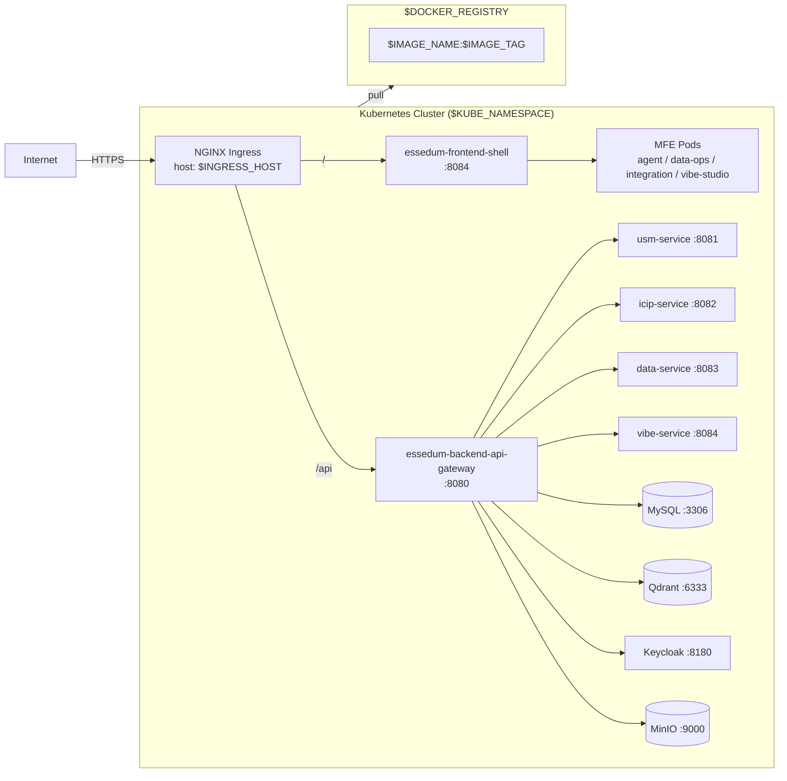

# Essedum Platform — Universal Deployment Guide
## Single-Touch Deployment for AKS | 5G | LFN

> **One `.env` file. One script. Any cluster.**

---

## Architecture Overview

```
docker/.env.sample
       │
       ▼  (copy + fill in values)
docker/.env  ──────────────────────────────────────────────────────┐
       │                                                           │
       ▼                                                           ▼
build-and-push.sh                                           deploy.sh
  • loads docker/.env                                        • loads docker/.env
  • removes npm lock files                                   • switches kubectl context
  • configures npm registry                                  • creates namespaces
  • builds images: $DOCKER_REGISTRY/$IMAGE:$TAG              • envsubst < YAML | kubectl apply
  • pushes to registry (with 3-attempt retry)                • waits for rollout
       │                                                           │
       ▼                                                           ▼
  Registry                                              Kubernetes Cluster
  (ACR / local)                                         (AKS / 5G / LFN)
```

### Key Design Decisions
- **Zero hardcoding** — registry host, namespace, and ingress hostnames only appear in `.env`.
- **`envsubst`** replaces `${VAR}` in all YAML at apply-time, not at write-time.
- **Idempotent** — every `kubectl apply` uses `--dry-run=client -o yaml | apply` for namespaces; YAML changes are diffed.
- **Retry logic** — build-and-push.sh retries failed Docker builds up to 3 times.
- **Future-proof** — adding a new environment = new `.env` file only; zero script changes.

---

## Directory Structure

```
aks-deployment/
├── build-and-push.sh          ← Universal build script
├── deploy.sh                  ← Universal deploy script
├── deployment-skill.md        ← Operations & troubleshooting guide
├── templates/
│   ├── deployment.yaml        ← Generic K8s Deployment template
│   ├── service.yaml           ← Generic K8s Service template
│   ├── ingress.yaml           ← Generic K8s Ingress template
│   └── configmap.yaml         ← Platform-wide ConfigMap template
├── *.yaml / *.yml             ← Per-service manifests (use ${VAR} placeholders)
└── README.md                  ← This file

docker/
└── .env.sample                ← Single source of truth for ALL configuration
```

---

## Quick Start

```bash
# 1. Clone and configure
cp docker/.env.sample docker/.env
# Edit docker/.env — fill in your environment's values

# 2. Build and push images
cd aks-deployment
./build-and-push.sh all

# 3. Deploy
./deploy.sh
```

That's it. The same three commands work on every cluster.

---

## Step-by-Step Setup

### 1. Configure `docker/.env`

Open `docker/.env.sample`, copy it to `docker/.env`, then fill in every section.

**Minimum required values for a new environment:**

```bash
# Target environment
ENVIRONMENT=<aks|5g|lfn>

# Registry — where images are stored
DOCKER_REGISTRY=<YOUR_REGISTRY_HOST>      # Your private registry
DOCKER_USERNAME=                          # Leave blank for unauthenticated
DOCKER_PASSWORD=
IMAGE_TAG=<your-image-tag>                # Tag applied to every built image

# Kubernetes cluster
KUBE_CONTEXT=<YOUR_KUBE_CONTEXT>          # kubectl config get-contexts
KUBE_NAMESPACE=<YOUR_NAMESPACE>

# Ingress
INGRESS_HOST=<YOUR_INGRESS_HOST>
INGRESS_HOST_LFN=<YOUR_LFN_HOST>
KEYCLOAK_INGRESS_HOST=<YOUR_KEYCLOAK_HOST>
TLS_SECRET_NAME=<YOUR_TLS_SECRET_NAME>

# Database (Kubernetes internal DNS)
DB_HOST=mysql.<YOUR_NAMESPACE>.svc.cluster.local
DB_NAME=<YOUR_DB_NAME>

# Keycloak
EXTERNAL_ISSUER_URI=https://<YOUR_KEYCLOAK_HOST>/realms/ESSEDUM
EXTERNAL_KC_URL=https://<YOUR_KEYCLOAK_HOST>
EXTERNAL_BASE_URL=https://<YOUR_INGRESS_HOST>:8082

# NPM (only needed if using a private npm registry)
NPM_REGISTRY_URL=<YOUR_NPM_REGISTRY_URL>
NPM_AUTH_TOKEN=<your-token>
```

### 2. Install Prerequisites

```bash
# Required on the deployment machine
sudo apt-get update
sudo apt-get install -y kubectl docker.io gettext-base

# Optional: verify
kubectl version --client
envsubst --version
docker version
```

### 3. Create Kubernetes Secrets

**Secrets are never stored in `.env` or YAML files** — they must be created manually.

```bash
source docker/.env

# Ensure namespace exists
kubectl create namespace "${KUBE_NAMESPACE}" --dry-run=client -o yaml | kubectl apply -f -

# Database credentials
kubectl create secret generic essedum-db-secret \
  --from-literal=username="${MYSQL_DATASOURCE_USER}" \
  --from-literal=password="${MYSQL_DATASOURCE_PASSWORD}" \
  -n "${KUBE_NAMESPACE}" --dry-run=client -o yaml | kubectl apply -f -

# MinIO credentials
kubectl create secret generic essedum-minio-secret \
  --from-literal=endpoint="${MINIO_ENDPOINT}" \
  --from-literal=access-key="${MINIO_ACCESS_KEY}" \
  --from-literal=secret-key="${MINIO_SECRET_KEY}" \
  -n "${KUBE_NAMESPACE}" --dry-run=client -o yaml | kubectl apply -f -

# Application secrets (encryption key, license)
kubectl create secret generic essedum-app-secret \
  --from-literal=encryption-key="${ENCRYPTION_KEY}" \
  --from-literal=license="${LICENSE}" \
  --from-literal=public-key="${PUBLIC_KEY}" \
  -n "${KUBE_NAMESPACE}" --dry-run=client -o yaml | kubectl apply -f -

# TLS certificate (obtain cert from your CA or generate self-signed)
# Option A — Self-signed (for dev/lab environments)
openssl req -x509 -nodes -days 3650 -newkey rsa:2048 \
  -keyout tls.key -out tls.crt \
  -subj "/CN=${INGRESS_HOST}/O=Essedum"

# Option B — Use existing cert files
kubectl create secret tls "${TLS_SECRET_NAME}" \
  --cert=tls.crt --key=tls.key \
  -n "${KUBE_NAMESPACE}" --dry-run=client -o yaml | kubectl apply -f -

# Keycloak admin credentials
kubectl create secret generic keycloak-admin-secret \
  --from-literal=admin-user="${KEYCLOAK_ADMIN_USER}" \
  --from-literal=admin-password="${KEYCLOAK_ADMIN_PASSWORD}" \
  -n "${KUBE_NAMESPACE}" --dry-run=client -o yaml | kubectl apply -f -
```

### 4. Apply the Platform ConfigMap

```bash
source docker/.env
envsubst < aks-deployment/templates/configmap.yaml | kubectl apply -f -

# Verify
kubectl get configmap essedum-platform-config -n "${KUBE_NAMESPACE}" -o yaml
```

### 5. Build and Push Images

```bash
cd aks-deployment
chmod +x build-and-push.sh

./build-and-push.sh all             # every image
./build-and-push.sh backend         # api-gateway, usm, icip, data, vibe services
./build-and-push.sh frontend        # UI, all MFEs, agent-designer
./build-and-push.sh api-gateway     # single service
```

### 6. Deploy to Kubernetes

```bash
cd aks-deployment
chmod +x deploy.sh

./deploy.sh validate    # check env config without touching the cluster
./deploy.sh             # full deployment (same as ./deploy.sh deploy)
./deploy.sh status      # check pod / service / ingress status
./deploy.sh teardown    # remove all resources (asks for confirmation)
```

---

## Per-Environment `.env` Examples

### AKS (Azure)
```bash
ENVIRONMENT=aks
DOCKER_REGISTRY=<YOUR_ACR_REGISTRY>
DOCKER_USERNAME=<your-registry-username>
DOCKER_PASSWORD=<your-registry-password>
IMAGE_TAG=<your-image-tag>
KUBE_CONTEXT=<YOUR_KUBE_CONTEXT>
KUBE_NAMESPACE=<YOUR_NAMESPACE>
INGRESS_HOST=<YOUR_INGRESS_HOST>
TLS_SECRET_NAME=<YOUR_TLS_SECRET_NAME>
```

### 5G Server
```bash
ENVIRONMENT=5g
DOCKER_REGISTRY=<YOUR_REGISTRY_HOST>
DOCKER_USERNAME=
DOCKER_PASSWORD=
IMAGE_TAG=<your-image-tag>
KUBE_CONTEXT=<YOUR_KUBE_CONTEXT>
KUBE_NAMESPACE=<YOUR_NAMESPACE>
INGRESS_HOST=<YOUR_INGRESS_HOST>
TLS_SECRET_NAME=<YOUR_TLS_SECRET_NAME>
```

### LFN Server
```bash
ENVIRONMENT=lfn
DOCKER_REGISTRY=<YOUR_REGISTRY_HOST>
DOCKER_USERNAME=
DOCKER_PASSWORD=
IMAGE_TAG=<your-image-tag>
KUBE_CONTEXT=<YOUR_KUBE_CONTEXT>
KUBE_NAMESPACE=<YOUR_NAMESPACE>
INGRESS_HOST=<YOUR_INGRESS_HOST>
INGRESS_HOST_LFN=<YOUR_LFN_HOST>
KEYCLOAK_INGRESS_HOST=<YOUR_KEYCLOAK_HOST>
TLS_SECRET_NAME=<YOUR_TLS_SECRET_NAME>
```

---

## Adding a New Service

Use the generic templates in `aks-deployment/templates/`:

```bash
source docker/.env

export SERVICE_NAME=essedum-my-service \
       SERVICE_IMAGE=essedum-my-service \
       CONTAINER_PORT=8090 \
       SERVICE_PORT=8090 \
       REPLICAS=1 \
       CPU_REQUEST="${BACKEND_CPU_REQUEST}" \
       CPU_LIMIT="${BACKEND_CPU_LIMIT}" \
       MEM_REQUEST="${BACKEND_MEM_REQUEST}" \
       MEM_LIMIT="${BACKEND_MEM_LIMIT}" \
       PROBE_PATH=/actuator/health/readiness \
       INGRESS_PATH=/my-service

envsubst < aks-deployment/templates/deployment.yaml | kubectl apply -f -
envsubst < aks-deployment/templates/service.yaml    | kubectl apply -f -
envsubst < aks-deployment/templates/ingress.yaml    | kubectl apply -f -
```

---

## Architecture Diagram



---

## Scaling

HPA is configured for key workloads. Metrics Server must be enabled.

```bash
# Check HPA
kubectl get hpa -n "${KUBE_NAMESPACE}"

# Manual scale
kubectl scale deployment essedum-backend-api-gateway \
  --replicas=3 -n "${KUBE_NAMESPACE}"
```

---

## Troubleshooting

See [`deployment-skill.md`](./deployment-skill.md) for the complete troubleshooting playbook including:
- Image pull failures
- Keycloak misconfiguration
- MySQL connection errors
- ICIP probe failures
- TLS issues
- npm / Artifactory build failures
- Ingress 404 / 502 errors
- OOMKilled pods
