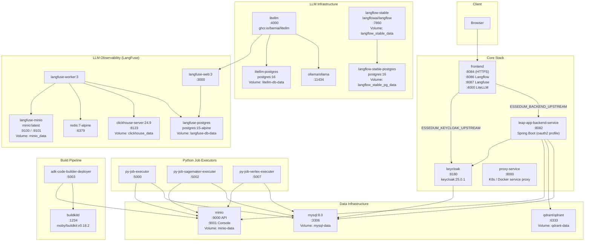

# Docker Compose Deployment Architecture

> **Compose file:** [`docker-compose.yml`](docker-compose.yml)  
> **Setup guide:** [`SETUP_GUIDE.md`](SETUP_GUIDE.md)  
> **UI-only variant:** [`docker-compose.ui-only.yml`](docker-compose.ui-only.yml)

---

## Service Topology



---

## Service Inventory

### Core Application

| Service | Image | Port(s) | Depends On | Key Env |
|---|---|---|---|---|
| `leap-app-backend-service` | built from `sv/` | `${BACKEND_PORT:-8082}:8082` | mysql (healthy), qdrant, keycloak | `spring.profiles.active=mysql,oauth2`, `MYSQL_DATASOURCE_URL`, `GITHUB_CLIENT_ID` |
| `frontend` | built from `essedum-ui/` | `${FRONTEND_PORT:-8084}:8084`, `:8086`, `:8087`, `:4000`, `:8089` | leap-app-backend-service | `ESSEDUM_BACKEND_UPSTREAM`, `ESSEDUM_KEYCLOAK_UPSTREAM`, `FE_LANGFLOW_URL`, `FE_LANGFUSE_URL`, `FE_LITELLM_URL` |
| `keycloak` | `quay.io/keycloak/keycloak:25.0.1` | `${KEYCLOAK_PORT:-8180}:8080` | mysql (healthy) | `KC_DB=mysql`, `KC_PROXY=edge`, `KC_HOSTNAME` |
| `proxy-service` | built from `proxy-service/` | `:8000` | leap-app-backend-service | `TARGET_NAMESPACE`, `ALLOWLIST` |

### Python Job Executors

| Service | Image | Port | Depends On | Key Env |
|---|---|---|---|---|
| `py-job-executor` | built from `py-job-executer/` | `${PYJOB_EXECUTOR_PORT:-5000}:5000` | mysql (healthy) | — |
| `py-job-sagemaker-executer` | built from `py-job-sagemaker-executer/` | `${PYJOB_SAGEMAKER_EXECUTER_PORT:-5002}:5002` | mysql (healthy) | `AWS_ACCESS_KEY_ID`, `AWS_SECRET_ACCESS_KEY`, `SAGEMAKER_ROLE`, `MINIO_*` |
| `py-job-vertex-executer` | built from `py-job-vertex-executer/` | `${PYJOB_VERTEX_EXECUTER_PORT:-5007}:5007` | mysql (healthy) | `GOOGLE_APPLICATION_CREDENTIALS`, `GOOGLE_CLOUD_PROJECT`, `VERTEX_LOCATION`, `MINIO_*` |

### Build Pipeline

| Service | Image | Port | Purpose |
|---|---|---|---|
| `buildkitd` | `moby/buildkit:v0.18.2` | `:1234` | OCI image build daemon (rootless) |
| `adk-code-builder-deployer` | built from `adk-code-builder-deployer/` | `:5003` | Download source → build image via BuildKit → deploy |

### Data Infrastructure

| Service | Image | Port(s) | Volume | Health Check |
|---|---|---|---|---|
| `mysql` | `mysql:8.0` | `${MYSQL_PORT:-3306}:3306` | `mysql-data:/var/lib/mysql` | `mysqladmin ping` every 10s, 10 retries |
| `qdrant` | `qdrant/qdrant:latest` | `${QDRANT_PORT:-6333}:6333` | `qdrant-data:/qdrant/storage` | — |
| `minio` | `quay.io/minio/minio:RELEASE.2025-04-22...` | `:9000`, `:9001` | `minio-data` | — |

### LLM Infrastructure

| Service | Image | Port(s) | Volume | Purpose |
|---|---|---|---|---|
| `ollama` | `ollama/ollama:latest` | `:11434` | ollama models volume | Local LLM runner |
| `litellm-postgres` | `postgres:16` | — | `litellm-db-data` | LiteLLM config DB |
| `litellm` | `ghcr.io/berriai/litellm:main-latest` | `:4000` | litellm config volume | Unified LLM proxy |
| `langflow-stable-postgres` | `postgres:16` | `:5432` | `langflow_stable_pg_data` | Langflow metadata DB |
| `langflow-stable` | `langflowai/langflow:latest` | `:7860` | `langflow_stable_data` | Visual AI pipeline builder |

### LangFuse Observability Stack

| Service | Image | Port(s) | Volume | Purpose |
|---|---|---|---|---|
| `langfuse-postgres` | `postgres:15-alpine` | `:5434` | `langfuse-db-data` | LangFuse metadata |
| `clickhouse` | `clickhouse/clickhouse-server:24.9` | `:8123`, `:9000` | `clickhouse_data`, `clickhouse_logs` | LLM call analytics |
| `redis` | `redis:7-alpine` | `:6379` | — | Queue cache |
| `langfuse-minio` | `minio/minio:latest` | `:9100`, `:9101` | `minio_data` | LangFuse trace file storage |
| `langfuse-worker` | `langfuse/langfuse-worker:3` | — | — | Async event processor |
| `langfuse-web` | `langfuse/langfuse:3` | `:3000` | — | LangFuse UI + API |

---

## Startup Dependency Order

```
mysql ──────────────────────────────┐
                                    ├──► leap-app-backend-service ──► frontend
keycloak ──► (depends on mysql) ───┘
qdrant ─────────────────────────────┘

mysql ──► py-job-executor
       ──► py-job-sagemaker-executer
       ──► py-job-vertex-executer

buildkitd ──► adk-code-builder-deployer

litellm-postgres ──► litellm
langflow-stable-postgres ──► langflow-stable
langfuse-postgres + clickhouse + redis + langfuse-minio ──► langfuse-worker + langfuse-web
```

MySQL has an explicit health check (`mysqladmin ping`) — services that depend on it use `condition: service_healthy` to wait until MySQL is ready before starting.

---

## Named Volumes

| Volume | Used By | Data |
|---|---|---|
| `mysql-data` | `mysql` | All relational databases (essedum_*, keycloak) |
| `qdrant-data` | `qdrant` | Vector embeddings |
| `minio-data` | `minio` | Model artifacts, uploaded files, job outputs |
| `langflow_stable_pg_data` | `langflow-stable-postgres` | Langflow metadata |
| `langflow_stable_data` | `langflow-stable` | Flow definition files |
| `litellm-db-data` | `litellm-postgres` | LiteLLM routing config |
| `langfuse-db-data` | `langfuse-postgres` | LangFuse trace metadata |
| `clickhouse_data` / `clickhouse_logs` | `clickhouse` | LLM call analytics events |
| `minio_data` | `langfuse-minio` | LangFuse trace file exports |
| `postgres_data` | shared PostgreSQL | LiteLLM / LangFuse shared data |

---

## Networks

| Network | Purpose |
|---|---|
| `default` | Internal bridge — all services communicate by service name |
| `essedum-net` | Named external network (`essedum-net`) for cross-compose-file communication |
| `salus-network` | External network (`salus_salus-network`) — connects to Salus service if running |

---

## Exposed Access URLs (Default Ports)

| Service | URL | Auth |
|---|---|---|
| Essedum UI | `https://<SERVER_IP>:8084` | Keycloak OIDC |
| Keycloak Admin | `http://<SERVER_IP>:8180` | `KEYCLOAK_ADMIN_USER` / `KEYCLOAK_ADMIN_PASSWORD` |
| MinIO Console | `http://<SERVER_IP>:9001` | `MINIO_ROOT_USER` / `MINIO_ROOT_PASSWORD` |
| Langflow | `https://<SERVER_IP>:8086` | `LANGFLOW_AUTO_LOGIN` setting |
| LangFuse | `https://<SERVER_IP>:8087` | Register on first visit |
| LiteLLM UI | `https://<SERVER_IP>:4000/ui/` | `LITELLM_UI_USERNAME` / `LITELLM_UI_PASSWORD` |
| Ollama API | `http://<SERVER_IP>:11434` | No auth |
| Qdrant | `http://<SERVER_IP>:6333` | No auth (internal only) |
| Backend API | `http://<SERVER_IP>:8082/api/` | JWT (via Keycloak) |

---

## UI-Only Variant

`docker-compose.ui-only.yml` runs only the **frontend** container, proxying all API and auth traffic to a shared remote backend. Use this for local frontend development or when a backend is already deployed elsewhere.

```bash
cp .env.ui-only.sample .env.ui-only
# Edit: ESSEDUM_BACKEND_UPSTREAM, ESSEDUM_KEYCLOAK_UPSTREAM, KEYCLOAK_ISSUER
docker compose -f docker-compose.ui-only.yml up
```
