# Essedum Platform — Full Architecture

> **Version:** 3.2.x  
> **Last Updated:** 2026-07-13

---

## Table of Contents

1. [Platform Overview](#1-platform-overview)
2. [Frontend Architecture — Micro-Frontend Shell](#2-frontend-architecture--micro-frontend-shell)
3. [Backend Microservices Architecture](#3-backend-microservices-architecture)
4. [Authentication & Authorization Flow](#4-authentication--authorization-flow)
5. [AI/ML Infrastructure](#5-aiml-infrastructure)
6. [Python Job Executor Layer](#6-python-job-executor-layer)
7. [Data & Storage Layer](#7-data--storage-layer)
8. [Developer Tooling & Code Build Pipeline](#8-developer-tooling--code-build-pipeline)
9. [Deployment Topology (Docker Compose)](#9-deployment-topology-docker-compose)
10. [Kubernetes / AKS Deployment](#10-kubernetes--aks-deployment)
11. [End-to-End Request Flow](#11-end-to-end-request-flow)
12. [Cross-Service Interaction Flows](#12-cross-service-interaction-flows)
13. [Service Architecture Index](#service-architecture-index)

---

## 1. Platform Overview

```mermaid
graph TB
    subgraph Users["👤 Users / Clients"]
        BROWSER["Browser\nAngular Shell UI"]
        VSCODE["VS Code\nExtension"]
        EXTAPI["External REST\nClients / APIs"]
    end

    subgraph FrontendLayer["🖥️ Frontend Layer  (Nginx :8084)"]
        NGINX_FE["Nginx Reverse Proxy\n· Shell App\n· MFE Modules\n· Route /api → Backend\n· Route /realms → Keycloak"]
    end

    subgraph BackendLayer["⚙️ Backend Layer"]
        GW["API Gateway :8080\nSpring Cloud Gateway"]
        USM["USM Service :8081\nUser & Security Mgmt"]
        ICIP["ICIP Service :8082\nAI/ML Pipelines"]
        DATA["Data Service :8083\nFiles & Adapters"]
        VIBE["Vibe Service :8084\nAI-Assisted Coding"]
        EUR["Eureka Discovery :8761"]
    end

    subgraph Auth["🔐 Authentication"]
        KC["Keycloak :8180\nOIDC Identity Provider\nRealm: ESSEDUM"]
    end

    subgraph PyJobLayer["🐍 Python Job Executors"]
        PYJOB["py-job-executer :5000\nGeneral Python Jobs"]
        PYSM["py-job-sagemaker :5002\nAWS SageMaker Jobs"]
        PYVERTEX["py-job-vertex :5007\nGCP Vertex AI Jobs"]
        PYAZURE["py-job-azure\nAzure ML Jobs"]
    end

    subgraph AIInfra["🤖 AI / LLM Infrastructure"]
        LITELLM["LiteLLM :4000\nUnified LLM Proxy"]
        LANGFLOW["Langflow\nVisual AI Pipeline Builder"]
        LANGFUSE["LangFuse\nLLM Observability"]
        OLLAMA["Ollama :11434\nLocal LLM Runner"]
        AGENTBE["Agent Designer Backend\nLangGraph / FastAPI"]
    end

    subgraph DataLayer["🗄️ Data Layer"]
        MYSQL[("MySQL :3306\nMain DB")]
        QDRANT[("Qdrant :6333\nVector DB")]
        MINIO[("MinIO :9000\nObject Storage")]
        POSTGRES_LF[("PostgreSQL\nLangFuse / Langflow / LiteLLM")]
        CLICKHOUSE[("ClickHouse\nLangFuse Analytics")]
        REDIS[("Redis\nLangFuse Cache")]
    end

    subgraph CloudAPIs["☁️ External Cloud APIs"]
        AWS_SM["AWS SageMaker"]
        GCP_V["GCP Vertex AI"]
        AZ_ML["Azure ML"]
        GITHUB["GitHub API"]
        GOOSE["Goose AI\nCoding Agent"]
    end

    subgraph DevTools["🛠️ Dev & Build Tools"]
        BUILDKIT["BuildKit :1234\nImage Builder Daemon"]
        ADK["ADK Code Builder\nDeployer :5003"]
        PROXY_SVC["Proxy Service :8000\nK8s Service Proxy"]
        VIBE_POD["Vibe Pod Watcher\nK8s Pod Lifecycle"]
    end

    BROWSER & VSCODE & EXTAPI --> NGINX_FE

    NGINX_FE -->|"/api/** /services/**"| GW
    NGINX_FE -->|"/realms/ /resources/"| KC

    GW -->|"/api/users/** /api/authenticate"| USM
    GW -->|"/api/aip/** /api/event/** /api/modelservice/**"| ICIP
    GW -->|"/api/file/** /api/datasets/** /api/adapters/**"| DATA
    GW -->|"/api/vibe/** /api/goose/** /api/github/**"| VIBE
    GW <-->|register/discover| EUR
    USM & ICIP & DATA & VIBE <-->|register/discover| EUR

    USM & ICIP & DATA & VIBE --> KC
    USM & ICIP & DATA & VIBE --- MYSQL

    ICIP -->|submit jobs| PYJOB & PYSM & PYVERTEX & PYAZURE
    PYSM --> AWS_SM
    PYVERTEX --> GCP_V
    PYAZURE --> AZ_ML

    DATA --> MINIO
    ICIP --> MINIO

    ICIP --> QDRANT

    VIBE --> GOOSE & GITHUB

    LITELLM --> OLLAMA
    LITELLM --> AWS_SM & GCP_V & AZ_ML
    LITELLM --> LANGFUSE

    LANGFLOW --- POSTGRES_LF
    LANGFUSE --- POSTGRES_LF & CLICKHOUSE & REDIS
    LITELLM --- POSTGRES_LF

    ADK --> BUILDKIT
    ADK --> MINIO

    KC --- MYSQL

    classDef fe     fill:#457b9d,stroke:#1d3557,color:#fff
    classDef be     fill:#2a9d8f,stroke:#264653,color:#fff
    classDef auth   fill:#e76f51,stroke:#c14b2a,color:#fff,font-weight:bold
    classDef py     fill:#8ecae6,stroke:#457b9d,color:#000
    classDef ai     fill:#a8dadc,stroke:#457b9d,color:#000
    classDef db     fill:#e9c46a,stroke:#f4a261,color:#000
    classDef cloud  fill:#d4e09b,stroke:#7db87a,color:#000
    classDef dev    fill:#f1faee,stroke:#999,color:#000
    classDef user   fill:#e8e8e8,stroke:#888,color:#000

    class NGINX_FE fe
    class GW,USM,ICIP,DATA,VIBE,EUR be
    class KC auth
    class PYJOB,PYSM,PYVERTEX,PYAZURE py
    class LITELLM,LANGFLOW,LANGFUSE,OLLAMA,AGENTBE ai
    class MYSQL,QDRANT,MINIO,POSTGRES_LF,CLICKHOUSE,REDIS db
    class AWS_SM,GCP_V,AZ_ML,GITHUB,GOOSE cloud
    class BUILDKIT,ADK,PROXY_SVC,VIBE_POD dev
    class BROWSER,VSCODE,EXTAPI user
```

---

## 2. Frontend Architecture — Micro-Frontend Shell

```mermaid
graph TB
    subgraph Browser["Browser"]
        USER["User"]
    end

    subgraph NginxFE["Nginx :8084 — Reverse Proxy"]
        direction TB
        SHELL_ROUTE["Shell App\n/  →  /app/ui/shell"]
        API_PROXY["API Proxy\n/api/**  →  Backend :8080"]
        KC_PROXY["Auth Proxy\n/realms/**  →  Keycloak :8180"]
    end

    subgraph ShellApp["Angular Shell App  (essedum-ui/shell)"]
        SHELL["Shell App\nHost / Router\nModule Federation"]
        AUTH_SVC["Auth Service\nOIDC / JWT\nangular-oauth2-oidc"]
        APIS_SVC["Apis Service\nHTTP calls to /api/**"]
        INIT_SVC["App Init Service\nGET /api/getConfigDetails"]
    end

    subgraph MFEModules["Micro-Frontend Modules  (essedum-ui/modules/)"]
        AGENT_STUDIO["Agent Studio MFE\nagent-studio/"]
        DATA_OPS["Data Ops MFE\ndata-ops/"]
        INTEGRATION["Integration Hub MFE\nintegration-hub/"]
        VIBE_STUDIO["Vibe Studio MFE\nvibe-studio/"]
    end

    subgraph AgentFE["Agent Designer Frontend\n(agent-designer-frontend/)"]
        AGENT_DESIGNER["LangGraph Agent\nDesigner UI"]
    end

    subgraph EmbeddedIframes["Embedded UIs  (iframed via Nginx routes)"]
        LANGFLOW_UI["Langflow UI\n(Visual Pipeline Builder)"]
        LANGFUSE_UI["LangFuse UI\n(LLM Observability)"]
        LITELLM_UI["LiteLLM UI\n(LLM Proxy Dashboard)"]
    end

    USER --> NginxFE
    NginxFE --> SHELL
    SHELL --> AUTH_SVC
    SHELL --> APIS_SVC & INIT_SVC
    SHELL -->|"lazy load\nModule Federation"| AGENT_STUDIO & DATA_OPS & INTEGRATION & VIBE_STUDIO
    SHELL -->|embed| AGENT_DESIGNER
    SHELL -->|iframe| LANGFLOW_UI & LANGFUSE_UI & LITELLM_UI

    classDef shell  fill:#457b9d,stroke:#1d3557,color:#fff
    classDef mfe    fill:#2a9d8f,stroke:#264653,color:#fff
    classDef embed  fill:#a8dadc,stroke:#457b9d,color:#000
    classDef nginx  fill:#e9c46a,stroke:#f4a261,color:#000

    class SHELL,AUTH_SVC,APIS_SVC,INIT_SVC shell
    class AGENT_STUDIO,DATA_OPS,INTEGRATION,VIBE_STUDIO,AGENT_DESIGNER mfe
    class LANGFLOW_UI,LANGFUSE_UI,LITELLM_UI embed
    class SHELL_ROUTE,API_PROXY,KC_PROXY nginx
```

---

## 3. Backend Microservices Architecture

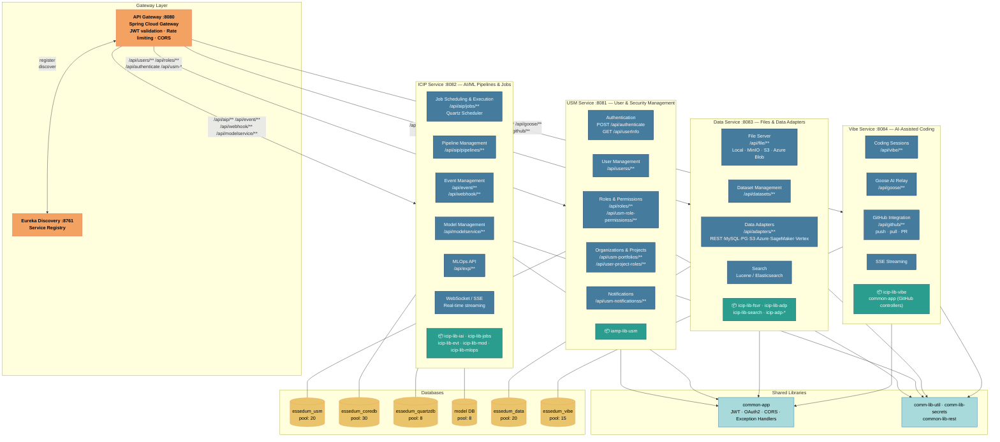

---

## 4. Authentication & Authorization Flow

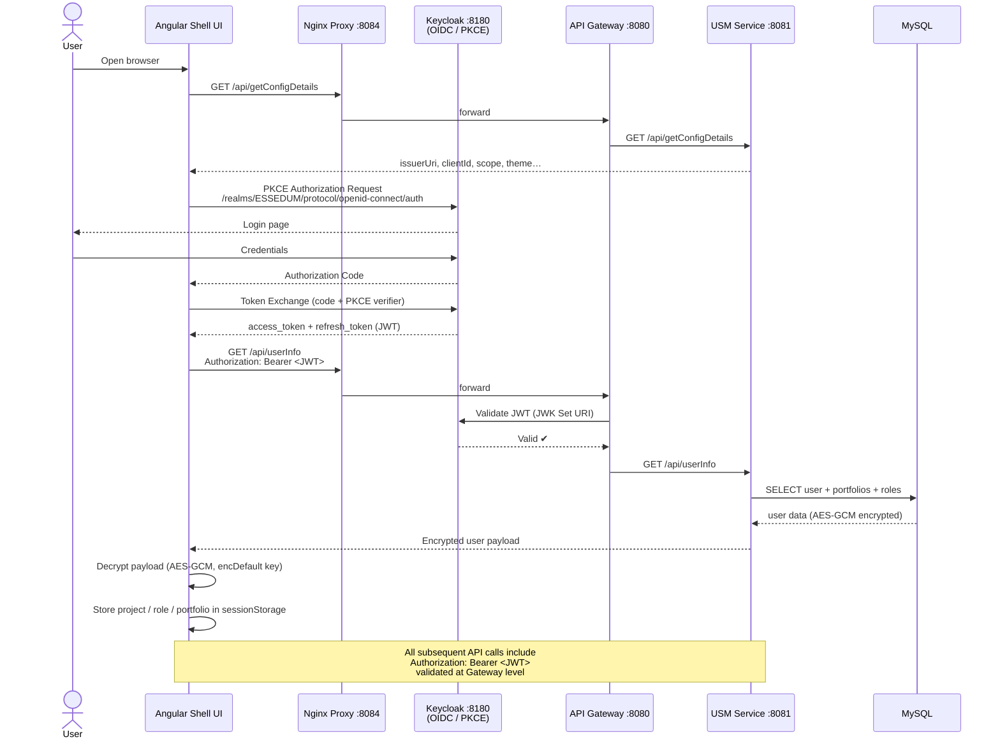

---

## 5. AI/ML Infrastructure

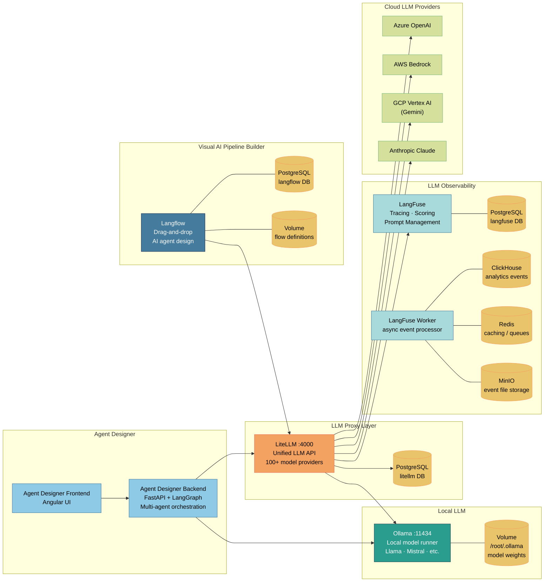

---

## 6. Python Job Executor Layer

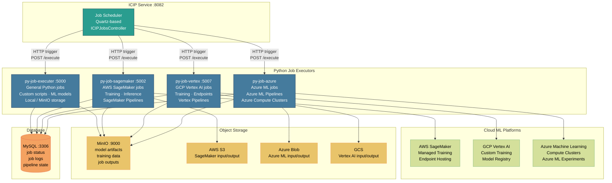

---

## 7. Data & Storage Layer

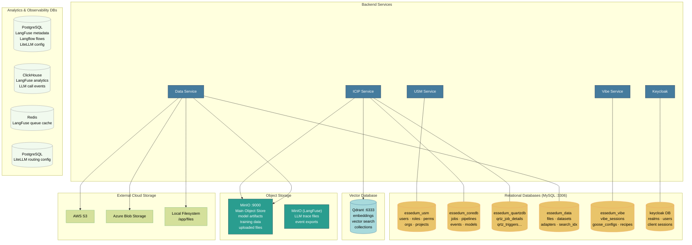

---

## 8. Developer Tooling & Code Build Pipeline

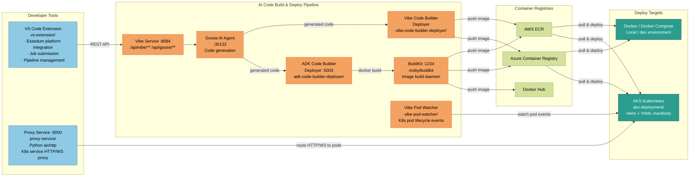

---

## 9. Deployment Topology (Docker Compose)

```mermaid
graph TB
    subgraph DockerCompose["docker-compose.yml  (docker/)"]

        subgraph CoreStack["Core Application Stack"]
            FE["frontend\nNginx :8084/:8086/:8087/:4000"]
            BE["leap-app-backend-service\nSpring Boot :8082"]
            KC["keycloak\n:8180"]
            PROXY["proxy-service\n:8000"]
        end

        subgraph JobStack["Job Executor Stack"]
            PYJOB["py-job-executor\n:5000"]
            PYSM["py-job-sagemaker\n:5002"]
            PYVERTEX["py-job-vertex\n:5007"]
        end

        subgraph BuildStack["Build & Deploy Stack"]
            BUILDKIT["buildkitd\n:1234\nmoby/buildkit"]
            ADK["adk-code-builder\n:5003"]
        end

        subgraph DataStack["Data Infrastructure"]
            MYSQL["mysql:8.0\n:3306"]
            QDRANT["qdrant/qdrant\n:6333"]
            MINIO_SVC["minio\n:9000 / :9001"]
        end

        subgraph LLMStack["LLM Infrastructure"]
            OLLAMA_SVC["ollama/ollama\n:11434"]
            LITELLM_SVC["litellm\n:4000"]
            LITELLM_PG["litellm-postgres\nPostgreSQL :5432"]
            LANGFLOW_SVC["langflow-stable\n:7860"]
            LANGFLOW_PG["langflow-stable-postgres\nPostgreSQL"]
        end

        subgraph ObsStack["Observability Stack  (LangFuse)"]
            LANGFUSE_WEB["langfuse-web\n:3000"]
            LANGFUSE_WRK["langfuse-worker"]
            LF_PG["langfuse-postgres\nPostgreSQL :5434"]
            LF_CH["clickhouse\n:8123 / :9000"]
            LF_REDIS["redis:7-alpine\n:6379"]
            LF_MINIO["langfuse-minio\n:9100 / :9101"]
        end
    end

    subgraph External["External Access"]
        BROWSER_DC["Browser / Client"]
    end

    BROWSER_DC --> FE

    FE -->|"ESSEDUM_BACKEND_UPSTREAM"| BE
    FE -->|"ESSEDUM_KEYCLOAK_UPSTREAM"| KC

    BE --> MYSQL & QDRANT & MINIO_SVC
    KC --> MYSQL

    PYJOB & PYSM & PYVERTEX --> MYSQL & MINIO_SVC

    ADK --> BUILDKIT

    LITELLM_SVC --> OLLAMA_SVC & LITELLM_PG
    LITELLM_SVC --> LANGFUSE_WEB

    LANGFLOW_SVC --> LANGFLOW_PG

    LANGFUSE_WEB --> LF_PG
    LANGFUSE_WRK --> LF_CH & LF_REDIS & LF_MINIO

    classDef core  fill:#457b9d,stroke:#1d3557,color:#fff
    classDef job   fill:#8ecae6,stroke:#457b9d,color:#000
    classDef build fill:#f4a261,stroke:#e76f51,color:#000
    classDef data  fill:#e9c46a,stroke:#f4a261,color:#000
    classDef llm   fill:#a8dadc,stroke:#457b9d,color:#000
    classDef obs   fill:#d4e09b,stroke:#7db87a,color:#000

    class FE,BE,KC,PROXY core
    class PYJOB,PYSM,PYVERTEX job
    class BUILDKIT,ADK build
    class MYSQL,QDRANT,MINIO_SVC data
    class OLLAMA_SVC,LITELLM_SVC,LITELLM_PG,LANGFLOW_SVC,LANGFLOW_PG llm
    class LANGFUSE_WEB,LANGFUSE_WRK,LF_PG,LF_CH,LF_REDIS,LF_MINIO obs
```

---

## 10. Kubernetes / AKS Deployment

### 10.1 Cluster Topology

```mermaid
graph TB
    subgraph Internet
        CLIENT["Browser / VS Code / REST client"]
    end

    subgraph AKS["AKS Cluster"]

        subgraph IngressNS["ingress-nginx namespace"]
            ING_CTRL["ingress-nginx controller\ningress-nginx-deploy.yaml"]
        end

        subgraph MetalLB["metallb-system"]
            LB["MetalLB LoadBalancer\nmetallib-config.yaml"]
        end

        subgraph aipns["aipns  — primary application namespace"]
            direction TB

            subgraph Ingresses["Ingress Rules"]
                ING_FE["essedum-frontend-ingress\nHost: essedum.az.ad.idemo-ppc.com → shell :8084"]
                ING_MFE["essedum-frontend-mfe-ingress\n/agent → agent :8082\n/data-ops → data-ops :8082\n/integration → integration :8082\n/vibe-studio → vibe-studio :8082"]
                ING_API["essedum-api-ingress\nHost: essedum.az.ad.idemo-ppc.com → api-gateway :8080"]
                ING_KC["keycloak-ingress\nHost: essedum.az.ad.idemo-ppc.com → keycloak :8443"]
                ING_LFN["essedum-ingress (LFN)\nHost: lfn.essedum.anuket.iol.unh.edu → frontend :8084"]
            end

            subgraph FrontendWL["Frontend Workloads"]
                SHELL["essedum-frontend-shell\nimage: essedum-ui\nport 8082 + 8084\nHPA: 1–5 replicas / CPU 50%"]
                AGENT_FE["essedum-frontend-agent\nAgent Designer UI\nport 8082"]
                DATA_OPS_FE["essedum-frontend-data-ops\nport 8082"]
                INT_FE["essedum-frontend-integration\nport 8082"]
                VIBE_ST["essedum-frontend-vibe-studio\nport 8082"]
            end

            subgraph BackendWL["Backend Workloads"]
                GW_DEP["essedum-backend-api-gateway\nimage: essedum-api-gateway\nport 8080\nHPA: 1–5 replicas / CPU+Mem 50%"]
                USM_DEP["essedum-backend-usm\nimage: essedum-usm-service\nport 8081 · req 200m/512Mi · lim 2/2Gi"]
                ICIP_DEP["essedum-backend-icip\nimage: essedum-icip-service\nport 8082 · req 200m/512Mi · lim 2/2Gi"]
                DATA_DEP["essedum-backend-data\nimage: essedum-data-service\nport 8083 · req 200m/512Mi · lim 2/2Gi"]
                VIBE_DEP["essedum-backend-vibe\nimage: essedum-vibe-service\nport 8084"]
                PYJOB["pyjob-executor\nimage: pyjob-excecutor\nport 5000 · req 100m/256Mi · lim 500m/512Mi\nHPA: 1–3 replicas / CPU+Mem 70%"]
            end

            subgraph InfraWL["Infrastructure Workloads"]
                KC_DEP["keycloak\nimage: keycloak:26.2.3\nport 8443 · req 500m/1Gi · lim 2/2Gi\nHPA: 1–2 replicas / CPU+Mem 70%"]
                MYSQL_DEP["mysql\nimage: mysql:8.0\nport 3306\nPVC: 5Gi (mysql-file-pv.yaml)"]
                QDRANT_DEP["qdrant\nimage: qdrant/qdrant\nport 6333\nPVC: 10Gi (qdrantfilepv.yaml)"]
                LANGFLOW_DEP["langflow\nport 7860\nPVC: 5Gi (langflow_file_pv.yaml)"]
            end

            subgraph VibeInfra["Vibe Platform Workloads"]
                PROXY_DEP["proxy-service\nimage: proxy-service\nport 8080 · req 100m/128Mi · lim 500m/512Mi"]
                VCB_DEP["vibe-code-builder-service\nimage: vibe-code-builder-service\nport 5000 · req 200m/256Mi · lim 2/2Gi"]
                VPW_DEP["vibe-pod-watcher\nimage: vibe-pod-watcher\nport 5000 · req 50m/64Mi · lim 200m/128Mi"]
                BUILDER["builder-service\nimage: builder-service\nport 5000 · req 200m/256Mi · lim 2/2Gi"]
                GOOSE["goosed + goose-ui\nGoose AI engine + UI"]
            end
        end

        subgraph VibeAppsNS["vibe-apps namespace"]
            VA_PODS["Vibe App Pods\n(dynamically spawned per coding session)\nRBAC: vibe-apps-rbac.yaml"]
        end

        subgraph VibeMCPNS["vibe-mcp namespace"]
            MCP_PODS["MCP Server Pods\n(Model Context Protocol servers)\nRBAC: vibe-mcp-rbac.yaml"]
        end

        subgraph VibeAgentsNS["vibe-agents namespace"]
            AG_PODS["Agent Pods\n(dynamically spawned agents)\nRBAC: vibe-agents-rbac.yaml"]
        end
    end

    subgraph Registry["In-Cluster Registry"]
        REG["localhost:5000\nContainer Registry"]
    end

    CLIENT --> LB --> ING_CTRL
    ING_CTRL --> ING_FE & ING_MFE & ING_API & ING_KC & ING_LFN
    ING_FE & ING_LFN --> SHELL
    ING_MFE --> AGENT_FE & DATA_OPS_FE & INT_FE & VIBE_ST
    ING_API --> GW_DEP
    ING_KC --> KC_DEP

    GW_DEP --> USM_DEP & ICIP_DEP & DATA_DEP & VIBE_DEP
    ICIP_DEP --> PYJOB
    KC_DEP --> MYSQL_DEP
    USM_DEP & ICIP_DEP & DATA_DEP & VIBE_DEP --> MYSQL_DEP & QDRANT_DEP

    VCB_DEP --> VA_PODS & AG_PODS
    BUILDER --> VA_PODS
    PROXY_DEP --> VA_PODS & MCP_PODS & AG_PODS
    VPW_DEP --> VA_PODS & AG_PODS

    REG -.->|"image pull"| GW_DEP & USM_DEP & ICIP_DEP & DATA_DEP & VIBE_DEP & PYJOB & PROXY_DEP & VCB_DEP & VPW_DEP & BUILDER
```

---

### 10.2 Namespace Summary

| Namespace | Purpose | Key Workloads |
|---|---|---|
| `aipns` | Primary application namespace — all platform services | API Gateway, USM, ICIP, Data, Vibe, Keycloak, MySQL, Qdrant, Langflow, Python Executor, Proxy, Vibe Code Builder, Pod Watcher, Builder, Goose |
| `vibe-apps` | Dynamically spawned Vibe coding session containers | Created/deleted by Vibe Code Builder Deployer per user session |
| `vibe-mcp` | MCP (Model Context Protocol) server pods | Dynamically spawned MCP server instances |
| `vibe-agents` | Dynamically spawned ADK/LangGraph agent containers | Created/deleted by ADK Code Builder Deployer |
| `ingress-nginx` | Nginx Ingress Controller | Handles all external traffic routing |
| `metallb-system` | MetalLB load balancer | Assigns external IPs on bare-metal / on-prem clusters |

---

### 10.3 Ingress Routing

| Ingress | Hostname | Backend Service | TLS Secret |
|---|---|---|---|
| `essedum-frontend-ingress` | `essedum.az.ad.idemo-ppc.com` | `essedum-frontend-shell-service :8084` | `essedum-az-tls` |
| `essedum-frontend-mfe-ingress` | `essedum.az.ad.idemo-ppc.com` | Agent / Data-Ops / Integration / Vibe-Studio services `:8082` | `essedum-az-tls` |
| `essedum-api-ingress` | `essedum.az.ad.idemo-ppc.com` | `essedum-backend-api-gateway-service :8080` | `essedum-az-tls` |
| `keycloak-ingress` | `essedum.az.ad.idemo-ppc.com` | `keycloak :8443` | `essedum-az-tls` |
| `essedum-ingress` (LFN) | `lfn.essedum.anuket.iol.unh.edu` | `essedum-frontend-ui-service :8084` | `essedum-secret` |
| `vibe-code-builder-ingress` | cluster-internal | `vibe-code-builder-service :5000` | — |
| `vibe-pod-watcher-ingress` | cluster-internal | `vibe-pod-watcher :5000` | — |

All ingress rules use `ingressClassName: nginx`. The API and auth backends use `nginx.ingress.kubernetes.io/backend-protocol: HTTPS` with SSL verification disabled (`proxy-ssl-verify: off`).

---

### 10.4 Horizontal Pod Autoscalers

| HPA | Workload | Min | Max | Scale Trigger |
|---|---|---|---|---|
| `essedum-backend-api-gateway-hpa` | API Gateway | 1 | 5 | CPU 50% · Memory 50% |
| `essedum-frontend-ui-hpa` | Frontend UI | 1 | 5 | CPU 50% · Memory 50% |
| `pyjob-executor-hpa` | Python Executor | 1 | 3 | CPU 70% · Memory 70% |
| `keycloak-hpa` | Keycloak | 1 | 2 | CPU 70% · Memory 70% |

All other services (USM, ICIP, Data, Vibe, Proxy, etc.) run at `replicas: 1` with no HPA — scale by redeploying with a higher replica count.

---

### 10.5 Persistent Volumes

| PVC / PV File | Capacity | Mount | Used By |
|---|---|---|---|
| `mysql_file_pv.yaml` | 5 Gi | `/var/lib/mysql` | MySQL — all service databases |
| `qdrantfilepv.yaml` | 10 Gi | `/qdrant/storage` | Qdrant — vector embeddings |
| `langflow_file_pv.yaml` | 5 Gi | `/app/langflow` | Langflow — flow definitions |

---

### 10.6 Secrets and Config

| Secret | Used By | Contains |
|---|---|---|
| `essedum-db-secret` | USM, ICIP, Data, Vibe | MySQL host, user, password, DB names |
| `essedum-encryption-secret` | USM, ICIP, Data | AES-GCM encryption key + salt |
| `essedum-minio-secret` | API Gateway | MinIO endpoint, access key, secret key |
| `essedum-vibe-secret` | Vibe Service | Goose API URL, GitHub OAuth credentials |
| `essedum-az-tls` | Ingress rules | TLS certificate + key for `*.az.ad.idemo-ppc.com` |
| `essedum-secret` | LFN ingress | TLS certificate + key for `lfn.essedum.anuket.iol.unh.edu` |
| `vibe-code-builder-secret` | Vibe Code Builder | Registry credentials, K8s service account |

All secrets are referenced by name in `envFrom` / `secretKeyRef` blocks — no values are stored in manifest files.

---

### 10.7 Container Image Registry

All platform services pull images from an **in-cluster registry at `localhost:5000`**. Image tags follow the pattern `<service-name>:v<N>` (e.g., `essedum-icip-service:v17`). The registry is a cluster-local deployment accessible only within the cluster network — no external registry credentials are required for core services.

The Frontend UI image is an exception: it pulls from Azure Container Registry (`acrreq0762935.azurecr.io/essedum-ui:latest`) in the Azure deployment variant.

---

## 11. End-to-End Request Flow

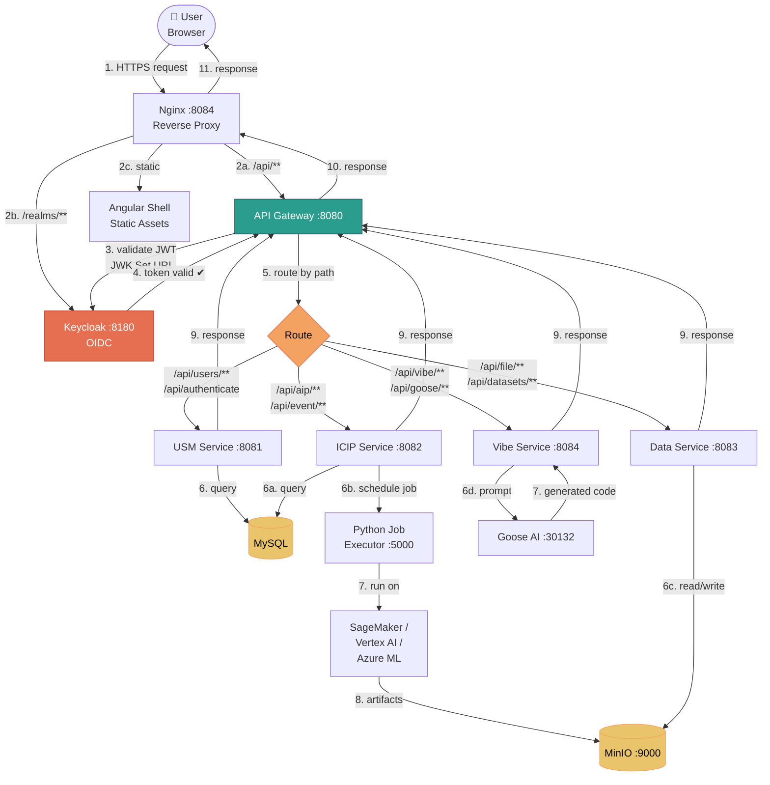

---

## 12. Cross-Service Interaction Flows

These flows document how services collaborate to deliver the platform's key capabilities. Each service's internal steps are intentionally abbreviated here — refer to the [Service Architecture Index](#service-architecture-index) for what happens inside each service.

---

### Flow 1 — User Login and First Authenticated API Call

Covers: Browser → Nginx → Keycloak → Gateway → USM

```mermaid
sequenceDiagram
    participant B as Browser
    participant NGX as Nginx
    participant KC as Keycloak
    participant GW as API Gateway
    participant USM as USM Service

    B->>NGX: Navigate to app (unauthenticated)
    NGX->>B: Serve Angular shell (index.html)
    B->>NGX: GET /realms/ESSEDUM/.well-known/openid-configuration
    NGX->>KC: Forward (KC proxy route)
    KC-->>B: OIDC discovery document
    B->>KC: PKCE auth request → login page
    KC-->>B: Redirect with auth code
    B->>KC: Exchange code for tokens
    KC-->>B: access_token + refresh_token
    Note over B: Angular stores token; all subsequent calls carry Bearer header
    B->>NGX: GET /api/usm/users (Bearer token)
    NGX->>GW: Forward
    GW->>KC: Validate token (JWK Set URI — cached)
    KC-->>GW: Token valid + claims
    GW->>USM: Forward + user claims in headers
    USM->>USM: Resolve permissions for user roles
    USM-->>GW: 200 OK [users]
    GW-->>NGX-->>B: 200 OK [users]
```

---

### Flow 2 — Pipeline Execution End-to-End

Covers: ICIP → Python Executor → Data Service → MinIO → ICIP (completion)

```mermaid
sequenceDiagram
    participant UI as Browser (UI)
    participant GW as API Gateway
    participant ICIP as ICIP Service
    participant EXEC as Python Executor
    participant DATA as Data Service
    participant MINIO as MinIO

    UI->>GW: POST /api/aip/jobs/run {pipelineId, executionContainerId}
    GW->>ICIP: Forward
    ICIP->>ICIP: Resolve execution container (cloud target + credentials)
    ICIP->>ICIP: Create Job record (QUEUED)
    ICIP-->>UI: 202 Accepted {jobId}
    Note over UI: Subscribes to WebSocket /api/aip/ws/{jobId}
    ICIP->>EXEC: POST /execute {command, bucket, credentials, storage}
    EXEC-->>ICIP: 200 OK {task_id}
    EXEC->>DATA: GET /api/data/files/{inputArtifactId} (download input)
    DATA->>MINIO: Fetch object
    MINIO-->>DATA-->>EXEC: Input file bytes
    EXEC->>EXEC: Run pipeline subprocess
    EXEC->>MINIO: Upload output artifacts
    EXEC->>ICIP: Status poll response: COMPLETED
    ICIP->>DATA: Register output artifact (POST /api/data/files)
    ICIP->>ICIP: Update Job record (COMPLETED)
    ICIP->>UI: WebSocket push: {status: COMPLETED, outputArtifacts}
```

---

### Flow 3 — Agent Design to Kubernetes Deployment

Covers: Agent Designer Backend → Vibe Code Builder Deployer → BuildKit → Kubernetes → Proxy Service + Vibe Pod Watcher

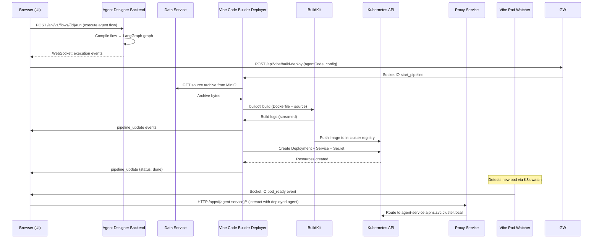

---

### Flow 4 — RAG Pipeline (Document Ingestion → Query)

Covers: Data Service → Qdrant → ICIP → LiteLLM → LLM provider

```mermaid
sequenceDiagram
    participant UI as Browser (UI)
    participant GW as API Gateway
    participant DATA as Data Service
    participant QDRANT as Qdrant
    participant ICIP as ICIP Service
    participant LITELLM as LiteLLM
    participant LLM as LLM Provider

    Note over UI,LLM: Part 1 — Document Ingestion
    UI->>GW: POST /api/data/knowledge-bases/{kb}/documents (file upload)
    GW->>DATA: Forward
    DATA->>DATA: Chunk document (background task)
    DATA->>LITELLM: POST /embeddings {chunks}
    LITELLM->>LLM: Embedding request
    LLM-->>LITELLM: Embedding vectors
    LITELLM-->>DATA: Vectors
    DATA->>QDRANT: Upsert vectors (collection=kb_id)
    DATA-->>UI: 202 Accepted

    Note over UI,LLM: Part 2 — RAG Query at Pipeline Execution
    ICIP->>ICIP: Execute RAG node in pipeline
    ICIP->>DATA: POST /api/data/rag/query {kb_id, query, top_k}
    DATA->>LITELLM: POST /embeddings {query_text}
    LITELLM->>LLM: Embedding request
    LLM-->>DATA: Query vector
    DATA->>QDRANT: Search(collection=kb_id, vector, top_k)
    QDRANT-->>DATA: Top-k chunks + scores
    DATA-->>ICIP: {chunks, sources}
    ICIP->>LITELLM: POST /chat/completions {prompt + chunks as context}
    LITELLM->>LLM: Chat completion
    LLM-->>LITELLM-->>ICIP: LLM response
    ICIP-->>UI: Pipeline output with RAG-grounded answer
```

---

### Flow 5 — Vibe AI Coding Session (Code Generation → GitHub Push)

Covers: Vibe Service → Goose AI → Vibe Service → GitHub

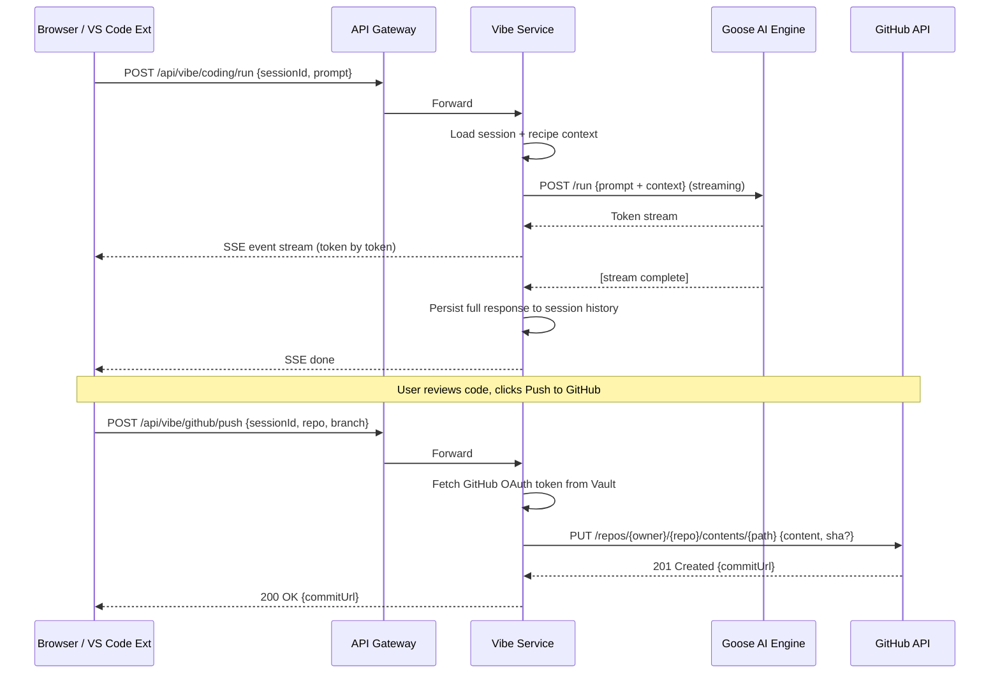

---

### Flow 6 — LLM Call with Observability (LiteLLM → LangFuse)

Covers: Any service → LiteLLM → LLM provider → LangFuse trace

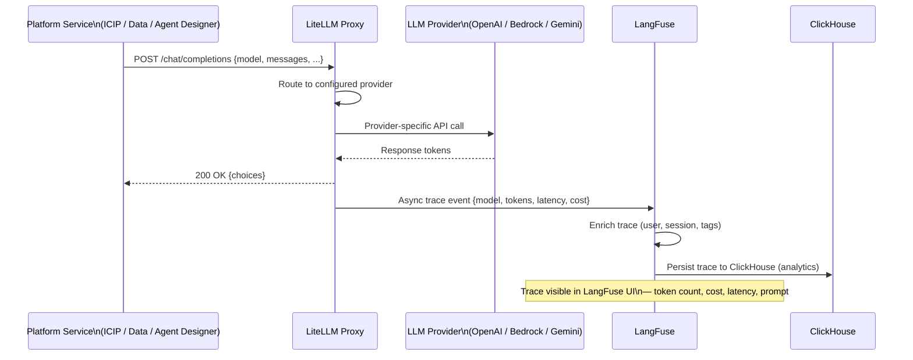

---

### Flow 7 — Model Training to Endpoint Deployment

Covers: ICIP → SageMaker Executor → AWS SageMaker → ICIP model registry → endpoint

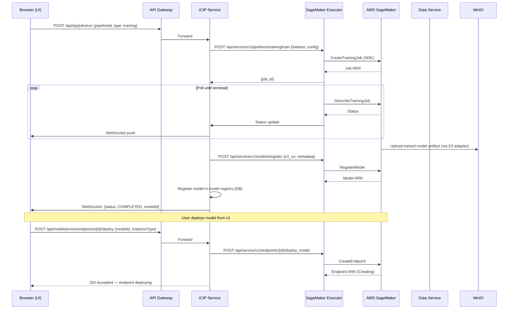

---

## Component Port Reference

| Component | Port | Technology | Purpose |
|---|---|---|---|
| Nginx (Frontend) | 8084 | Nginx | Reverse proxy + static serving |
| API Gateway | 8080 | Spring Cloud Gateway | Backend routing + JWT validation |
| Eureka Discovery | 8761 | Spring Cloud Eureka | Service registry |
| USM Service | 8081 | Spring Boot | User & security management |
| ICIP Service | 8082 | Spring Boot | AI/ML pipelines & jobs |
| Data Service | 8083 | Spring Boot | Files & data adapters |
| Vibe Service | 8084 | Spring Boot | AI-assisted coding |
| Keycloak | 8180 | Keycloak 25 | OIDC identity provider |
| Proxy Service | 8000 | Python/aiohttp | K8s service proxy |
| py-job-executer | 5000 | Python/Flask | General Python job executor |
| py-job-sagemaker | 5002 | Python/Flask | AWS SageMaker executor |
| py-job-vertex | 5007 | Python/Flask | GCP Vertex AI executor |
| ADK Code Builder | 5003 | Python | Container image builder |
| BuildKit | 1234 | moby/buildkit | Image build daemon |
| MySQL | 3306 | MySQL 8.0 | Relational data store |
| Qdrant | 6333 | Qdrant | Vector database |
| MinIO (main) | 9000 | MinIO | Object storage |
| MinIO Console | 9001 | MinIO | Object storage UI |
| Ollama | 11434 | Ollama | Local LLM runner |
| LiteLLM | 4000 | LiteLLM | Unified LLM proxy |
| Langflow | 7860 | Langflow | Visual AI pipeline builder |
| LangFuse | 3000 | LangFuse | LLM observability |
| ClickHouse | 8123 | ClickHouse | Analytics events store |
| Redis | 6379 | Redis 7 | Cache / message queue |

---

*Document auto-generated from codebase analysis — 2026-07-13*

---

## Service Architecture Index

Detailed architecture for each service — internal component diagrams, dependency maps, architectural decisions, and significant flows.

### Java Backend

| Service | Architecture Doc |
|---|---|
| Backend Overview | [sv/docs/ARCHITECTURE.md](../sv/docs/ARCHITECTURE.md) |
| API Gateway | [sv/api-gateway/docs/ARCHITECTURE.md](../sv/api-gateway/docs/ARCHITECTURE.md) |
| USM Service | [sv/usm-service/docs/ARCHITECTURE.md](../sv/usm-service/docs/ARCHITECTURE.md) |
| ICIP Service | [sv/icip-service/docs/ARCHITECTURE.md](../sv/icip-service/docs/ARCHITECTURE.md) |
| Data Service | [sv/data-service/docs/ARCHITECTURE.md](../sv/data-service/docs/ARCHITECTURE.md) · [OpenAPI Spec](../sv/data-service/docs/openapi.yaml) |
| Vibe Service | [sv/vibe-service/docs/ARCHITECTURE.md](../sv/vibe-service/docs/ARCHITECTURE.md) |

### AI / Agent Backend

| Service | Architecture Doc |
|---|---|
| Agent Designer Backend | [agent-designer-backend/docs/ARCHITECTURE.md](../agent-designer-backend/docs/ARCHITECTURE.md) |

### Python Job Executors

| Service | Architecture Doc |
|---|---|
| General Python Executor | [py-job-executer/docs/ARCHITECTURE.md](../py-job-executer/docs/ARCHITECTURE.md) |
| SageMaker Executor | [py-job-sagemaker-executer/docs/ARCHITECTURE.md](../py-job-sagemaker-executer/docs/ARCHITECTURE.md) |
| Vertex AI Executor | [py-job-vertex-executer/docs/ARCHITECTURE.md](../py-job-vertex-executer/docs/ARCHITECTURE.md) |
| Azure ML Executor | [py-job-azure-executer/docs/ARCHITECTURE.md](../py-job-azure-executer/docs/ARCHITECTURE.md) |

### Infrastructure & Developer Tools

| Service | Architecture Doc |
|---|---|
| Nginx | [nginx/docs/ARCHITECTURE.md](../nginx/docs/ARCHITECTURE.md) |
| Proxy Service | [proxy-service/docs/ARCHITECTURE.md](../proxy-service/docs/ARCHITECTURE.md) |
| S3Proxy | [s3proxy/docs/ARCHITECTURE.md](../s3proxy/docs/ARCHITECTURE.md) |
| Vibe Pod Watcher | [vibe-pod-watcher/docs/ARCHITECTURE.md](../vibe-pod-watcher/docs/ARCHITECTURE.md) |
| Vibe Code Builder Deployer | [vibe-code-builder-deployer/docs/ARCHITECTURE.md](../vibe-code-builder-deployer/docs/ARCHITECTURE.md) |
| ADK Code Builder Deployer | [adk-code-builder-deployer/docs/ARCHITECTURE.md](../adk-code-builder-deployer/docs/ARCHITECTURE.md) |
| VS Code Extension | [vs-extension/docs/ARCHITECTURE.md](../vs-extension/docs/ARCHITECTURE.md) |
