# Essedum Platform — Full Architecture

> **Version:** 3.2.x  
> **Last Updated:** 2026-07-13

---

## Table of Contents

1. [Platform Overview — Functional Blocks + Detailed Diagram](#1-platform-overview)
2. [Frontend Architecture — Micro-Frontend Shell](#2-frontend-architecture--micro-frontend-shell)
3. [Backend Microservices Architecture](#3-backend-microservices-architecture)
4. [Authentication & Authorization Flow](#4-authentication--authorization-flow)
5. [AI/ML Infrastructure](#5-aiml-infrastructure)
6. [Python Job Executor Layer](#6-python-job-executor-layer)
7. [Data & Storage Layer](#7-data--storage-layer)
8. [Developer Tooling & Code Build Pipeline](#8-developer-tooling--code-build-pipeline)
9. [Deployment Topology (Docker Compose)](#9-deployment-topology-docker-compose)
10. [Kubernetes / AKS Deployment](#10-kubernetes--aks-deployment)
11. [End-to-End Request Flow](#11-end-to-end-request-flow)
12. [Cross-Service Interaction Flows](#12-cross-service-interaction-flows)
13. [Service Architecture Index](#service-architecture-index)

---

## 1. Platform Overview

### 1.1 Functional Architecture

The platform is organised into eight functional blocks. Understanding these before diving into individual services is the fastest way to grasp the system.

```mermaid
graph TB
    subgraph Clients["Clients"]
        C1["Browser\nAngular MFE Shell"]
        C2["VS Code Extension\nPipeline submit + monitoring"]
        C3["REST / External APIs"]
    end

    subgraph Presentation["Presentation Layer\nAngular 18 · React · Nginx"]
        P1["Pipeline Studio\nBuild & run ML pipelines"]
        P2["Data Ops\nDatasets · Datasources · Models"]
        P3["Agent Studio\nAI agent authoring · LangFuse · LiteLLM views"]
        P4["Vibe Studio\nAI coding interface"]
        P5["Agent Designer UI\nVisual LangGraph canvas (React)"]
        P6["Embedded Tools\nLangflow · LangFuse · LiteLLM (iframes)"]
    end

    subgraph APIGateway["API Gateway & Auth\nSingle entry point"]
        G1["API Gateway\nJWT validation · routing · rate limiting"]
        G2["Keycloak\nOIDC/OAuth2 identity provider"]
    end

    subgraph CoreServices["Core Platform Services\nJava Spring Boot microservices"]
        S1["User & Access Management\nUsers · Roles · Orgs · RBAC"]
        S2["AI/ML Pipeline Engine\nJobs · Pipelines · Model Registry · Events"]
        S3["Data & Storage Service\nFiles · Datasets · Adapters · Search"]
        S4["AI Coding Service\nVibe sessions · Goose AI relay · GitHub sync"]
    end

    subgraph AgentPlatform["Agent & Code Build Platform"]
        A1["Agent Designer Backend\nLangGraph execution · RAG · MCP tools · Memory"]
        A2["Vibe Code Builder\nBuild container image → deploy to K8s (Vibe sessions)"]
        A3["ADK Code Builder\nBuild container image → deploy to K8s (ADK agents)"]
        A4["Vibe Pod Watcher\nMonitor · stream logs · manage K8s pods"]
        A5["Proxy Service\nRoute HTTP & WebSocket to dynamic K8s pods"]
    end

    subgraph LLMInfra["LLM Infrastructure"]
        L1["LiteLLM Proxy\nUnified API to 100+ LLM providers"]
        L2["LangFuse\nLLM tracing · cost · evaluation"]
        L3["Langflow\nVisual agent pipeline builder"]
        L4["Ollama\nLocal open-source LLM runner"]
    end

    subgraph CloudExec["Cloud ML Execution\nPython executor microservices"]
        E1["General Python Executor\nLocal scripts · MinIO storage"]
        E2["AWS SageMaker Executor\nTraining · inference · endpoints"]
        E3["GCP Vertex AI Executor\nTraining · inference · endpoints"]
        E4["Azure ML Executor\nTraining · inference · endpoints"]
    end

    subgraph DataLayer["Data Layer"]
        D1[("MySQL\nRelational state")]
        D2[("Qdrant\nVector embeddings")]
        D3[("MinIO / S3 / Azure Blob\nObject storage")]
        D4[("PostgreSQL\nLangFuse · Langflow · LiteLLM")]
        D5[("ClickHouse + Redis\nAnalytics + cache")]
    end

    Clients --> Presentation
    Presentation --> APIGateway
    APIGateway --> CoreServices
    CoreServices --> AgentPlatform
    CoreServices --> LLMInfra
    CoreServices --> CloudExec
    CoreServices & AgentPlatform & LLMInfra & CloudExec --> DataLayer
```

### Functional Block Descriptions

| Block | What it does |
|---|---|
| **Clients** | Three entry points: browser (Angular MFE shell), VS Code extension (pipeline submit + job monitoring), and direct REST API clients. |
| **Presentation Layer** | Angular 18 micro-frontend shell loading five feature modules. The Agent Designer is a separate React/Vite app. Langflow, LangFuse, and LiteLLM UIs are embedded as iframes. |
| **API Gateway & Auth** | All external traffic enters through a single API Gateway. Keycloak handles OIDC identity; the gateway validates tokens before forwarding to any service. |
| **Core Platform Services** | Four Spring Boot microservices covering the platform's core domains: identity/access, AI/ML pipeline execution, data management, and AI-assisted coding. |
| **Agent & Code Build Platform** | Services that design, build, and operate AI agents and coding sessions: the Agent Designer Backend runs LangGraph flows; the Vibe and ADK Code Builders compile source into container images and deploy them to Kubernetes; the Pod Watcher monitors those pods; the Proxy Service routes HTTP/WebSocket traffic to them. |
| **LLM Infrastructure** | LiteLLM provides a unified API to all LLM providers. LangFuse traces every LLM call. Langflow provides a visual drag-and-drop agent builder. Ollama runs open-source models locally. |
| **Cloud ML Execution** | Four Python executor services — each specialised for a target platform (local, SageMaker, Vertex AI, Azure ML). The Core Pipeline Engine submits jobs to them over HTTP. |
| **Data Layer** | MySQL for relational state, Qdrant for vector search, MinIO/S3/Azure Blob for object storage, PostgreSQL for LLM tooling metadata, ClickHouse + Redis for LangFuse analytics. |

---

### 1.2 Detailed Component Diagram

```mermaid
graph TB
    subgraph Users["👤 Users / Clients"]
        BROWSER["Browser\nAngular Shell UI"]
        VSCODE["VS Code Extension\n· authenticate\n· browse pipelines\n· submit & monitor jobs"]
        EXTAPI["External REST\nClients / APIs"]
    end

    subgraph FrontendLayer["🖥️ Frontend Layer  (Nginx :8084)"]
        NGINX_FE["Nginx Reverse Proxy\n· Shell App + MFE Modules\n· Agent Designer UI (React)\n· Route /api → Backend\n· Route /realms → Keycloak"]
    end

    subgraph BackendLayer["⚙️ Backend Layer"]
        GW["API Gateway :8080\nSpring Cloud Gateway"]
        USM["USM Service :8081\nUser & Security Mgmt"]
        ICIP["ICIP Service :8082\nAI/ML Pipelines"]
        DATA["Data Service :8083\nFiles & Adapters"]
        VIBE["Vibe Service :8084\nAI-Assisted Coding"]
        EUR["Eureka Discovery :8761"]
    end

    subgraph Auth["🔐 Authentication"]
        KC["Keycloak :8180\nOIDC Identity Provider\nRealm: ESSEDUM"]
    end

    subgraph AgentPlatformLayer["🤖 Agent & Code Build Platform"]
        AGENTBE["Agent Designer Backend\nFastAPI + LangGraph\nRAG · MCP tools · Memory"]
        VIBE_CB["Vibe Code Builder\n· Download source from MinIO\n· Build image via BuildKit\n· Deploy to vibe-apps K8s namespace"]
        ADK_CB["ADK Code Builder :5003\n· Build image via BuildKit\n· Deploy to vibe-agents K8s namespace"]
        VPW["Vibe Pod Watcher\n· Monitor vibe-apps / vibe-agents pods\n· Stream logs via Socket.IO\n· Delete deployments"]
        PROXY_SVC["Proxy Service :8000\n· HTTP + WebSocket proxy\n· Routes to K8s pod services\n· DNS-label SSRF protection"]
        BUILDKIT["BuildKit :1234\nOCI image build daemon"]
    end

    subgraph PyJobLayer["🐍 Python Job Executors"]
        PYJOB["py-job-executer :5000\nGeneral Python Jobs"]
        PYSM["py-job-sagemaker :5002\nAWS SageMaker Jobs"]
        PYVERTEX["py-job-vertex :5007\nGCP Vertex AI Jobs"]
        PYAZURE["py-job-azure\nAzure ML Jobs"]
    end

    subgraph AIInfra["🧠 LLM Infrastructure"]
        LITELLM["LiteLLM :4000\nUnified LLM Proxy"]
        LANGFLOW["Langflow\nVisual AI Pipeline Builder"]
        LANGFUSE["LangFuse\nLLM Observability"]
        OLLAMA["Ollama :11434\nLocal LLM Runner"]
    end

    subgraph DataLayer["🗄️ Data Layer"]
        MYSQL[("MySQL :3306\nMain DB")]
        QDRANT[("Qdrant :6333\nVector DB")]
        MINIO[("MinIO :9000\nObject Storage")]
        POSTGRES_LF[("PostgreSQL\nLangFuse / Langflow / LiteLLM")]
        CLICKHOUSE[("ClickHouse\nLangFuse Analytics")]
        REDIS[("Redis\nLangFuse Cache")]
    end

    subgraph CloudAPIs["☁️ External Cloud APIs"]
        AWS_SM["AWS SageMaker"]
        GCP_V["GCP Vertex AI"]
        AZ_ML["Azure ML"]
        GITHUB["GitHub API"]
        GOOSE["Goose AI\nCoding Agent"]
    end

    subgraph K8sPods["☸️ Dynamic Kubernetes Pods"]
        VIBE_PODS["vibe-apps namespace\nVibe coding session pods"]
        AGENT_PODS["vibe-agents namespace\nADK / LangGraph agent pods"]
        MCP_PODS["vibe-mcp namespace\nMCP server pods"]
    end

    BROWSER & VSCODE & EXTAPI --> NGINX_FE

    NGINX_FE -->|"/api/**"| GW
    NGINX_FE -->|"/realms/**"| KC
    VSCODE -->|"REST API (Bearer token)"| GW

    GW -->|"/api/users/** /api/authenticate"| USM
    GW -->|"/api/aip/** /api/event/** /api/modelservice/**"| ICIP
    GW -->|"/api/file/** /api/datasets/** /api/adapters/**"| DATA
    GW -->|"/api/vibe/** /api/goose/** /api/github/**"| VIBE
    GW <-->|register/discover| EUR
    USM & ICIP & DATA & VIBE <-->|register/discover| EUR
    USM & ICIP & DATA & VIBE --> KC
    USM & ICIP & DATA & VIBE --- MYSQL

    ICIP -->|"POST /execute"| PYJOB & PYSM & PYVERTEX & PYAZURE
    PYSM --> AWS_SM
    PYVERTEX --> GCP_V
    PYAZURE --> AZ_ML

    DATA --> MINIO
    ICIP --> MINIO
    ICIP --> QDRANT
    VIBE --> GOOSE & GITHUB

    VIBE_CB --> BUILDKIT --> VIBE_PODS
    ADK_CB --> BUILDKIT --> AGENT_PODS
    VIBE_CB & ADK_CB --> MINIO

    VPW -->|watch · log stream · delete| VIBE_PODS & AGENT_PODS & MCP_PODS
    PROXY_SVC -->|HTTP/WS proxy| VIBE_PODS & AGENT_PODS & MCP_PODS

    AGENTBE --> QDRANT & MINIO

    LITELLM --> OLLAMA
    LITELLM --> AWS_SM & GCP_V & AZ_ML
    LITELLM --> LANGFUSE
    LANGFLOW --- POSTGRES_LF
    LANGFUSE --- POSTGRES_LF & CLICKHOUSE & REDIS
    LITELLM --- POSTGRES_LF
    KC --- MYSQL

    classDef fe       fill:#457b9d,stroke:#1d3557,color:#fff
    classDef be       fill:#2a9d8f,stroke:#264653,color:#fff
    classDef auth     fill:#e76f51,stroke:#c14b2a,color:#fff,font-weight:bold
    classDef agent    fill:#6a4c93,stroke:#4a2c73,color:#fff
    classDef py       fill:#8ecae6,stroke:#457b9d,color:#000
    classDef ai       fill:#a8dadc,stroke:#457b9d,color:#000
    classDef db       fill:#e9c46a,stroke:#f4a261,color:#000
    classDef cloud    fill:#d4e09b,stroke:#7db87a,color:#000
    classDef k8s      fill:#f1faee,stroke:#2a9d8f,color:#000
    classDef user     fill:#e8e8e8,stroke:#888,color:#000

    class NGINX_FE fe
    class GW,USM,ICIP,DATA,VIBE,EUR be
    class KC auth
    class AGENTBE,VIBE_CB,ADK_CB,VPW,PROXY_SVC,BUILDKIT agent
    class PYJOB,PYSM,PYVERTEX,PYAZURE py
    class LITELLM,LANGFLOW,LANGFUSE,OLLAMA ai
    class MYSQL,QDRANT,MINIO,POSTGRES_LF,CLICKHOUSE,REDIS db
    class AWS_SM,GCP_V,AZ_ML,GITHUB,GOOSE cloud
    class VIBE_PODS,AGENT_PODS,MCP_PODS k8s
    class BROWSER,VSCODE,EXTAPI user
```

---

## 2. Frontend Architecture — Micro-Frontend Shell

> Full frontend architecture — MFE composition, Module Federation, OIDC auth, component diagram, and key flows — is documented in **[essedum-ui/docs/ARCHITECTURE.md](../essedum-ui/docs/ARCHITECTURE.md)**.

The frontend is an Angular 18 **Module Federation shell** hosting four independently deployed MFE remotes, one embedded React/Vite application, and three iframed external UIs. Nginx serves all artefacts on port 8084 and proxies API traffic to the backend.

| Application | Technology | Purpose |
|---|---|---|
| Shell (`shell/`) | Angular 18 · Module Federation host | Main layout, routing, OIDC auth, HTTP interceptor |
| Agent Studio MFE | Angular 18 · MFE remote | AI pipelines, agent directory, dataset, LangFuse/LiteLLM integration |
| Data Ops MFE | Angular 18 · MFE remote | Dataset, datasource, model, and schema management |
| Integration Hub MFE | Angular 18 · MFE remote | Pipeline design & execution, job monitoring, adapters |
| Vibe Studio MFE | Angular 18 · MFE remote | Vibe AI coding interface |
| Agent Designer (`agent-designer-frontend/`) | React 18 · Vite | LangGraph visual agent design canvas |
| Langflow / LangFuse / LiteLLM | iframed | Third-party platform UIs embedded within the shell |

---

## 3. Backend Microservices Architecture

> Full backend architecture — service internals, dependency maps, architectural decisions, and sequence diagrams for each service — is documented in **[sv/docs/ARCHITECTURE.md](../sv/docs/ARCHITECTURE.md)**.

The backend is a Java 21 / Spring Boot 3.x microservices system. All external traffic enters through a single API Gateway on port 8080 and is routed to one of four domain services via path prefix.

| Service | Port | Domain | Architecture Doc |
|---|---|---|---|
| API Gateway | 8080 | Routing · JWT validation · Rate limiting | [api-gateway](../sv/api-gateway/docs/ARCHITECTURE.md) |
| USM Service | 8081 | Users · Roles · Organisations | [usm-service](../sv/usm-service/docs/ARCHITECTURE.md) |
| ICIP Service | 8082 | AI/ML Pipelines · Jobs · Models | [icip-service](../sv/icip-service/docs/ARCHITECTURE.md) |
| Data Service | 8083 | Files · Datasets · Adapters · Search | [data-service](../sv/data-service/docs/ARCHITECTURE.md) |
| Vibe Service | 8084 | AI-Assisted Coding · GitHub Sync | [vibe-service](../sv/vibe-service/docs/ARCHITECTURE.md) |
| Eureka | 8761 | Service discovery | — |

---

## 4. Authentication & Authorization Flow

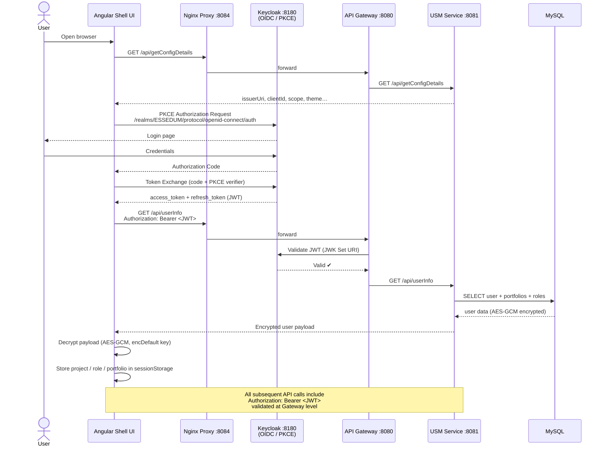

---

## 5. AI/ML Infrastructure

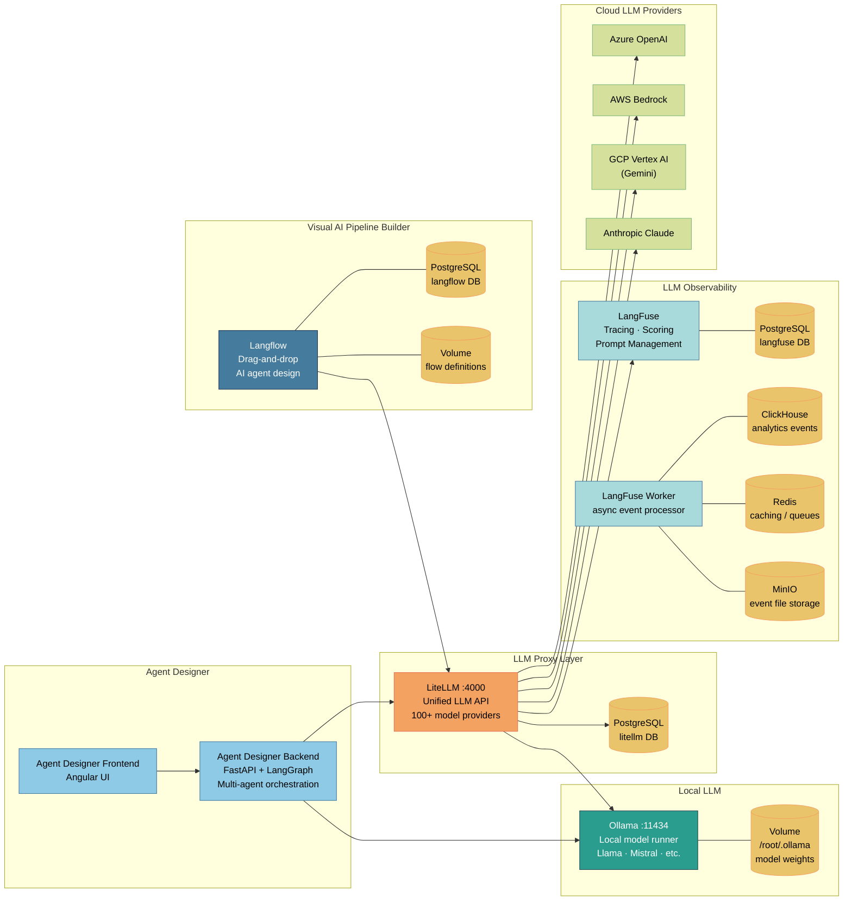

---

## 6. Python Job Executor Layer

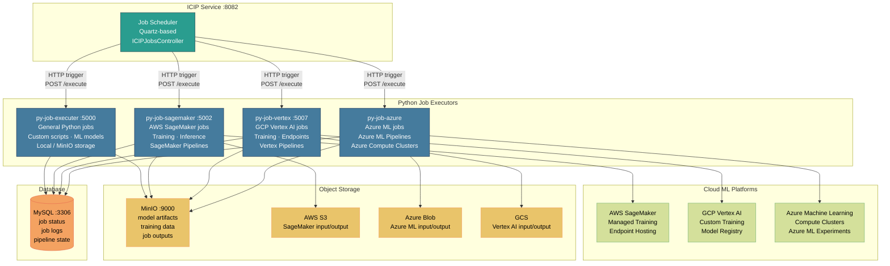

---

## 7. Data & Storage Layer

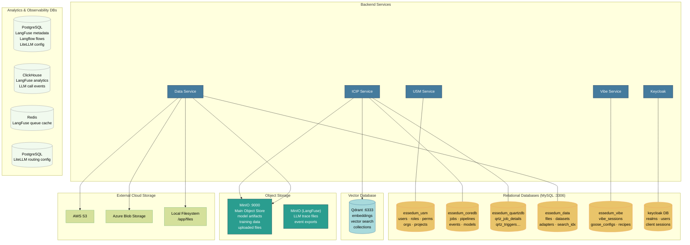

---

## 8. Developer Tooling & Code Build Pipeline

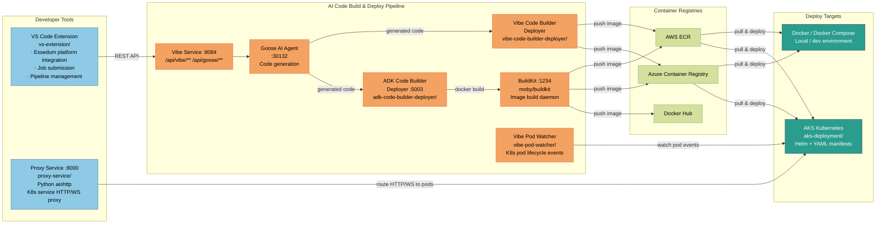

---

## 9. Deployment Topology (Docker Compose)

> Full Docker Compose deployment details — all services, images, ports, volumes, networks, startup order, and access URLs — are documented in **[DOCKERDEPLOYMENT.md](DOCKERDEPLOYMENT.md)**.

```mermaid
graph TB
    subgraph DockerCompose["docker-compose.yml  (docker/)"]

        subgraph CoreStack["Core Application Stack"]
            FE["frontend\nNginx :8084/:8086/:8087/:4000"]
            BE["leap-app-backend-service\nSpring Boot :8082"]
            KC["keycloak\n:8180"]
            PROXY["proxy-service\n:8000"]
        end

        subgraph JobStack["Job Executor Stack"]
            PYJOB["py-job-executor\n:5000"]
            PYSM["py-job-sagemaker\n:5002"]
            PYVERTEX["py-job-vertex\n:5007"]
        end

        subgraph BuildStack["Build & Deploy Stack"]
            BUILDKIT["buildkitd\n:1234\nmoby/buildkit"]
            ADK["adk-code-builder\n:5003"]
        end

        subgraph DataStack["Data Infrastructure"]
            MYSQL["mysql:8.0\n:3306"]
            QDRANT["qdrant/qdrant\n:6333"]
            MINIO_SVC["minio\n:9000 / :9001"]
        end

        subgraph LLMStack["LLM Infrastructure"]
            OLLAMA_SVC["ollama/ollama\n:11434"]
            LITELLM_SVC["litellm\n:4000"]
            LITELLM_PG["litellm-postgres\nPostgreSQL :5432"]
            LANGFLOW_SVC["langflow-stable\n:7860"]
            LANGFLOW_PG["langflow-stable-postgres\nPostgreSQL"]
        end

        subgraph ObsStack["Observability Stack  (LangFuse)"]
            LANGFUSE_WEB["langfuse-web\n:3000"]
            LANGFUSE_WRK["langfuse-worker"]
            LF_PG["langfuse-postgres\nPostgreSQL :5434"]
            LF_CH["clickhouse\n:8123 / :9000"]
            LF_REDIS["redis:7-alpine\n:6379"]
            LF_MINIO["langfuse-minio\n:9100 / :9101"]
        end
    end

    subgraph External["External Access"]
        BROWSER_DC["Browser / Client"]
    end

    BROWSER_DC --> FE

    FE -->|"ESSEDUM_BACKEND_UPSTREAM"| BE
    FE -->|"ESSEDUM_KEYCLOAK_UPSTREAM"| KC

    BE --> MYSQL & QDRANT & MINIO_SVC
    KC --> MYSQL

    PYJOB & PYSM & PYVERTEX --> MYSQL & MINIO_SVC

    ADK --> BUILDKIT

    LITELLM_SVC --> OLLAMA_SVC & LITELLM_PG
    LITELLM_SVC --> LANGFUSE_WEB

    LANGFLOW_SVC --> LANGFLOW_PG

    LANGFUSE_WEB --> LF_PG
    LANGFUSE_WRK --> LF_CH & LF_REDIS & LF_MINIO

    classDef core  fill:#457b9d,stroke:#1d3557,color:#fff
    classDef job   fill:#8ecae6,stroke:#457b9d,color:#000
    classDef build fill:#f4a261,stroke:#e76f51,color:#000
    classDef data  fill:#e9c46a,stroke:#f4a261,color:#000
    classDef llm   fill:#a8dadc,stroke:#457b9d,color:#000
    classDef obs   fill:#d4e09b,stroke:#7db87a,color:#000

    class FE,BE,KC,PROXY core
    class PYJOB,PYSM,PYVERTEX job
    class BUILDKIT,ADK build
    class MYSQL,QDRANT,MINIO_SVC data
    class OLLAMA_SVC,LITELLM_SVC,LITELLM_PG,LANGFLOW_SVC,LANGFLOW_PG llm
    class LANGFUSE_WEB,LANGFUSE_WRK,LF_PG,LF_CH,LF_REDIS,LF_MINIO obs
```

---

## 10. Kubernetes / AKS Deployment

> Full deployment details — namespace topology, ingress routing, HPA config, persistent volumes, secrets, and container registry — are documented in **[K8DEPLOYMENT.md](K8DEPLOYMENT.md)**.
> AKS manifest inventory and startup order: **[AKSDEPLOYMENT.md](AKSDEPLOYMENT.md)**.

The platform runs in a single AKS cluster across 6 namespaces:

| Namespace | Role |
|---|---|
| `aipns` | All platform services — frontend, backend, auth, data, Vibe, Python executor |
| `vibe-apps` | Dynamically spawned Vibe coding session pods |
| `vibe-mcp` | Dynamically spawned MCP server pods |
| `vibe-agents` | Dynamically spawned ADK / LangGraph agent pods |
| `ingress-nginx` | Nginx Ingress Controller |
| `metallb-system` | MetalLB load balancer (bare-metal / on-prem clusters) |

External traffic enters through **ingress-nginx** → reaches the appropriate service by hostname and path. Four HPAs (API Gateway, Frontend, Python Executor, Keycloak) provide automatic horizontal scaling. All workloads pull images from an in-cluster registry at `localhost:5000`.

---

## 11. End-to-End Request Flow

---

## 12. Cross-Service Interaction Flows

These flows document how services collaborate to deliver the platform's key capabilities. Each service's internal steps are intentionally abbreviated here — refer to the [Service Architecture Index](#service-architecture-index) for what happens inside each service.

---

### Flow 1 — User Login and First Authenticated API Call

Covers: Browser → Nginx → Keycloak → Gateway → USM

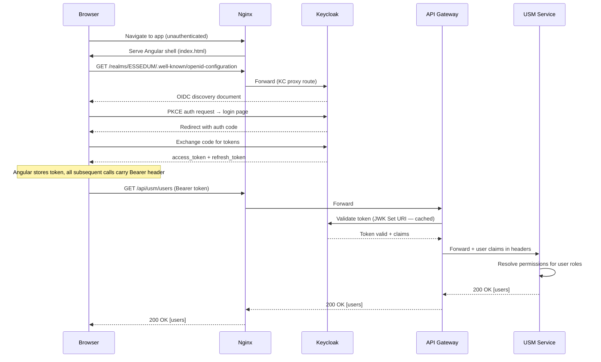

---

### Flow 2 — Pipeline Execution End-to-End

Covers: ICIP → Python Executor → Data Service → MinIO → ICIP (completion)

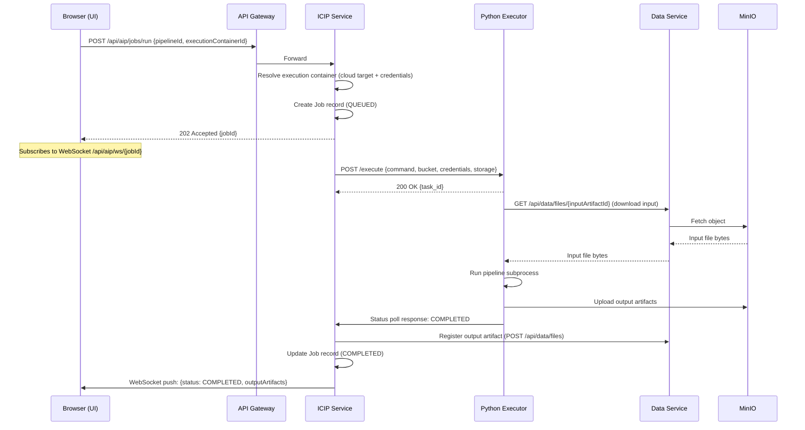

---

### Flow 3 — Agent Design to Kubernetes Deployment

Covers: Agent Designer Backend → Vibe Code Builder Deployer → BuildKit → Kubernetes → Proxy Service + Vibe Pod Watcher

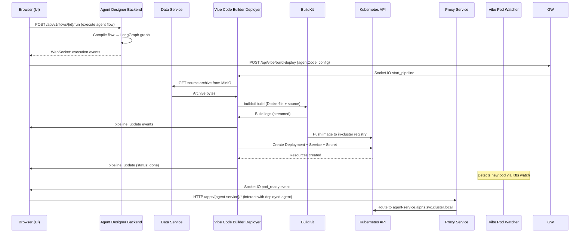

---

### Flow 4 — RAG Pipeline (Document Ingestion → Query)

Covers: Data Service → Qdrant → ICIP → LiteLLM → LLM provider

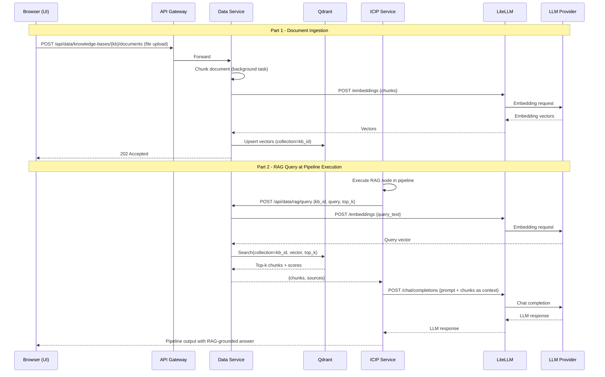

---

### Flow 5 — Vibe AI Coding Session (Code Generation → GitHub Push)

Covers: Vibe Service → Goose AI → Vibe Service → GitHub

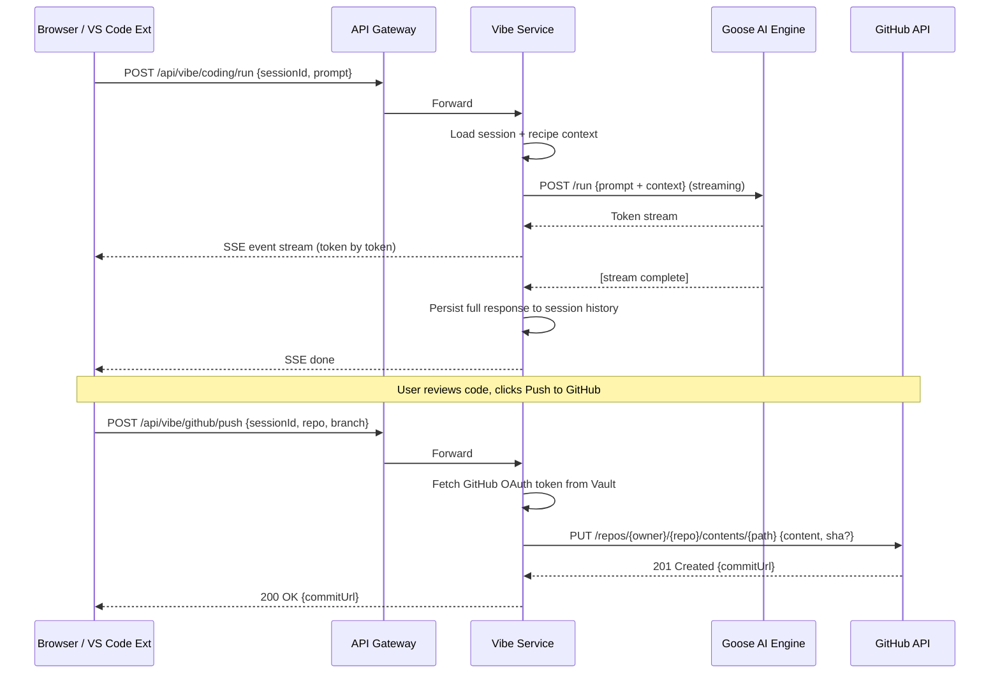

---

### Flow 6 — LLM Call with Observability (LiteLLM → LangFuse)

Covers: Any service → LiteLLM → LLM provider → LangFuse trace

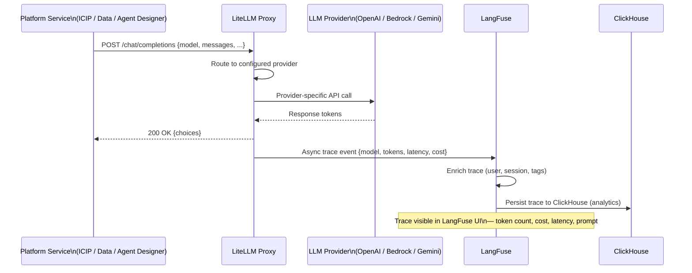

---

### Flow 7 — Model Training to Endpoint Deployment

Covers: ICIP → SageMaker Executor → AWS SageMaker → ICIP model registry → endpoint

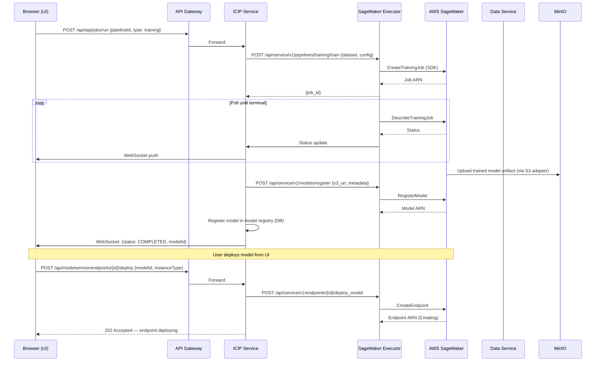

---

## Component Port Reference

| Component | Port | Technology | Purpose |
|---|---|---|---|
| Nginx (Frontend) | 8084 | Nginx | Reverse proxy + static serving |
| API Gateway | 8080 | Spring Cloud Gateway | Backend routing + JWT validation |
| Eureka Discovery | 8761 | Spring Cloud Eureka | Service registry |
| USM Service | 8081 | Spring Boot | User & security management |
| ICIP Service | 8082 | Spring Boot | AI/ML pipelines & jobs |
| Data Service | 8083 | Spring Boot | Files & data adapters |
| Vibe Service | 8084 | Spring Boot | AI-assisted coding |
| Keycloak | 8180 | Keycloak 25 | OIDC identity provider |
| Proxy Service | 8000 | Python/aiohttp | K8s service proxy |
| py-job-executer | 5000 | Python/Flask | General Python job executor |
| py-job-sagemaker | 5002 | Python/Flask | AWS SageMaker executor |
| py-job-vertex | 5007 | Python/Flask | GCP Vertex AI executor |
| ADK Code Builder | 5003 | Python | Container image builder |
| BuildKit | 1234 | moby/buildkit | Image build daemon |
| MySQL | 3306 | MySQL 8.0 | Relational data store |
| Qdrant | 6333 | Qdrant | Vector database |
| MinIO (main) | 9000 | MinIO | Object storage |
| MinIO Console | 9001 | MinIO | Object storage UI |
| Ollama | 11434 | Ollama | Local LLM runner |
| LiteLLM | 4000 | LiteLLM | Unified LLM proxy |
| Langflow | 7860 | Langflow | Visual AI pipeline builder |
| LangFuse | 3000 | LangFuse | LLM observability |
| ClickHouse | 8123 | ClickHouse | Analytics events store |
| Redis | 6379 | Redis 7 | Cache / message queue |

---

*Document auto-generated from codebase analysis — 2026-07-13*

---

## Service Architecture Index

Detailed architecture for each service — internal component diagrams, dependency maps, architectural decisions, and significant flows.

### Java Backend

| Service | Architecture Doc |
|---|---|
| Backend Overview | [sv/docs/ARCHITECTURE.md](../sv/docs/ARCHITECTURE.md) |
| API Gateway | [sv/api-gateway/docs/ARCHITECTURE.md](../sv/api-gateway/docs/ARCHITECTURE.md) |
| USM Service | [sv/usm-service/docs/ARCHITECTURE.md](../sv/usm-service/docs/ARCHITECTURE.md) |
| ICIP Service | [sv/icip-service/docs/ARCHITECTURE.md](../sv/icip-service/docs/ARCHITECTURE.md) |
| Data Service | [sv/data-service/docs/ARCHITECTURE.md](../sv/data-service/docs/ARCHITECTURE.md) · [OpenAPI Spec](../sv/data-service/docs/openapi.yaml) |
| Vibe Service | [sv/vibe-service/docs/ARCHITECTURE.md](../sv/vibe-service/docs/ARCHITECTURE.md) |

### AI / Agent Backend

| Service | Architecture Doc |
|---|---|
| Agent Designer Backend | [agent-designer-backend/docs/ARCHITECTURE.md](../agent-designer-backend/docs/ARCHITECTURE.md) |

### Python Job Executors

| Service | Architecture Doc |
|---|---|
| General Python Executor | [py-job-executer/docs/ARCHITECTURE.md](../py-job-executer/docs/ARCHITECTURE.md) |
| SageMaker Executor | [py-job-sagemaker-executer/docs/ARCHITECTURE.md](../py-job-sagemaker-executer/docs/ARCHITECTURE.md) |
| Vertex AI Executor | [py-job-vertex-executer/docs/ARCHITECTURE.md](../py-job-vertex-executer/docs/ARCHITECTURE.md) |
| Azure ML Executor | [py-job-azure-executer/docs/ARCHITECTURE.md](../py-job-azure-executer/docs/ARCHITECTURE.md) |

### Infrastructure & Developer Tools

| Service | Architecture Doc |
|---|---|
| Nginx | [nginx/docs/ARCHITECTURE.md](../nginx/docs/ARCHITECTURE.md) |
| Proxy Service | [proxy-service/docs/ARCHITECTURE.md](../proxy-service/docs/ARCHITECTURE.md) |
| S3Proxy | [s3proxy/docs/ARCHITECTURE.md](../s3proxy/docs/ARCHITECTURE.md) |
| Vibe Pod Watcher | [vibe-pod-watcher/docs/ARCHITECTURE.md](../vibe-pod-watcher/docs/ARCHITECTURE.md) |
| Vibe Code Builder Deployer | [vibe-code-builder-deployer/docs/ARCHITECTURE.md](../vibe-code-builder-deployer/docs/ARCHITECTURE.md) |
| ADK Code Builder Deployer | [adk-code-builder-deployer/docs/ARCHITECTURE.md](../adk-code-builder-deployer/docs/ARCHITECTURE.md) |
| VS Code Extension | [vs-extension/docs/ARCHITECTURE.md](../vs-extension/docs/ARCHITECTURE.md) |
