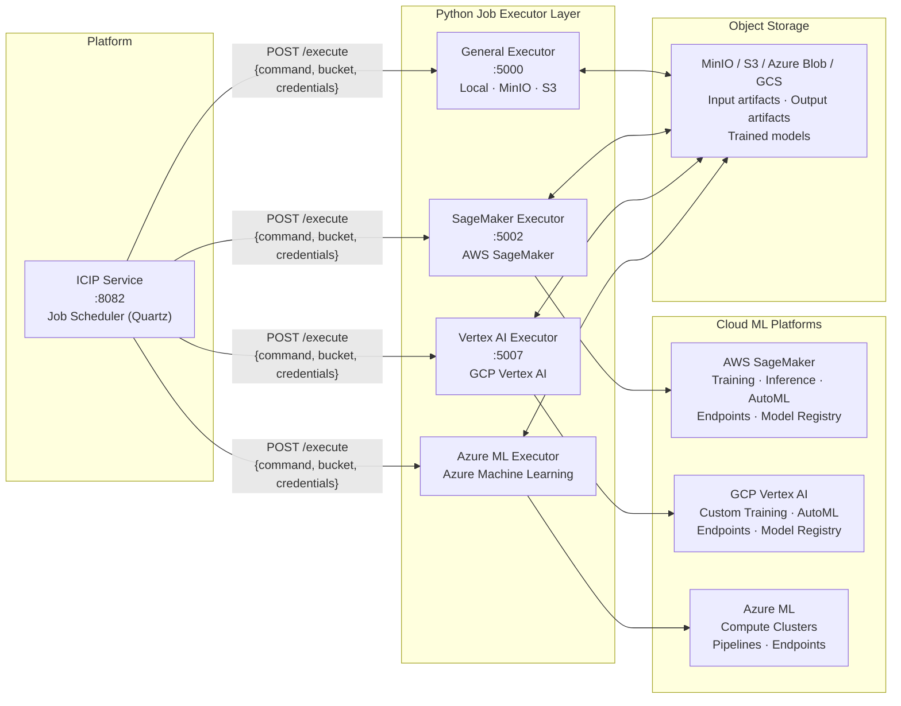
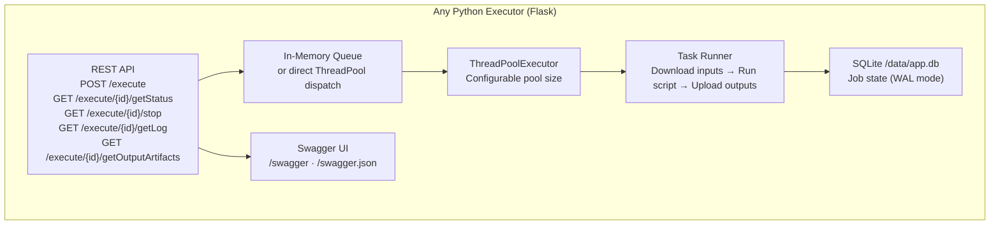
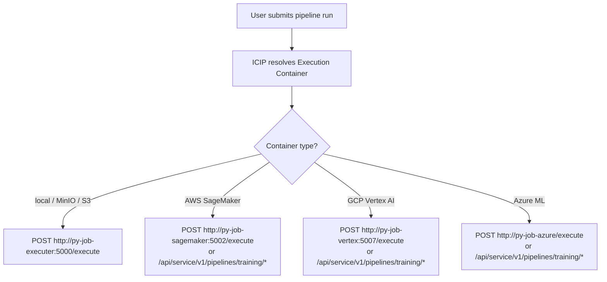
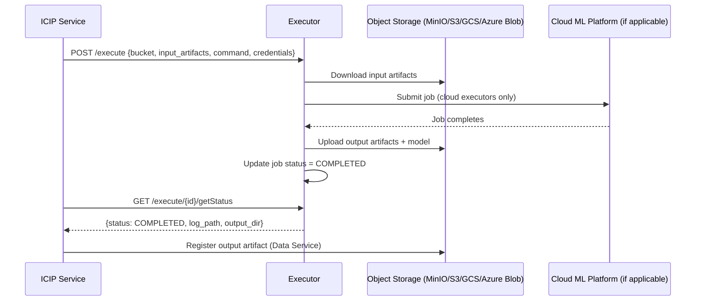

# Job Executor Layer — Architecture

> **See also:** [Platform Architecture](ARCHITECTURE.md#6-python-job-executor-layer) · Individual executor docs linked below.

---

## 1. Functional Role

The job executor layer is the **cloud ML execution bridge** between the Essedum platform and external compute infrastructure. When a user runs a pipeline, the ICIP Service selects the appropriate executor based on the pipeline's *execution container* configuration, submits the job over HTTP, and polls for status. The executor handles everything from that point: downloading input artifacts, running the script (locally or on a cloud platform), uploading output artifacts, and reporting the final status.

---

## 2. Common Architecture (All Executors)

All four executors share the same base design pattern:

**Shared behaviour across all executors:**

| Concern | Behaviour |
|---|---|
| Job submission | Returns `task_id` immediately (HTTP 202/200); execution is async |
| Job state | Persisted in SQLite (`/data/app.db`, WAL mode) — survives restarts |
| Concurrency | Configurable thread pool (`conf/conf.ini` → `ThreadCount`) |
| Job cancellation | OS process-tree kill for running jobs; `future.cancel()` for queued jobs |
| Security | UUID validation on all `/{id}/*` routes; path-traversal guards on filesystem access |
| API docs | Swagger UI at `/swagger`; spec at `/swagger.json` |

---

## 3. Executor Variants

Each executor builds on the common base and adds a **cloud MLOps API layer** specific to its target platform.

### General Python Executor (`py-job-executer`)

**Target:** Local execution, MinIO, AWS S3  
**Extra capability:** None beyond the base — pure subprocess execution with local/MinIO/S3 storage. Also provides function-adapter execution (dynamic script generation + pip install) and virtual environment management.

| Endpoint group | Purpose |
|---|---|
| `/execute/*` | Base job lifecycle |
| `/api/service/v1/function/execute` | Dynamic Python script generation and execution |
| `/venvs` | Virtual environment list and deletion |

→ [Detailed architecture](../py-job-executer/docs/ARCHITECTURE.md)

---

### SageMaker Executor (`py-job-sagemaker-executer`)

**Target:** AWS SageMaker  
**Extra capability:** Full SageMaker MLOps API — dataset management, model registry, endpoint lifecycle, AutoML, custom script training, inference pipelines, cloud connectivity test.

| Endpoint group | Purpose |
|---|---|
| `/execute/*` | Base job lifecycle |
| `/api/service/v1/datasets/*` | SageMaker dataset CRUD |
| `/api/service/v1/models/*` | SageMaker model registry |
| `/api/service/v1/endpoints/*` | Endpoint registration, deploy, infer, explain, undeploy |
| `/api/service/v1/pipelines/training/*` | AutoML + custom script training |
| `/api/service/v1/pipelines/inference/*` | Inference pipeline jobs |
| `/cloudconnect` | SageMaker connectivity test |

Authentication to AWS uses `AWS_ACCESS_KEY_ID` + `AWS_SECRET_ACCESS_KEY` from environment variables.

→ [Detailed architecture](../py-job-sagemaker-executer/docs/ARCHITECTURE.md)

---

### Vertex AI Executor (`py-job-vertex-executer`)

**Target:** GCP Vertex AI  
**Extra capability:** Identical API surface to the SageMaker executor, targeting GCP. Supports AutoML, custom training, model registry, and batch/online endpoints.

Authentication uses `GOOGLE_APPLICATION_CREDENTIALS` (Service Account JSON) or Application Default Credentials.

→ [Detailed architecture](../py-job-vertex-executer/docs/ARCHITECTURE.md)

---

### Azure ML Executor (`py-job-azure-executer`)

**Target:** Microsoft Azure ML  
**Extra capability:** Azure-specific MLOps API. Handles Azure ML workspace authentication via Service Principal (`tenant_id`, `service_principal_id`, `service_principal_password`), dataset management, AutoML training, model registration, and batch endpoint deployment.

Proxy environment variables are explicitly cleared before any Azure SDK calls to ensure direct connectivity to Azure endpoints.

→ [Detailed architecture](../py-job-azure-executer/docs/ARCHITECTURE.md)

---

## 4. How ICIP Selects an Executor

Each pipeline in Essedum is linked to an **execution container** — a named configuration record that stores the target platform type and credentials. When a job is submitted, the ICIP Service reads the execution container, resolves the executor URL from the container configuration, and forwards the job.

---

## 5. Artifact Flow

All executors follow the same artifact lifecycle:

---

## 6. Deployment

In Kubernetes (AKS), only the **general Python executor** (`pyjob-executor`) runs as a platform-managed deployment with an HPA (1–3 replicas, CPU/Mem 70%). The cloud-specific executors run as separate pods configured per deployment environment.

In Docker Compose, three executors run by default: `py-job-executor` (:5000), `py-job-sagemaker-executer` (:5002), and `py-job-vertex-executer` (:5007). The Azure executor is started separately when needed.

| Executor | K8s manifest | Docker Compose service | Default port |
|---|---|---|---|
| General | `aks-deployment/pyjob-executor.yaml` | `py-job-executor` | 5000 |
| SageMaker | — | `py-job-sagemaker-executer` | 5002 |
| Vertex AI | — | `py-job-vertex-executer` | 5007 |
| Azure ML | — | (separate) | — |
