# Kubernetes / AKS Deployment Architecture

> **Manifests location:** [`aks-deployment/`](../aks-deployment/)  
> **Related:** [Platform Architecture](ARCHITECTURE.md#10-kubernetes--aks-deployment)

---

## Table of Contents

1. [Cluster Topology](#1-cluster-topology)
2. [Namespace Summary](#2-namespace-summary)
3. [Ingress Routing](#3-ingress-routing)
4. [Horizontal Pod Autoscalers](#4-horizontal-pod-autoscalers)
5. [Persistent Volumes](#5-persistent-volumes)
6. [Secrets and Config](#6-secrets-and-config)
7. [Container Image Registry](#7-container-image-registry)

---

## 1. Cluster Topology

```mermaid
graph TB
    subgraph Internet
        CLIENT["Browser / VS Code / REST client"]
    end

    subgraph AKS["AKS Cluster"]

        subgraph IngressNS["ingress-nginx namespace"]
            ING_CTRL["ingress-nginx controller\ningress-nginx-deploy.yaml"]
        end

        subgraph MetalLB["metallb-system"]
            LB["MetalLB LoadBalancer\nmetallib-config.yaml"]
        end

        subgraph aipns["aipns  — primary application namespace"]
            direction TB

            subgraph Ingresses["Ingress Rules"]
                ING_FE["essedum-frontend-ingress\nHost: essedum.az.ad.idemo-ppc.com → shell :8084"]
                ING_MFE["essedum-frontend-mfe-ingress\n/agent → agent :8082\n/data-ops → data-ops :8082\n/integration → integration :8082\n/vibe-studio → vibe-studio :8082"]
                ING_API["essedum-api-ingress\nHost: essedum.az.ad.idemo-ppc.com → api-gateway :8080"]
                ING_KC["keycloak-ingress\nHost: essedum.az.ad.idemo-ppc.com → keycloak :8443"]
                ING_LFN["essedum-ingress (LFN)\nHost: lfn.essedum.anuket.iol.unh.edu → frontend :8084"]
            end

            subgraph FrontendWL["Frontend Workloads"]
                SHELL["essedum-frontend-shell\nimage: essedum-ui\nport 8082 + 8084\nHPA: 1–5 replicas / CPU 50%"]
                AGENT_FE["essedum-frontend-agent\nAgent Designer UI\nport 8082"]
                DATA_OPS_FE["essedum-frontend-data-ops\nport 8082"]
                INT_FE["essedum-frontend-integration\nport 8082"]
                VIBE_ST["essedum-frontend-vibe-studio\nport 8082"]
            end

            subgraph BackendWL["Backend Workloads"]
                GW_DEP["essedum-backend-api-gateway\nimage: essedum-api-gateway\nport 8080\nHPA: 1–5 replicas / CPU+Mem 50%"]
                USM_DEP["essedum-backend-usm\nimage: essedum-usm-service\nport 8081 · req 200m/512Mi · lim 2/2Gi"]
                ICIP_DEP["essedum-backend-icip\nimage: essedum-icip-service\nport 8082 · req 200m/512Mi · lim 2/2Gi"]
                DATA_DEP["essedum-backend-data\nimage: essedum-data-service\nport 8083 · req 200m/512Mi · lim 2/2Gi"]
                VIBE_DEP["essedum-backend-vibe\nimage: essedum-vibe-service\nport 8084"]
                PYJOB["pyjob-executor\nimage: pyjob-excecutor\nport 5000 · req 100m/256Mi · lim 500m/512Mi\nHPA: 1–3 replicas / CPU+Mem 70%"]
            end

            subgraph InfraWL["Infrastructure Workloads"]
                KC_DEP["keycloak\nimage: keycloak:26.2.3\nport 8443 · req 500m/1Gi · lim 2/2Gi\nHPA: 1–2 replicas / CPU+Mem 70%"]
                MYSQL_DEP["mysql\nimage: mysql:8.0\nport 3306\nPVC: 5Gi (mysql-file-pv.yaml)"]
                QDRANT_DEP["qdrant\nimage: qdrant/qdrant\nport 6333\nPVC: 10Gi (qdrantfilepv.yaml)"]
                LANGFLOW_DEP["langflow\nport 7860\nPVC: 5Gi (langflow_file_pv.yaml)"]
            end

            subgraph VibeInfra["Vibe Platform Workloads"]
                PROXY_DEP["proxy-service\nimage: proxy-service\nport 8080 · req 100m/128Mi · lim 500m/512Mi"]
                VCB_DEP["vibe-code-builder-service\nimage: vibe-code-builder-service\nport 5000 · req 200m/256Mi · lim 2/2Gi"]
                VPW_DEP["vibe-pod-watcher\nimage: vibe-pod-watcher\nport 5000 · req 50m/64Mi · lim 200m/128Mi"]
                BUILDER["builder-service\nimage: builder-service\nport 5000 · req 200m/256Mi · lim 2/2Gi"]
                GOOSE["goosed + goose-ui\nGoose AI engine + UI"]
            end
        end

        subgraph VibeAppsNS["vibe-apps namespace"]
            VA_PODS["Vibe App Pods\n(dynamically spawned per coding session)\nRBAC: vibe-apps-rbac.yaml"]
        end

        subgraph VibeMCPNS["vibe-mcp namespace"]
            MCP_PODS["MCP Server Pods\n(Model Context Protocol servers)\nRBAC: vibe-mcp-rbac.yaml"]
        end

        subgraph VibeAgentsNS["vibe-agents namespace"]
            AG_PODS["Agent Pods\n(dynamically spawned agents)\nRBAC: vibe-agents-rbac.yaml"]
        end
    end

    subgraph Registry["In-Cluster Registry"]
        REG["localhost:5000\nContainer Registry"]
    end

    CLIENT --> LB --> ING_CTRL
    ING_CTRL --> ING_FE & ING_MFE & ING_API & ING_KC & ING_LFN
    ING_FE & ING_LFN --> SHELL
    ING_MFE --> AGENT_FE & DATA_OPS_FE & INT_FE & VIBE_ST
    ING_API --> GW_DEP
    ING_KC --> KC_DEP

    GW_DEP --> USM_DEP & ICIP_DEP & DATA_DEP & VIBE_DEP
    ICIP_DEP --> PYJOB
    KC_DEP --> MYSQL_DEP
    USM_DEP & ICIP_DEP & DATA_DEP & VIBE_DEP --> MYSQL_DEP & QDRANT_DEP

    VCB_DEP --> VA_PODS & AG_PODS
    BUILDER --> VA_PODS
    PROXY_DEP --> VA_PODS & MCP_PODS & AG_PODS
    VPW_DEP --> VA_PODS & AG_PODS

    REG -.->|"image pull"| GW_DEP & USM_DEP & ICIP_DEP & DATA_DEP & VIBE_DEP & PYJOB & PROXY_DEP & VCB_DEP & VPW_DEP & BUILDER
```

---

## 2. Namespace Summary

| Namespace | Purpose | Key Workloads |
|---|---|---|
| `aipns` | Primary application namespace — all platform services | API Gateway, USM, ICIP, Data, Vibe, Keycloak, MySQL, Qdrant, Langflow, Python Executor, Proxy, Vibe Code Builder, Pod Watcher, Builder, Goose |
| `vibe-apps` | Dynamically spawned Vibe coding session containers | Created/deleted by Vibe Code Builder Deployer per user session |
| `vibe-mcp` | MCP (Model Context Protocol) server pods | Dynamically spawned MCP server instances |
| `vibe-agents` | Dynamically spawned ADK/LangGraph agent containers | Created/deleted by ADK Code Builder Deployer |
| `ingress-nginx` | Nginx Ingress Controller | Handles all external traffic routing |
| `metallb-system` | MetalLB load balancer | Assigns external IPs on bare-metal / on-prem clusters |

---

## 3. Ingress Routing

| Ingress | Hostname | Backend Service | TLS Secret |
|---|---|---|---|
| `essedum-frontend-ingress` | `essedum.az.ad.idemo-ppc.com` | `essedum-frontend-shell-service :8084` | `essedum-az-tls` |
| `essedum-frontend-mfe-ingress` | `essedum.az.ad.idemo-ppc.com` | Agent / Data-Ops / Integration / Vibe-Studio services `:8082` | `essedum-az-tls` |
| `essedum-api-ingress` | `essedum.az.ad.idemo-ppc.com` | `essedum-backend-api-gateway-service :8080` | `essedum-az-tls` |
| `keycloak-ingress` | `essedum.az.ad.idemo-ppc.com` | `keycloak :8443` | `essedum-az-tls` |
| `essedum-ingress` (LFN) | `lfn.essedum.anuket.iol.unh.edu` | `essedum-frontend-ui-service :8084` | `essedum-secret` |
| `vibe-code-builder-ingress` | cluster-internal | `vibe-code-builder-service :5000` | — |
| `vibe-pod-watcher-ingress` | cluster-internal | `vibe-pod-watcher :5000` | — |

All ingress rules use `ingressClassName: nginx`. The API and auth backends use `nginx.ingress.kubernetes.io/backend-protocol: HTTPS` with SSL verification disabled (`proxy-ssl-verify: off`).

---

## 4. Horizontal Pod Autoscalers

| HPA | Workload | Min | Max | Scale Trigger |
|---|---|---|---|---|
| `essedum-backend-api-gateway-hpa` | API Gateway | 1 | 5 | CPU 50% · Memory 50% |
| `essedum-frontend-ui-hpa` | Frontend UI | 1 | 5 | CPU 50% · Memory 50% |
| `pyjob-executor-hpa` | Python Executor | 1 | 3 | CPU 70% · Memory 70% |
| `keycloak-hpa` | Keycloak | 1 | 2 | CPU 70% · Memory 70% |

All other services (USM, ICIP, Data, Vibe, Proxy, etc.) run at `replicas: 1` with no HPA — scale by redeploying with a higher replica count.

---

## 5. Persistent Volumes

| PVC / PV File | Capacity | Mount | Used By |
|---|---|---|---|
| `mysql_file_pv.yaml` | 5 Gi | `/var/lib/mysql` | MySQL — all service databases |
| `qdrantfilepv.yaml` | 10 Gi | `/qdrant/storage` | Qdrant — vector embeddings |
| `langflow_file_pv.yaml` | 5 Gi | `/app/langflow` | Langflow — flow definitions |

---

## 6. Secrets and Config

| Secret | Used By | Contains |
|---|---|---|
| `essedum-db-secret` | USM, ICIP, Data, Vibe | MySQL host, user, password, DB names |
| `essedum-encryption-secret` | USM, ICIP, Data | AES-GCM encryption key + salt |
| `essedum-minio-secret` | API Gateway | MinIO endpoint, access key, secret key |
| `essedum-vibe-secret` | Vibe Service | Goose API URL, GitHub OAuth credentials |
| `essedum-az-tls` | Ingress rules | TLS certificate + key for `*.az.ad.idemo-ppc.com` |
| `essedum-secret` | LFN ingress | TLS certificate + key for `lfn.essedum.anuket.iol.unh.edu` |
| `vibe-code-builder-secret` | Vibe Code Builder | Registry credentials, K8s service account |

All secrets are referenced by name in `envFrom` / `secretKeyRef` blocks — no values are stored in manifest files.

---

## 7. Container Image Registry

All platform services pull images from an **in-cluster registry at `localhost:5000`**. Image tags follow the pattern `<service-name>:v<N>` (e.g., `essedum-icip-service:v17`). The registry is a cluster-local deployment accessible only within the cluster network — no external registry credentials are required for core services.

The Frontend UI image is an exception: it pulls from Azure Container Registry (`acrreq0762935.azurecr.io/essedum-ui:latest`) in the Azure deployment variant.
