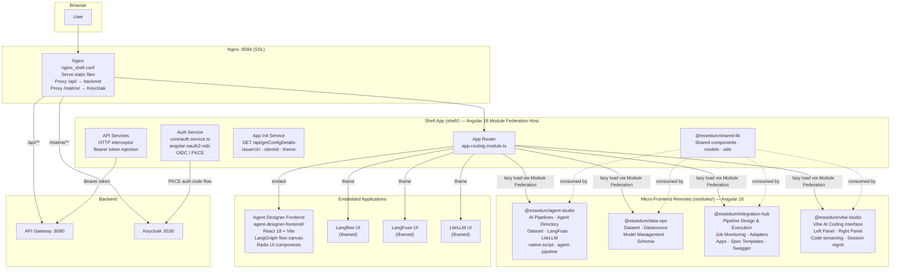
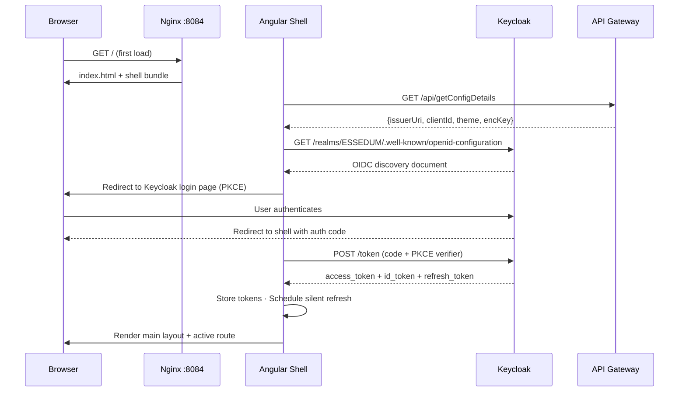
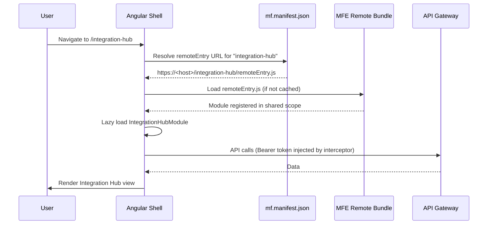

# Essedum UI — Architecture

---

## 1. Service Architecture

The frontend is a **Micro-Frontend (MFE) shell application** built on Angular 18 and Webpack Module Federation. A single shell host loads feature modules on demand; each module is an independently built and deployed Angular remote. One embedded React/Vite application (Agent Designer) is integrated via iframe. Nginx serves all artefacts on port 8084 and proxies all `/api/**` calls to the backend gateway.



**Component responsibilities:**

- **Shell App** — owns routing, authentication, global layout, and shared library. It is the Module Federation host; it loads no business logic of its own beyond bootstrap concerns.
- **Agent Studio MFE** — AI pipeline authoring, agent directory, dataset management, LangFuse/LiteLLM integration.
- **Data Ops MFE** — Dataset, datasource, model, and schema management.
- **Integration Hub MFE** — Pipeline design and execution, job monitoring, adapter configuration, app management.
- **Vibe Studio MFE** — Vibe AI coding interface; renders the coding session view with real-time SSE streaming.
- **Agent Designer Frontend** — Standalone React/Vite application for visual LangGraph agent design. Embedded within the shell via routing.
- **Nginx** — Serves all compiled static assets and terminates TLS. Proxies `/api/**` to the backend gateway and `/realms/**` to Keycloak.

---

## 2. Module Federation Layout

The shell uses the `@angular-architects/module-federation` manifest pattern. Remote URLs are resolved at runtime from a manifest file, not hardcoded in the webpack config.

```
Shell (host)
  └── webpack.config.js
        ModuleFederationPlugin
          shared singletons: @angular/core, @angular/common, @angular/router,
                             @angular/forms, @angular/material
          remotes: (resolved dynamically via mf.manifest.json at runtime)

Remotes (each independently built):
  modules/agent-studio/     → exposes AgentStudioModule
  modules/data-ops/         → exposes DataOpsModule
  modules/integration-hub/  → exposes IntegrationHubModule
  modules/vibe-studio/      → exposes VibeStudioModule
```

Each remote is built to its own `dist/` directory and served by Nginx under a path prefix. The shell loads the remote entry URL from the manifest at bootstrap and then lazy-loads the module when the user navigates to that route.

---

## 3. Dependency Map

| Dependency | Type | Purpose |
|---|---|---|
| API Gateway `:8080` | External (HTTP via Nginx proxy) | All platform REST API calls — pipelines, jobs, files, auth |
| Keycloak `:8180` | External (HTTPS via Nginx proxy) | OIDC discovery, authorization endpoint, token endpoint |
| `angular-oauth2-oidc` | Library | OIDC/PKCE flow, token storage, silent refresh |
| `@angular-architects/module-federation` | Library | Module Federation host setup, manifest-based remote loading |
| `@angular/material` | Library (shared singleton) | UI components across shell and all MFEs |
| `@essedum/shared-lib` | Workspace library | Shared models, services, and UI components across MFEs |
| Langflow UI | External (iframe) | Visual AI pipeline builder — embedded at configured URL |
| LangFuse UI | External (iframe) | LLM observability dashboard — embedded at configured URL |
| LiteLLM UI | External (iframe) | LLM proxy dashboard — embedded at configured URL |

---

## 4. Architectural Decisions

### AD-UI1 — Module Federation for MFE composition
**Decision:** The frontend is split into one shell host and four Angular MFE remotes, composed at runtime via Webpack Module Federation.
**Reason:** Each MFE (Agent Studio, Data Ops, Integration Hub, Vibe Studio) maps to a distinct product domain. MFE isolation means teams can build, test, and deploy each module independently without rebuilding the full frontend.

### AD-UI2 — Dynamic remote loading via manifest (no hardcoded remote URLs)
**Decision:** Remote MFE entry URLs are resolved at runtime from `mf.manifest.json`, not as static entries in webpack config.
**Reason:** Static remote URLs in webpack config require a full shell rebuild every time a remote URL changes (e.g., version bump, environment change). The manifest approach lets remote addresses be updated without touching the shell bundle.

### AD-UI3 — Angular singletons shared across shell and all MFEs
**Decision:** `@angular/core`, `@angular/common`, `@angular/router`, `@angular/forms`, and `@angular/material` are declared as `singleton: true` in Module Federation shared config.
**Reason:** Multiple instances of Angular's core modules in the same browser context cause runtime errors. Singletons ensure one instance is shared, reducing bundle size and preventing DI conflicts between shell and remotes.

### AD-UI4 — OIDC/PKCE authentication owned exclusively by the shell
**Decision:** Authentication (OIDC flow, token storage, token refresh) lives entirely in the shell's `core/auth.service.ts`. MFEs consume the token via a shared HTTP interceptor — they do not implement auth themselves.
**Reason:** Auth state must be consistent across all MFEs. Centralising it in the shell ensures one token lifecycle, one refresh timer, and one logout handler regardless of which MFE is active.

### AD-UI5 — Agent Designer as a separate React/Vite application
**Decision:** The LangGraph Agent Designer is built as a standalone React + Vite application, embedded within the shell via Angular routing.
**Reason:** The Agent Designer requires a rich, graph-canvas-based UI built with React-specific libraries (Radix UI, React Flow). Rewriting it in Angular would be prohibitive. Embedding it as a standalone app preserves the React ecosystem while keeping it navigable from the Angular shell.

### AD-UI6 — External UIs (Langflow, LangFuse, LiteLLM) embedded as iframes
**Decision:** Third-party platform UIs are embedded as iframes at configured URLs, not rewritten or proxied as components.
**Reason:** These tools have their own complex UIs maintained upstream. Iframing them gives users a unified experience within the Essedum shell without owning or maintaining their frontend code.

---

## 5. Architecturally Significant Flows

### Flow 1 — App Bootstrap and OIDC Authentication



### Flow 2 — MFE Lazy Load on Navigation



### Flow 3 — API Call with Token Injection

```mermaid
sequenceDiagram
    participant MFE as MFE Component
    participant INTERCEPT as HTTP Interceptor (shell)
    participant NGX as Nginx
    participant GW as API Gateway

    MFE->>INTERCEPT: HttpClient.get('/api/aip/pipelines')
    INTERCEPT->>INTERCEPT: Read access_token from Auth Service
    alt Token expiring soon
        INTERCEPT->>INTERCEPT: Trigger silent token refresh
    end
    INTERCEPT->>NGX: GET /api/aip/pipelines\nAuthorization: Bearer <token>
    NGX->>GW: Proxy forward
    GW-->>NGX-->>INTERCEPT-->>MFE: 200 OK [pipelines]
```
