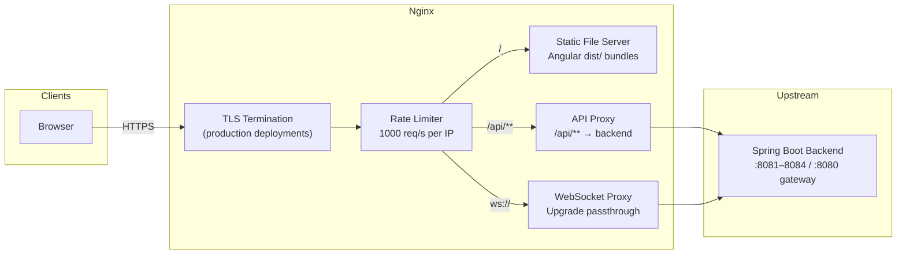
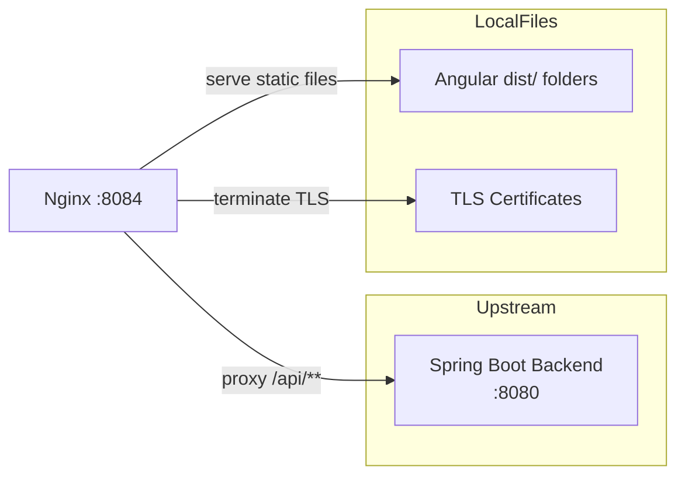
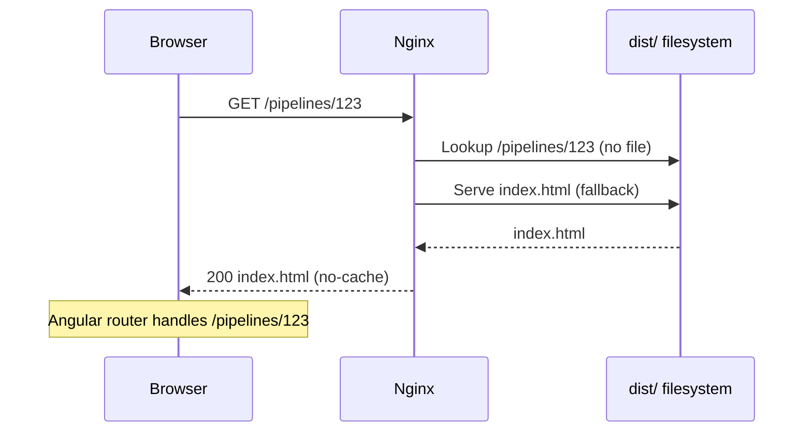
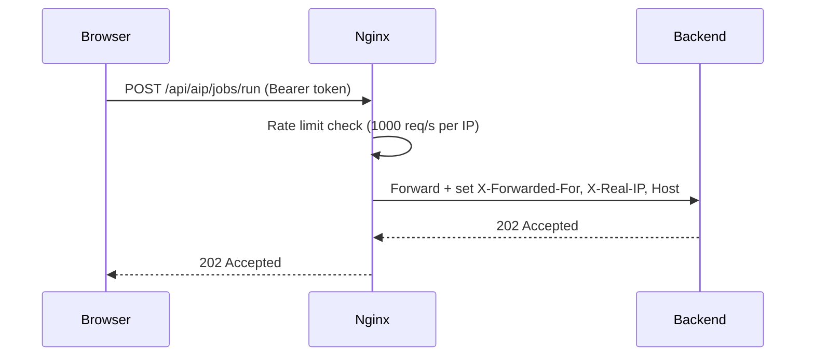

# Nginx — Architecture

---

## 1. Service Architecture

Nginx is a **stateless reverse proxy and static file server**. It has two concerns: serve compiled Angular bundles to browsers, and forward API/WebSocket requests to upstream services. All configuration is declarative — no custom code runs inside Nginx.

**Key configuration variants:**

| File | Purpose |
|---|---|
| `nginx.conf` | Local development — serves two apps on ports 8080 and 8082 |
| `nginx_ui.conf` | Production Docker — serves shell app and AIP micro-frontend with TLS |
| `nginx_ui_5g.conf` | 5G lab deployment variant |
| `nginx_mfe.conf` | Micro-frontend serving configuration |
| `nginx_shell.conf` | Shell-only serving |

---

## 2. Dependency Map

 Receives all `/api/**` traffic and WebSocket connections |
| Angular `dist/` folders | Local filesystem | Source of all static files served to browsers |
| TLS certificates | Local filesystem | Certificate + key files for HTTPS termination |

Nginx has **no dependency on any database, message queue, or external service**. It is purely a proxy and file server.

---

## 3. Architectural Decisions

### AD-NGX1 — Single reverse proxy for all concerns
**Decision:** TLS termination, rate limiting, CORS, request-size limits, and WebSocket upgrades are all handled at Nginx. Upstream services do not implement any of these.
**Reason:** Centralising these cross-cutting concerns at the edge avoids duplicating security and traffic controls across multiple services, reduces attack surface, and makes policy changes (e.g., rate limit values) a single-file edit.

### AD-NGX2 — SPA fallback to `index.html`
**Decision:** All unmatched paths under the frontend location are served `index.html` rather than returning 404.
**Reason:** Angular uses client-side routing. Direct navigation to a deep URL (e.g., `/pipelines/123`) would return 404 without this fallback, as no static file exists at that path. The fallback lets Angular's router handle the URL after the shell loads.

### AD-NGX3 — Static assets cached indefinitely, HTML not cached
**Decision:** CSS, JS, and images are served with `max` cache expiry; HTML is served with `epoch` (no-cache).
**Reason:** Angular appends content-hash suffixes to asset filenames on each build, so cached assets are always valid. The HTML shell file (`index.html`) must never be cached — it contains the references to the current asset hashes and must always be the latest version.

---

## 4. Architecturally Significant Flows

### Flow 1 — Browser SPA Navigation

### Flow 2 — API Request Proxy

