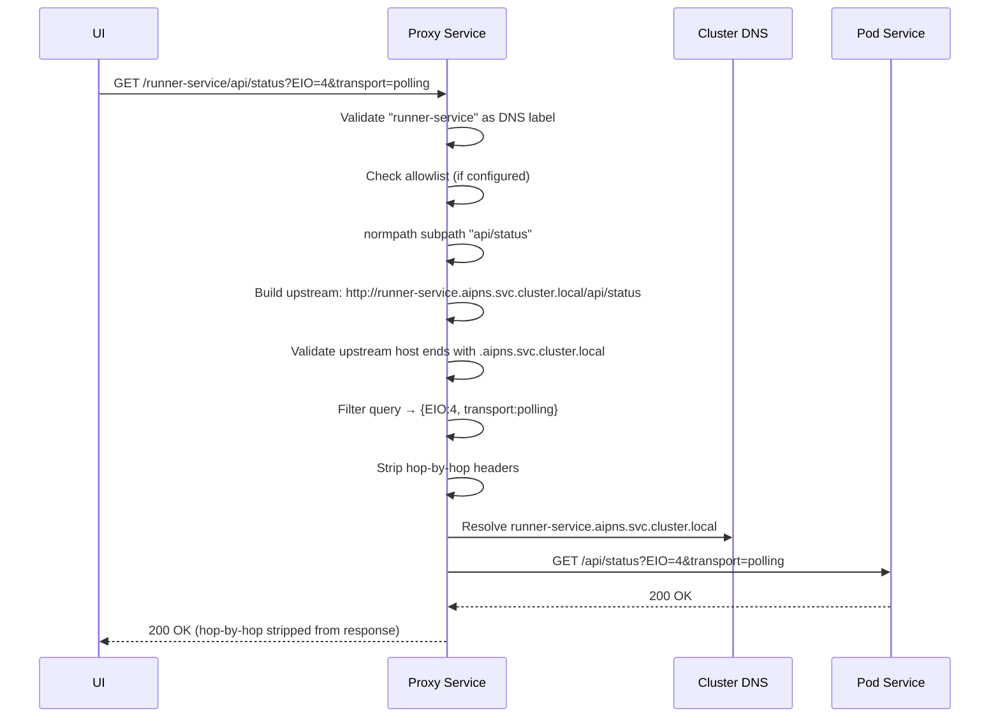
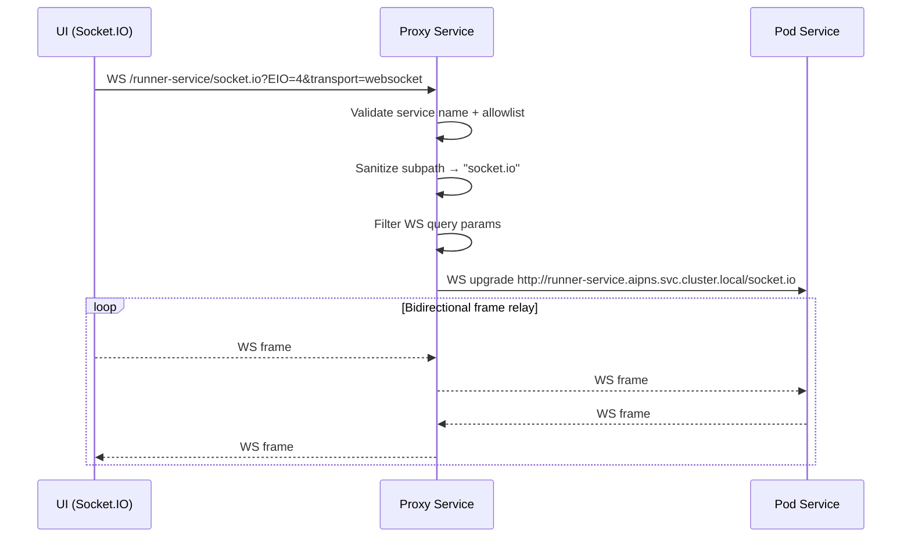

# Proxy Service — Architecture

---

## 1. Service Architecture

A fully async **aiohttp** application with two proxy handlers — one for HTTP/polling and one for WebSocket upgrades. Both handlers share the same service-name validation, allowlist check, subpath sanitization, and upstream URL validation before forwarding any request.

```mermaid
graph LR
    subgraph Inbound
        UI["Essedum UI\n(HTTP + Socket.IO WS)"]
    end

    subgraph Proxy Service
        HEALTH["Health\nGET /health"]
        VALIDATE["Validator\nDNS-label check · Allowlist check\nSubpath normpath · Upstream URL check"]
        HTTP_PROXY["HTTP Proxy\nForward HTTP + strip hop-by-hop\nFilter query params"]
        WS_PROXY["WebSocket Proxy\nBidirectional WS frame relay\nSocket.IO upgrade passthrough"]
    end

    subgraph Kubernetes Cluster
        POD_SVC["Pod Service\n{name}.{ns}.svc.cluster.local"]
    end

    UI -->|GET /{service}/{subpath}| HTTP_PROXY
    UI -->|WS /{service}/socket.io| WS_PROXY
    HTTP_PROXY --> VALIDATE --> POD_SVC
    WS_PROXY --> VALIDATE --> POD_SVC
```

---

## 2. Dependency Map

| Dependency | Type | Purpose |
|---|---|---|
| Kubernetes cluster DNS | Internal (DNS) | Resolve `{service}.{namespace}.svc.cluster.local` to pod IP |
| Target pod services | Internal (HTTP/WS) | Upstream endpoints for proxied requests |

The service has **no database, no authentication module, and no external dependencies** beyond the Kubernetes cluster network.

---

## 3. Architectural Decisions

### AD-PROXY1 — DNS-label validation as the primary SSRF defence
**Decision:** Service names from the URL path are validated against a strict DNS-label regex (`^[a-z0-9][a-z0-9-]{0,61}[a-z0-9]$`) before any upstream URL is constructed.
**Reason:** Without this, a caller could supply a service name like `../other-namespace/secret-service` or embed a full hostname to redirect the proxy to an arbitrary network target (SSRF). The DNS-label pattern guarantees only valid Kubernetes service names pass through.

### AD-PROXY2 — Upstream URL validated to remain within the cluster namespace
**Decision:** After the upstream URL is constructed, its host is checked to confirm it ends with `.{namespace}.svc.cluster.local` and uses the `http` scheme.
**Reason:** Defense-in-depth after the name validation. Even if an attacker bypasses the DNS-label check, the URL validation ensures the request cannot escape to an external host or use an unexpected scheme.

### AD-PROXY3 — Query parameters filtered to known Socket.IO set
**Decision:** Only `EIO`, `transport`, `t`, `sid`, `j` query parameters are forwarded to upstream services.
**Reason:** Arbitrary query parameters from user input could be used to inject unexpected arguments into the upstream service URL, potentially influencing its behaviour (query-string injection). Restricting to the known Socket.IO set closes this vector.

### AD-PROXY4 — Hop-by-hop headers stripped on both request and response
**Decision:** Standard hop-by-hop headers (`connection`, `keep-alive`, `transfer-encoding`, `upgrade`, `te`, `trailers`, `proxy-authenticate`, `proxy-authorization`) are removed before forwarding in either direction.
**Reason:** Hop-by-hop headers are connection-scoped and must not be forwarded by proxies (RFC 7230). Forwarding them can cause connection management bugs or expose internal proxy state to clients or upstreams.

---

## 4. Architecturally Significant Flows

### Flow 1 — HTTP Proxy Request



### Flow 2 — WebSocket Proxy


