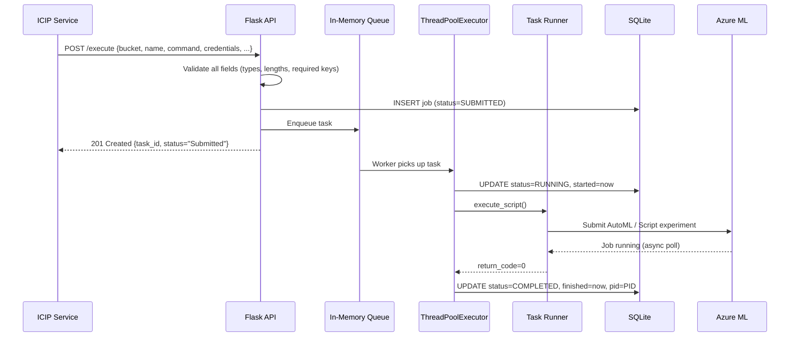
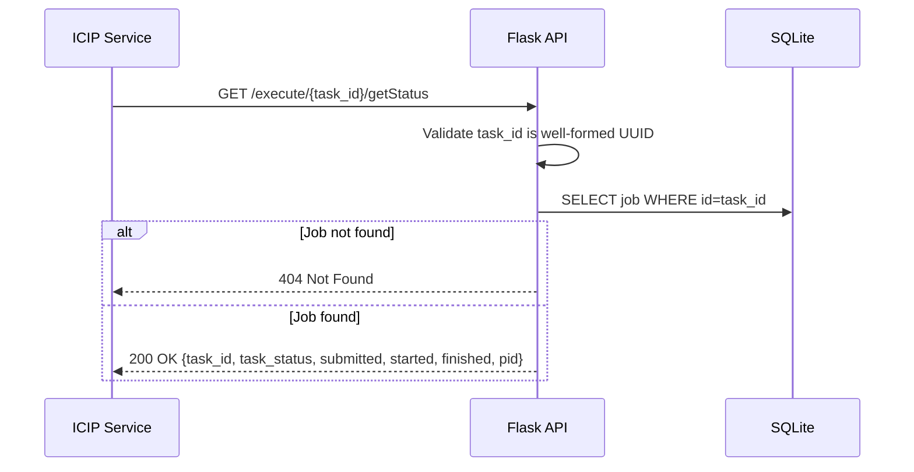
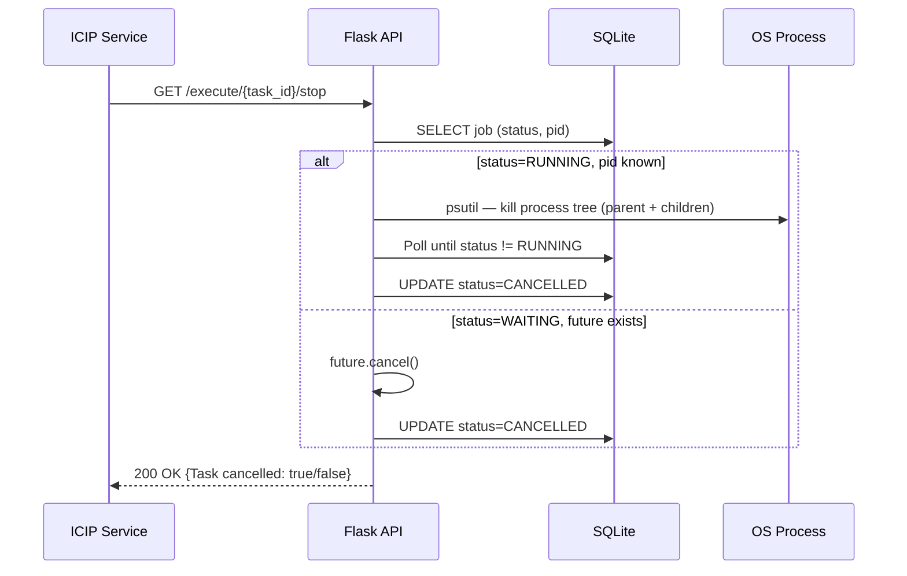
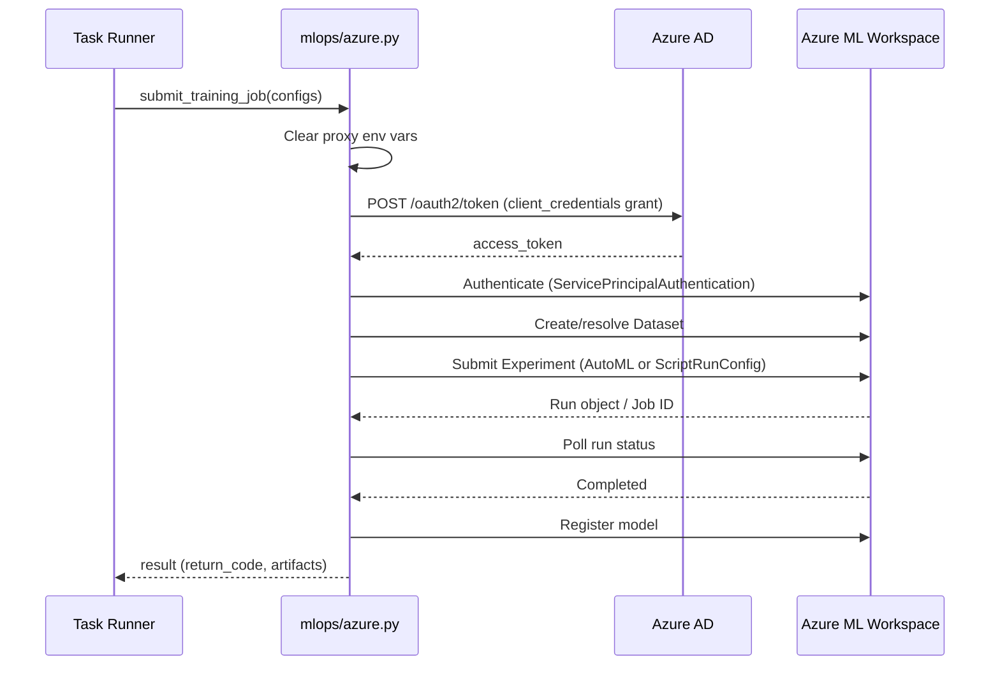

# Azure Job Executor — Architecture

---

## 1. Service Architecture

The service is a **Flask HTTP microservice** that decouples job acceptance from job execution. Incoming requests are validated and queued immediately; a background thread pool consumes the queue and drives execution against Azure ML. All job state is persisted locally in SQLite so the API can answer status queries at any time, independent of execution progress.

```mermaid
graph TB
    subgraph Inbound
        ICIP["ICIP Service\n(Backend)"]
    end

    subgraph Azure Job Executor
        API["Flask REST API\n/execute · /execute/{id}/getStatus\n/execute/{id}/stop · /execute/{id}/getLog"]
        VALIDATOR["Input Validator\nField presence · type · UUID format\nPath traversal guard"]
        QUEUE["In-Memory Queue\nQueue.py"]
        THREAD_POOL["ThreadPoolExecutor\nConfigurable pool size"]
        TASK["Task Runner\nTask.py — spawns subprocess"]
        DB["SQLite\n/data/app.db (WAL mode)\nJob state persistence"]
        AZURE_MLOPS["Azure MLOps Adapter\nmlops/azure.py"]
        DS["Datasource Connector\ndatasource.py · db.py\nMySQL / PostgreSQL"]
        SWAGGER["Swagger UI\n/swagger · /swagger.json"]
    end

    subgraph External
        AZURE_ML["Azure ML\nWorkspace · Experiments\nAutoML · Batch Endpoints"]
        AZURE_AD["Azure AD\nOAuth2 token endpoint"]
        EXT_DB["External Databases\nMySQL · PostgreSQL"]
    end

    ICIP -->|POST /execute| API
    ICIP -->|GET /execute/{id}/getStatus| API
    ICIP -->|GET /execute/{id}/stop| API
    API --> VALIDATOR --> QUEUE
    API --> DB
    QUEUE --> THREAD_POOL --> TASK
    TASK --> DB
    TASK --> AZURE_MLOPS
    TASK --> DS
    AZURE_MLOPS --> AZURE_AD
    AZURE_MLOPS --> AZURE_ML
    DS --> EXT_DB
    API --> SWAGGER
```

**Component responsibilities:**

- **Flask REST API** — accepts and validates HTTP requests, returns immediate responses. Contains no business logic.
- **Input Validator** — checks all required fields, types, and lengths before any job is created. UUIDs are re-validated on every `/{id}/*` endpoint. Path traversal is checked before any filesystem read.
- **In-Memory Queue** — decouples the HTTP response from execution. Jobs are enqueued synchronously; the API returns `task_id` before execution begins.
- **ThreadPoolExecutor** — consumes the queue concurrently. Pool size is set via `conf/conf.ini` (`ThreadCount`).
- **Task Runner** — spawns the pipeline command as a subprocess, streams output to a log file under `/temp/Jobs/{task_id}/`, and reports return code back to the executor.
- **SQLite (WAL mode)** — tracks all job state transitions (SUBMITTED → RUNNING → COMPLETED / ERROR / CANCELLED) with timestamps and PIDs. Thread-local connections prevent cross-thread SQLite conflicts.
- **Azure MLOps Adapter** — all Azure ML SDK calls are isolated here. Handles token generation, dataset management, AutoML experiment submission, model registration, and batch endpoint deployment.
- **Datasource Connector** — connects to MySQL or PostgreSQL using credentials from the job payload for pipeline input data.

---

## 2. Dependency Map

| Dependency | Type | Purpose |
|---|---|---|
| Azure ML (`azureml-core`, `azure-ai-ml`) | External (HTTP/SDK) | Submit training experiments, manage datasets and models, deploy batch endpoints |
| Azure AD | External (HTTPS) | OAuth2 client-credentials token exchange for Azure ML API authentication |
| SQLite (`/data/app.db`) | Local file | Job state persistence — status, timestamps, PID, log path |
| MySQL (external, per-job) | External (TCP) | Pipeline input data, sourced from job payload credentials |
| PostgreSQL (external, per-job) | External (TCP) | Pipeline input data, sourced from job payload credentials |
| `conf/conf.ini` | Local file | Thread pool size, working directory, proxy settings, DB connection references |
| Local filesystem (`/temp/Jobs/`) | Local file | Per-job execution log files |
| `flask-swagger-ui` | Library | Swagger UI at `/swagger` |

The service has **no dependency on any other Essedum microservice** at runtime. It is invoked exclusively by the ICIP Service and communicates only with Azure and optionally with user-configured external databases.

---

## 3. Architectural Decisions

### AD-AZ1 — In-memory queue with ThreadPoolExecutor for async job execution
**Decision:** Job submissions are enqueued in-process and executed by a `ThreadPoolExecutor`. The submission HTTP call returns before execution starts.
**Reason:** Azure ML jobs can run for minutes to hours. Blocking an HTTP connection for that duration is unreliable. The queue decouples API latency from execution time and allows the thread pool size to be tuned independently.

### AD-AZ2 — SQLite with WAL mode as the local job store
**Decision:** Job state is persisted in a local SQLite file at `/data/app.db` with WAL journal mode and thread-local connections.
**Reason:** No external database dependency is required for the executor to function. WAL mode allows concurrent reads from the API thread while write operations proceed from worker threads, preventing lock contention.

### AD-AZ3 — Azure MLOps logic isolated in `mlops/azure.py`
**Decision:** All Azure SDK calls (authentication, experiment submission, model registration, endpoint deployment) are encapsulated in a single module.
**Reason:** This keeps `app.py` focused on HTTP concerns and makes Azure ML interactions testable and replaceable without touching the API or queue logic.

### AD-AZ4 — Proxy environment variables cleared before importing `requests`
**Decision:** All proxy environment variables (`http_proxy`, `https_proxy`, etc.) are explicitly removed from `os.environ` before the `requests` module is imported.
**Reason:** Azure ML endpoints must be reached directly. Corporate proxy settings, if present in the container environment, would block Azure SDK HTTP calls. Clearing proxies at import time ensures they are never honoured by the Azure SDK.

### AD-AZ5 — HTML escaping applied to all response values
**Decision:** A `_sanitize_for_response()` function recursively HTML-escapes all string values before they are serialised into JSON responses.
**Reason:** The service echoes back user-submitted values (job names, commands, paths) in status and error responses. Without escaping, these create reflected XSS vectors when responses are rendered in a browser context.

### AD-AZ6 — Process tree kill for job cancellation
**Decision:** When stopping a running job, the service kills the entire OS process tree (parent + all children) using `psutil`.
**Reason:** A pipeline subprocess may spawn child processes (Python interpreters, shell commands). Killing only the parent process would leave orphaned children consuming resources.

---

## 4. Architecturally Significant Flows

### Flow 1 — Job Submission and Async Execution



### Flow 2 — Job Status Query



### Flow 3 — Job Cancellation



### Flow 4 — Azure Token Generation and ML Submission


