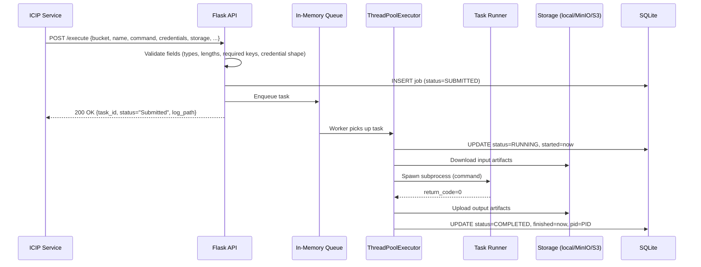
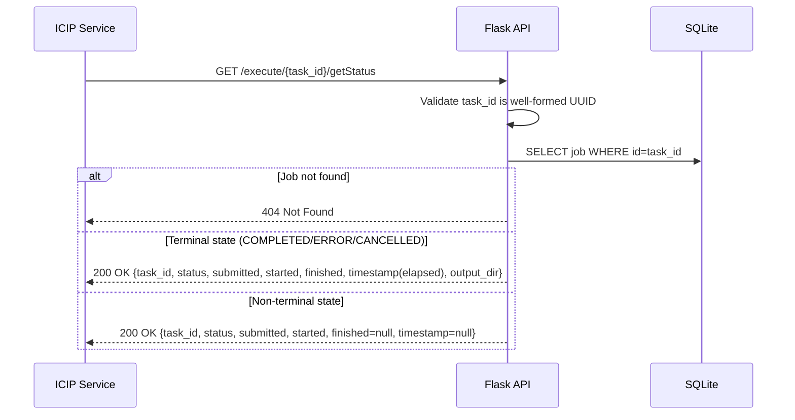
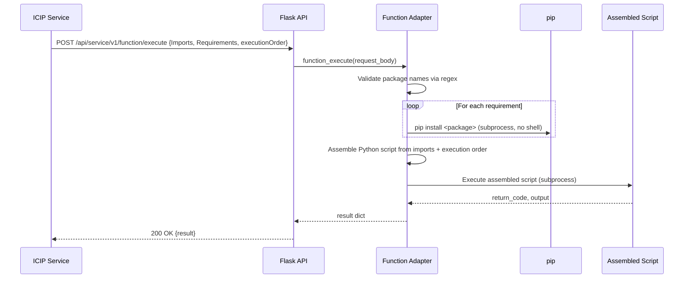
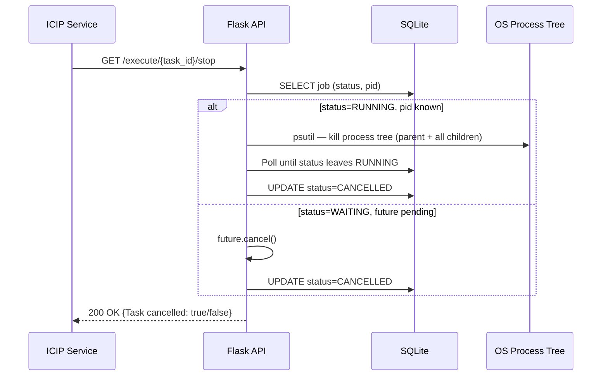

# Python Job Executor — Architecture

---

## 1. Service Architecture

The service is a **Flask HTTP microservice** with an asynchronous job execution engine. Submitted jobs are validated, persisted, and queued immediately — the HTTP call returns before execution begins. A background thread pool consumes the queue, spawns subprocesses for each pipeline script, and writes results back to SQLite. The service additionally exposes function-adapter execution (dynamic script generation + pip install) and virtual environment management.

```mermaid
graph TB
    subgraph Inbound
        ICIP["ICIP Service\n(Backend)"]
    end

    subgraph Python Job Executor
        API["Flask REST API\n/execute · /execute/{id}/getStatus · /execute/{id}/stop\n/execute/{id}/getLog · /execute/{id}/getOutputArtifacts\n/api/service/v1/function/execute · /venvs"]
        VALIDATOR["Input Validator\nField presence · type · UUID format\nPath traversal guard · Package name regex"]
        QUEUE["In-Memory Queue\nQueue.py — FIFO"]
        THREAD_POOL["ThreadPoolExecutor\nConfigurable pool size (conf.ini)"]
        TASK_RUNNER["Task Runner\nTask.py — downloads artifacts,\nspawns subprocess, uploads outputs"]
        DB["SQLite\n/data/app.db (WAL mode)\nJob state persistence"]
        FUNC_ADAPTER["Function Adapter\nfunctionadapter.py\nDynamic script gen + pip install"]
        TASK_RETRIEVER["Task Retriever\n(optional module)\nPropagates status to external DB"]
        SWAGGER["Swagger UI\n/swagger · /swagger.json"]
    end

    subgraph Storage
        LOCAL["Local Filesystem\nWorking directory (conf.ini)"]
        MINIO["MinIO\nObject storage"]
        S3["AWS S3"]
    end

    ICIP -->|POST /execute| API
    ICIP -->|GET /execute/{id}/getStatus| API
    ICIP -->|GET /execute/{id}/stop| API
    ICIP -->|POST /api/service/v1/function/execute| API
    API --> VALIDATOR --> QUEUE
    API --> DB
    QUEUE --> THREAD_POOL --> TASK_RUNNER
    TASK_RUNNER --> DB
    TASK_RUNNER --> LOCAL
    TASK_RUNNER --> MINIO
    TASK_RUNNER --> S3
    TASK_RUNNER -.->|if enabled| TASK_RETRIEVER
    FUNC_ADAPTER --> LOCAL
    API --> FUNC_ADAPTER
    API --> SWAGGER
```

**Component responsibilities:**

- **Flask REST API** — validates and routes HTTP requests; no business logic.
- **Input Validator** — enforces required fields, types, and exact parameter sets. UUIDs are re-validated on every `/{id}/*` endpoint. Filesystem paths are resolved and checked against the working directory before any read or write. Package names are checked by regex before being passed to pip.
- **In-Memory Queue** — FIFO queue backing the standard submission path. The direct-executor path bypasses the queue and submits directly to the thread pool (used for task-retriever-aware execution).
- **ThreadPoolExecutor** — bounded concurrency. Pool size set via `conf/conf.ini` (`ThreadCount`). Processes queue tasks and direct submissions in parallel.
- **Task Runner (`Task.py`)** — downloads input artifacts from the storage backend (local/MinIO/S3), spawns the pipeline command as an OS subprocess, streams output to a log file, uploads output artifacts on completion, and reports the return code.
- **SQLite (WAL mode)** — tracks all job state transitions with timestamps and PIDs. Thread-local connections prevent cross-thread SQLite conflicts.
- **Function Adapter (`functionadapter.py`)** — assembles a Python script from a structured request (imports, requirements, execution steps), installs any missing packages via pip, and executes the assembled script.
- **Task Retriever** — optional pluggable module (selected via `conf.ini`). When enabled, the runner asynchronously writes job status updates to an external database alongside the local SQLite updates.

---

## 2. Dependency Map

| Dependency | Type | Purpose |
|---|---|---|
| SQLite (`/data/app.db`) | Local file | Job state persistence — status, timestamps, PID, log path |
| Local filesystem | Local | Pipeline script execution, log files, output artifacts for `storage=local` jobs |
| MinIO | External (HTTP) | Input artifact download and output artifact upload for `storage=minio` jobs |
| AWS S3 | External (HTTPS/SDK) | Input artifact download and output artifact upload for `storage=s3` jobs |
| `conf/conf.ini` | Local file | Thread pool size, working directory, task-retriever config |
| `flask-swagger-ui` | Library | Swagger UI at `/swagger` |
| Task Retriever module | Internal (optional) | Async status propagation to an external database |

The service has **no dependency on any other Essedum microservice** at runtime. It is invoked exclusively by the ICIP Service.

---

## 3. Architectural Decisions

### AD-PY1 — Two dispatch modes: queue and direct executor
**Decision:** The service supports both FIFO queue dispatch (standard path) and direct thread-pool submission (bypassing the queue), selectable per-call.
**Reason:** The FIFO queue enforces ordering and backpressure for standard pipeline jobs. The direct path is used when the task-retriever module is active and needs to correlate a specific external database entry with the execution — it avoids the ordering delay of the queue for those calls.

### AD-PY2 — SQLite with WAL mode and thread-local connections
**Decision:** Job state is persisted in a local SQLite file using WAL journal mode with thread-local database connections.
**Reason:** No external database dependency is needed. WAL mode allows concurrent reads from the API thread while worker threads write, preventing lock contention. Thread-local connections avoid cross-thread SQLite handle sharing, which would cause runtime errors under concurrent load.

### AD-PY3 — Process tree kill for job cancellation
**Decision:** When stopping a running job, the service kills the entire OS process tree (parent + all child processes) using `psutil`.
**Reason:** Pipeline scripts may spawn child processes (Python interpreters, shell commands, subprocesses). Killing only the parent leaves orphaned children consuming CPU and memory.

### AD-PY4 — Path traversal prevention via resolved-path prefix check
**Decision:** Every filesystem path derived from a user-supplied `task_id` or `venv` name is resolved with `os.path.realpath()` and checked to confirm it starts with the expected base directory path.
**Reason:** Without this check, a crafted `task_id` containing `../` sequences could escape the working directory and allow arbitrary file reads or writes. The resolved-path prefix check is the standard defense against this class of attack.

### AD-PY5 — Package name validation via regex before pip install
**Decision:** In the function adapter, every package name from the request payload is validated against `^[A-Za-z0-9_\-\.]+([><=!~]{1,2}[A-Za-z0-9_\-\.]+)?$` before being passed to `pip install`.
**Reason:** Without validation, a malicious package name could inject arbitrary shell arguments into the pip subprocess. The regex restricts names to valid PyPI package formats, preventing command injection.

---

## 4. Architecturally Significant Flows

### Flow 1 — Standard Job Submission and Async Execution



### Flow 2 — Job Status Query



### Flow 3 — Function Adapter Execution



### Flow 4 — Job Cancellation


