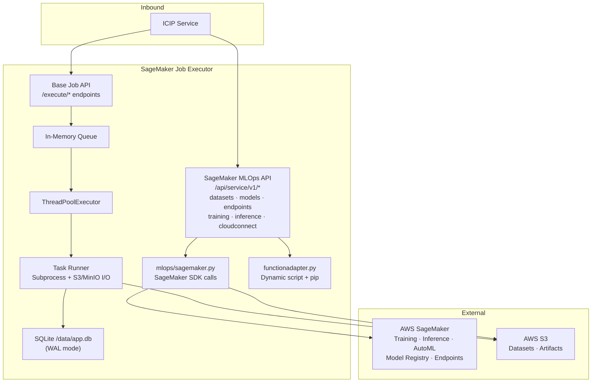
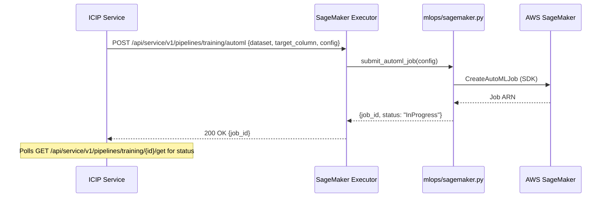
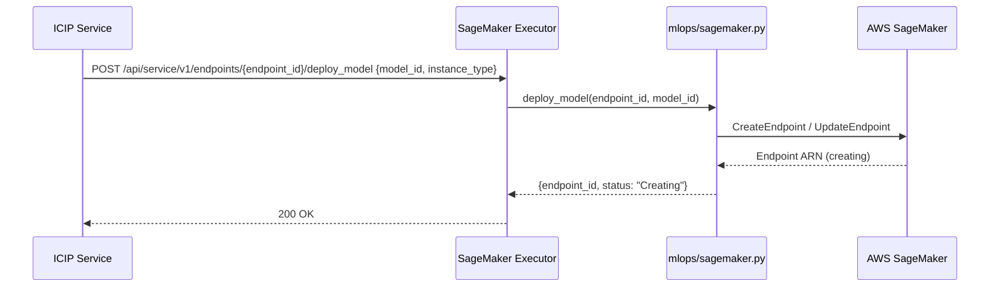

# SageMaker Job Executor — Architecture

---

## 1. Service Architecture

Extends the base Python job executor pattern with a full **SageMaker MLOps API layer**. The base job execution engine (queue → thread pool → subprocess) is identical to the standard executor. The SageMaker-specific routes operate independently of the job queue — they call the SageMaker SDK directly and return synchronously or initiate async SageMaker jobs tracked by SageMaker itself.

---

## 2. Dependency Map

| Dependency | Type | Purpose |
|---|---|---|
| AWS SageMaker SDK (`sagemaker`) | External (HTTPS/SDK) | Training jobs, AutoML, endpoints, model registry, inference |
| AWS S3 (`boto3`) | External (HTTPS/SDK) | Dataset storage, artifact upload/download |
| SQLite (`/data/app.db`) | Local file | Job state persistence |
| `conf/conf.ini` | Local file | Thread count, working directory |

---

## 3. Architectural Decisions

### AD-SM1 — SageMaker MLOps API is synchronous (not queued)
**Decision:** SageMaker dataset, model, endpoint, and pipeline API calls are handled synchronously via direct SDK calls — they do not go through the internal job queue.
**Reason:** SageMaker SDK calls themselves return job IDs or resource ARNs quickly (the actual work runs on AWS infrastructure). Queuing them would add latency without benefit. Polling for SageMaker job completion is the responsibility of the caller via the status endpoints.

### AD-SM2 — Shared SQLite store for base jobs only
**Decision:** SQLite tracks only the base job-executor jobs (submitted via `/execute`). SageMaker MLOps operations (training jobs, endpoints) are tracked directly in AWS and surfaced via the status/list endpoints.
**Reason:** SageMaker already maintains durable job state in AWS. Duplicating that into SQLite would create a consistency problem if the two stores diverged.

---

## 4. Architecturally Significant Flows

### Flow 1 — SageMaker AutoML Training Job

### Flow 2 — Model Deployment to Endpoint

