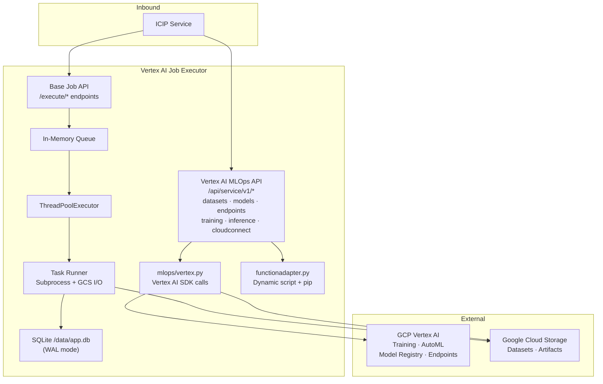
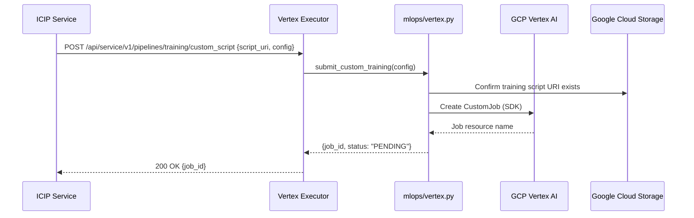
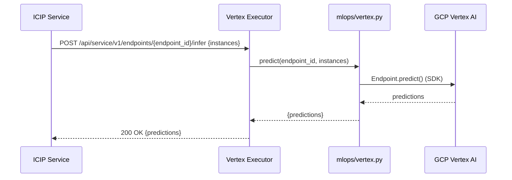

# Vertex AI Job Executor — Architecture

---

## 1. Service Architecture

Structurally identical to the SageMaker executor — the same base job execution engine (queue → thread pool → subprocess) plus a cloud MLOps API layer, targeting GCP Vertex AI instead of AWS SageMaker. The Vertex AI MLOps API calls are synchronous; actual training and inference workloads run on GCP infrastructure.

---

## 2. Dependency Map

| Dependency | Type | Purpose |
|---|---|---|
| GCP Vertex AI SDK (`google-cloud-aiplatform`) | External (HTTPS/SDK) | Training jobs, AutoML, endpoints, model registry |
| Google Cloud Storage | External (HTTPS/SDK) | Dataset and artifact storage |
| SQLite (`/data/app.db`) | Local file | Base job state persistence |
| `conf/conf.ini` | Local file | Thread count, working directory |

---

## 3. Architectural Decisions

### AD-VX1 — Mirror of SageMaker executor architecture
**Decision:** The Vertex AI executor follows the exact same architectural pattern as the SageMaker executor — base job queue + cloud MLOps API layer, with the cloud SDK layer (`mlops/vertex.py`) being the only differentiator.
**Reason:** The Essedum platform treats cloud ML platforms as interchangeable. A consistent executor structure means the ICIP Service uses the same protocol to communicate with all executors; only the target executor URL and the cloud-specific SDK differ.

### AD-VX2 — GCP credentials via Application Default Credentials or env vars
**Decision:** GCP authentication uses either a Service Account JSON file path (`GOOGLE_APPLICATION_CREDENTIALS` env var) or the GCP Application Default Credentials chain.
**Reason:** This follows GCP's recommended credential pattern, supporting both Kubernetes Workload Identity (cluster-managed credentials) and explicit Service Account keys without code changes.

---

## 4. Architecturally Significant Flows

### Flow 1 — Vertex AI Custom Script Training

### Flow 2 — Vertex AI Model Endpoint Inference

