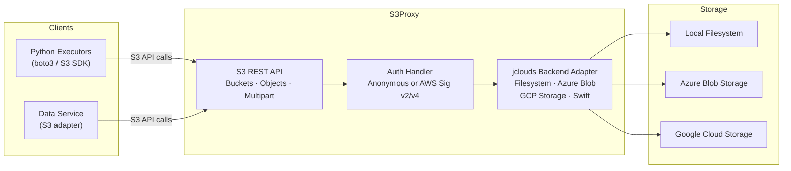
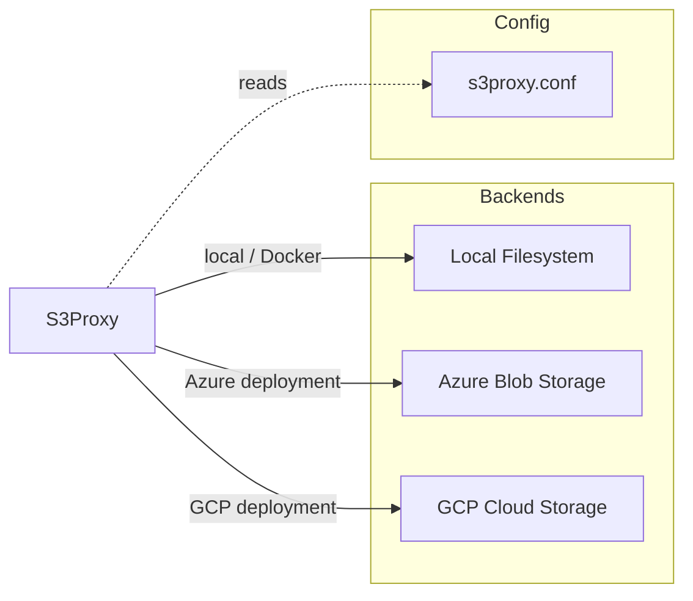
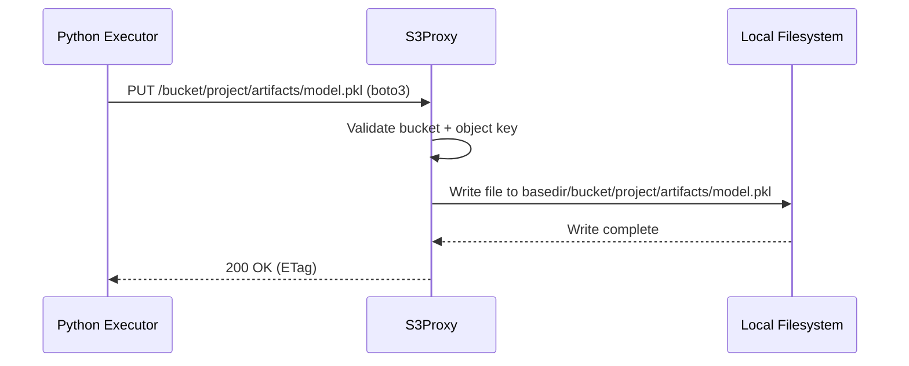

# S3Proxy — Architecture

---

## 1. Service Architecture

S3Proxy is a **protocol translation layer** — it speaks the S3 REST API to clients and translates each operation to the equivalent call on the configured jclouds backend. No business logic runs here; it is a thin translation proxy.

---

## 2. Dependency Map

 Object storage backend for local/Docker deployments |
| Azure Blob Storage | External (HTTPS) | Object storage backend for Azure deployments |
| GCP Cloud Storage | External (HTTPS) | Object storage backend for GCP deployments |
| `s3proxy.conf` | Local file | All configuration: endpoint, auth mode, backend type, credentials |

S3Proxy has **no dependency on any other Essedum service**.

---

## 3. Architectural Decisions

### AD-S3P1 — Vendored open-source project, not a custom service
**Decision:** S3Proxy is included as the upstream open-source `gaul/s3proxy` project with no custom application code added.
**Reason:** The S3 protocol translation problem is fully solved by the upstream project. Building a custom implementation would duplicate significant work. All Essedum-specific configuration is in `s3proxy.conf`.

### AD-S3P2 — Anonymous access for internal cluster deployments
**Decision:** S3Proxy is configured with `s3proxy.authorization=none` for internal Essedum deployments.
**Reason:** Access is controlled at the Kubernetes network policy level — only cluster-internal services reach S3Proxy. Requiring AWS credential validation for internal traffic would add complexity without meaningful security benefit.

---

## 4. Architecturally Significant Flows

### Flow 1 — Python Executor Uploads Artifact to Local Storage

