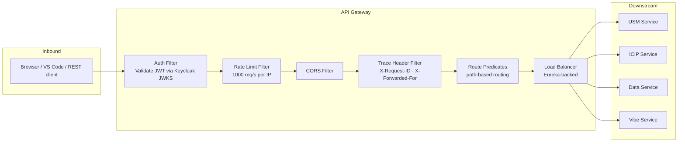
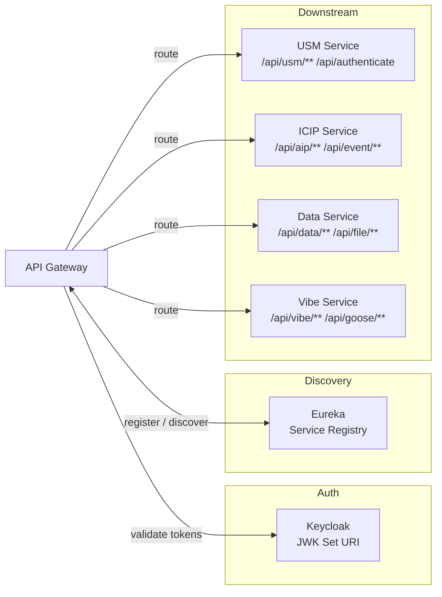
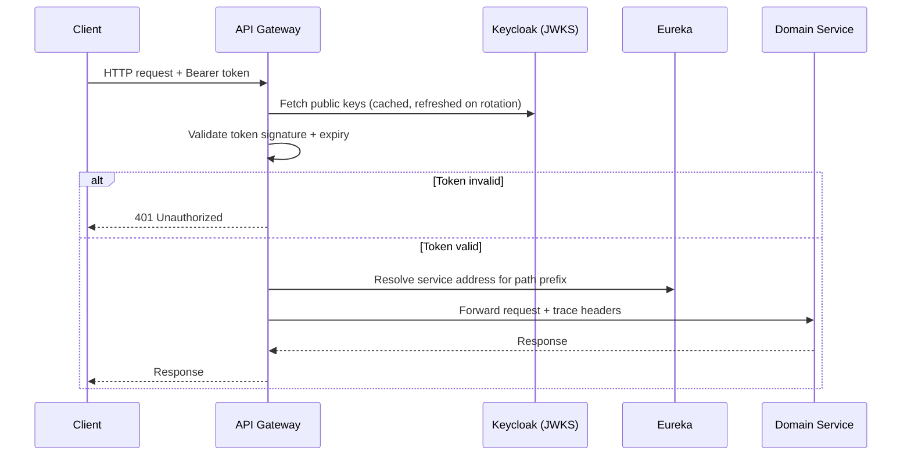
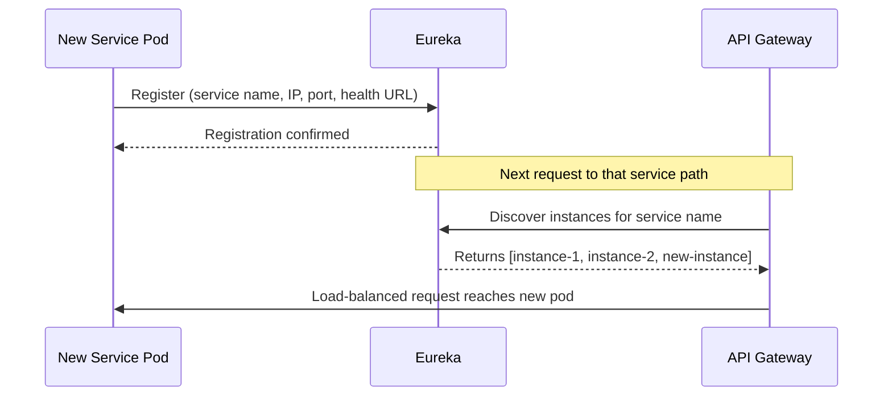

# API Gateway — Architecture

---

## 1. Service Architecture

The gateway is a **thin routing layer** built on Spring Cloud Gateway. It holds no domain state and contains no business logic. Its only concerns are: validate the token, find the right service, forward the request.

**Filter chain order (every request):**
1. Auth Filter — rejects with 401 if token is missing or invalid
2. Rate Limit Filter — rejects with 429 if threshold exceeded
3. CORS Filter — attaches response headers
4. Trace Filter — stamps `X-Request-ID`; propagates `X-Forwarded-For`
5. Router — matches path prefix, resolves service via Eureka, forwards

---

## 2. Dependency Map

 — fetch public keys to verify JWT signatures |
| Eureka | Internal (HTTP) | Resolve current IP:port for each downstream service |
| USM Service | Downstream | Receives `/api/usm/**` and `/api/authenticate` traffic |
| ICIP Service | Downstream | Receives `/api/icip/**`, `/api/aip/**`, `/api/event/**` traffic |
| Data Service | Downstream | Receives `/api/data/**`, `/api/file/**`, `/api/datasets/**` traffic |
| Vibe Service | Downstream | Receives `/api/vibe/**`, `/api/goose/**`, `/api/github/**` traffic |

The gateway has **no database** and calls **no external API** other than Keycloak JWKS and Eureka.

---

## 3. Architectural Decisions

### AD-GW1 — No business logic in the gateway
The gateway only routes and enforces cross-cutting policies. Any logic that relates to users, jobs, or data lives in the domain services. This keeps the gateway simple and ensures it never becomes a bottleneck for feature changes.

### AD-GW2 — Token validation at the edge, not in each service
JWT validation happens once at the gateway using Keycloak's JWK Set URI. Downstream services trust that any request that reaches them has already been authenticated. This avoids repeating validation logic across four services and ensures key rotation is handled in one place.

### AD-GW3 — Dynamic routing via Eureka (no hardcoded IPs)
Service addresses are resolved at request time from Eureka. When a new pod starts, it registers itself automatically; the gateway picks it up within seconds. This is essential in Kubernetes where pod IPs change on every restart.

### AD-GW4 — Stateless design
The gateway holds no session state. Any gateway instance can handle any request. This makes horizontal scaling straightforward — add more gateway pods behind the load balancer.

---

## 4. Architecturally Significant Flows

### Flow 1 — Authenticated API Request

### Flow 2 — Service Instance Scale-Out

