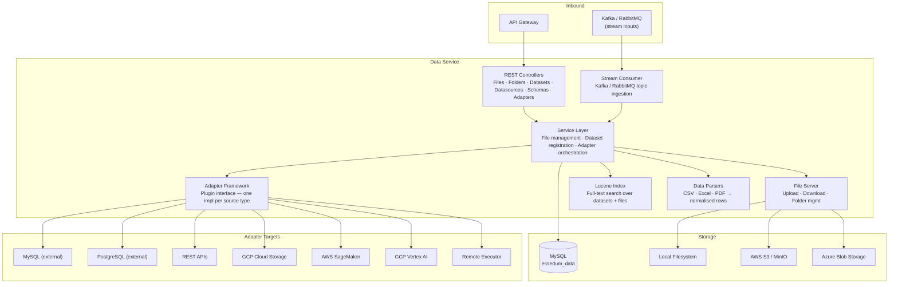
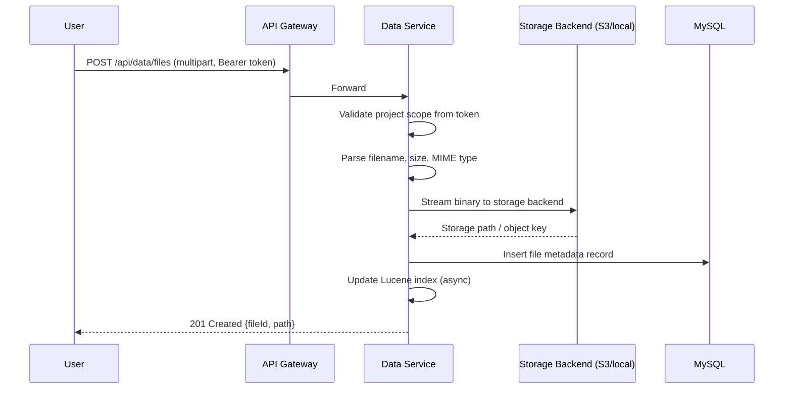
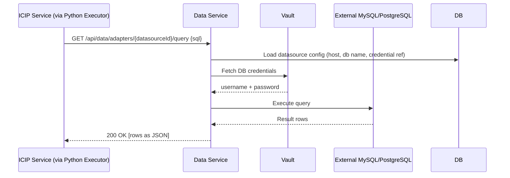
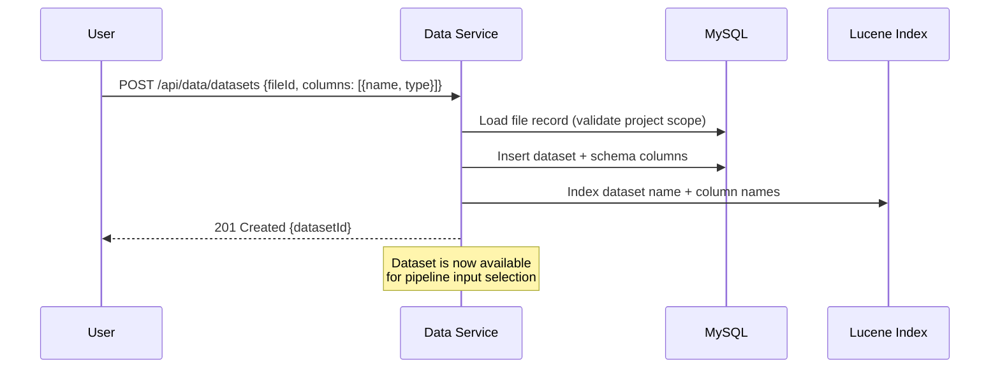

# Data Service — Architecture

> **OpenAPI Spec:** [`docs/openapi.yaml`](openapi.yaml) — generated automatically on every push to main by the [`openapi-spec`](../../../.github/workflows/openapi-spec.yml) workflow. Import into Postman, Swagger Editor, or any OpenAPI-compatible tool.

---

## 1. Service Architecture

Data Service is a **storage and connectivity hub**. It has two distinct responsibilities handled by the same process: a file server for binary assets, and an adapter framework that lets pipelines read from and write to external data sources through a uniform interface.

**Key internal subsystems:**
- **File Server** — handles binary I/O. Storage backend (local/S3/Azure) is selected at runtime based on configuration; the rest of the service does not know which backend is active.
- **Adapter Framework** — each external data source type is implemented as an adapter plugin. All adapters implement the same interface (`read`, `write`, `schema`). Pipelines call the framework; the framework delegates to the correct adapter.
- **Lucene Index** — maintained locally per service instance, updated on every file/dataset mutation. Used for keyword search within a project's data.
- **Data Parsers** — normalise uploaded CSV/Excel/PDF files into row-column records before indexing or dataset registration.

---

## 2. Dependency Map

| Dependency | Type | Purpose |
|---|---|---|
| MySQL (`essedum_data`) | Internal DB | File metadata, dataset definitions, datasource configs, schema registry |
| Local Filesystem | Storage | Binary file storage in single-node / Docker deployments |
| AWS S3 / MinIO | Storage | Object storage for cloud / Kubernetes deployments |
| Azure Blob Storage | Storage | Object storage for Azure-hosted deployments |
| MySQL (external) | Adapter target | Read/write user-connected databases |
| PostgreSQL (external) | Adapter target | Read/write user-connected databases |
| REST APIs (external) | Adapter target | Fetch data from user-configured HTTP endpoints |
| GCP Cloud Storage | Adapter target | Read/write files in GCS buckets |
| AWS SageMaker / GCP Vertex AI | Adapter target | Interact with cloud ML data channels |
| Kafka / RabbitMQ | Messaging | Consume streaming data; publish data outputs |

Data Service has **no dependency on USM, ICIP, or Vibe services** at runtime.

---

## 3. Architectural Decisions

### AD-DATA1 — Storage backend abstracted behind an interface
The file server delegates all I/O to a pluggable storage backend (local, S3, Azure Blob). The selection is configuration-driven. The rest of the service — controllers, service layer, metadata DB — is identical regardless of backend. This lets the platform run on a laptop (local) or in production (S3) without code changes.

### AD-DATA2 — Adapter framework as a plugin registry
Each adapter is a self-contained module implementing a common interface. Adding a new data source type requires adding a new adapter module and registering it — no changes to the framework or existing adapters. This is the primary extension point of the service.

### AD-DATA3 — Metadata in MySQL, binaries in object storage
File metadata (name, size, project, path) is stored in MySQL for fast querying. Binary content lives in the storage backend. This separation means the database stays small and fast regardless of file sizes.

### AD-DATA4 — Per-project data isolation enforced at the service layer
Every query and file operation is filtered by the project ID extracted from the user's token. This is enforced in the service layer, not the UI. A user in Project A cannot enumerate, read, or search data belonging to Project B even with a crafted API call.

### AD-DATA5 — Lucene index co-located with the service instance
The search index runs in-process (no external search cluster required). For the current scale target (millions of documents per deployment) this is sufficient. The trade-off is that index is not shared across service instances — each instance indexes independently. If full cross-instance search is needed in future, a migration to Elasticsearch/OpenSearch is the intended path.

---

## 4. Architecturally Significant Flows

### Flow 1 — File Upload

### Flow 2 — Pipeline Reads from External Database via Adapter

### Flow 3 — Dataset Registration with Schema

