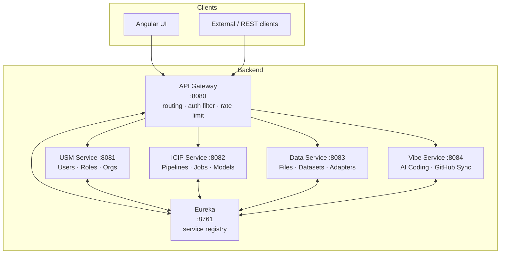
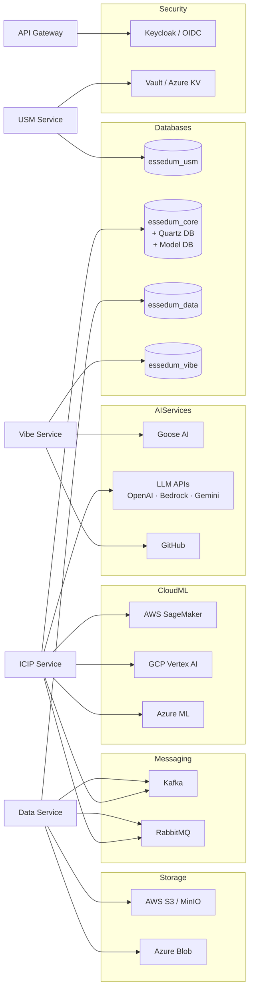

# Backend Services — Architecture

---

## 1. Overview

The backend is structured as **five independently deployable services** sitting behind a single entry point. All external traffic hits the API Gateway; it inspects the URL path and forwards the request to the correct domain service. Services find each other through a central service registry (Eureka) — no hardcoded addresses between services.

---

## 2. Services

### API Gateway — Port 8080
The sole entry point for all traffic.

- Validates JWT / OAuth2 tokens before forwarding any request.
- Routes based on URL path prefix — no business logic lives here.
- Applies global rate limiting and enforces the 500 MB request size cap.
- Discovers downstream service addresses dynamically via Eureka.

### USM Service — Port 8081
Owns everything related to **who can do what**.

- Authentication (JWT, OAuth2 via Keycloak).
- User, role, organisation, and project management.
- Permission checks — defines the RBAC model the entire platform relies on.
- Secrets integration with HashiCorp Vault / Azure Key Vault.
- Own database: `essedum_usm`.

### ICIP Service — Port 8082
The **AI/ML execution engine** — the largest and most complex service.

- Runs Python-based training, inference, and RAG pipelines.
- Schedules jobs (Quartz), triggers them on events, and streams status in real time via WebSocket.
- Manages the model registry and ML endpoints.
- Submits jobs to AWS SageMaker, GCP Vertex AI, and Azure ML.
- Generates code using LLM APIs (Azure OpenAI, Bedrock, Vertex AI).
- Publishes execution events to Kafka and RabbitMQ.
- Own databases: `essedum_core` (main), Quartz scheduler DB, model registry DB.

### Data Service — Port 8083
Manages **all data at rest and in motion**.

- File upload, download, and folder management.
- Connects to external sources via adapters: MySQL, PostgreSQL, REST, AWS S3/MinIO, Azure Blob, GCP Storage, SageMaker, Vertex AI.
- Dataset and schema registry management.
- Full-text search over ingested content (Apache Lucene).
- Consumes streaming data from Kafka / RabbitMQ topics.
- Own database: `essedum_data`.

### Vibe Service — Port 8084
Provides **AI-assisted coding** capabilities.

- Relays coding requests to the Goose AI engine; streams responses back via SSE.
- Manages AI coding sessions and recipes.
- Pushes generated code to GitHub and opens pull requests.
- Handles GitHub OAuth flow.
- Own database: `essedum_vibe`.

---

## 3. Dependency Map

The diagram below shows which service depends on which external system. Arrows point from consumer to provider.

**Key rule:** Domain services do **not** call each other directly. Cross-domain data (e.g., ICIP needing user context) is passed in the request by the gateway or resolved via shared database conventions — never via a synchronous service-to-service HTTP call.

---

## 4. Architectural Decisions

### AD-1 — Monolith split into four domain services
**Decision:** Decompose the original single deployable into USM, ICIP, Data, and Vibe services.  
**Reason:** The monolith had a single point of failure, could not be scaled per workload, and had dangerously high database connection counts (600+). Each domain now scales independently.

### AD-2 — API Gateway as the only public entry point
**Decision:** All external traffic enters exclusively through the gateway on port 8080. Ports 8081–8084 are internal only.  
**Reason:** Centralises authentication, rate limiting, and routing. Downstream services can trust that the token has already been validated before they see the request.

### AD-3 — Service discovery via Eureka (not hardcoded addresses)
**Decision:** Services register themselves with Eureka at startup; the gateway resolves addresses dynamically.  
**Reason:** Pod IPs change constantly in Kubernetes. Eureka removes the need for hardcoded service URLs and enables automatic load balancing across multiple instances of the same service.

### AD-4 — One database per service
**Decision:** Each service owns its schema and no service reads another service's database directly.  
**Reason:** Database-level isolation prevents tight coupling. A schema change in USM cannot break the ICIP service. It also caps connection pool size per service, solving the connection exhaustion problem.

### AD-5 — Asynchronous job execution via message queues
**Decision:** Long-running pipeline and ML jobs are triggered and tracked asynchronously via Kafka / RabbitMQ, not via synchronous HTTP calls.  
**Reason:** ML jobs can run for hours. Keeping an HTTP connection open that long is unreliable. Queues decouple the job submission from execution and make retries straightforward.

### AD-6 — Real-time status via WebSocket and SSE
**Decision:** Job execution progress is pushed to the UI over WebSocket (jobs) and SSE (Vibe / AI coding). The UI does not poll.  
**Reason:** Polling at scale wastes server resources and introduces latency. Push-based updates give instant feedback with minimal overhead.

### AD-7 — Spring profiles for environment configuration
**Decision:** Environment-specific behaviour (auth mode, DB type, secrets backend) is switched via Spring profiles (`mysql`, `oauth2`, `vault`, `btf`) — not via code branches.  
**Reason:** The same binary runs in local dev (DB JWT, no Vault) and production (Keycloak, Vault) without modification. Reduces environment-specific bugs.

### AD-8 — Shared libraries for cross-cutting concerns
**Decision:** Security filters, JWT utilities, and common REST helpers live in shared libraries (`comm-lib-util`, `common-lib-rest`, `comm-lib-secrets`) consumed by all services.  
**Reason:** Avoids duplicating security logic across four services. A security fix ships to all services by bumping the shared library version.

### AD-9 — Python executors as separate processes
**Decision:** Python job execution runs in dedicated Python microservices (`py-job-executer`, `py-job-sagemaker-executer`, etc.), not inside the JVM.  
**Reason:** Python ML libraries (PyTorch, TensorFlow, scikit-learn) cannot run inside a Java process. Separate executors also isolate memory and crash domains — a runaway Python job cannot take down the Java backend.
