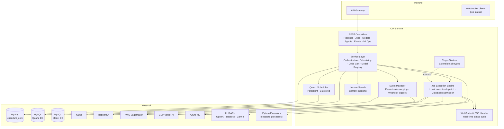
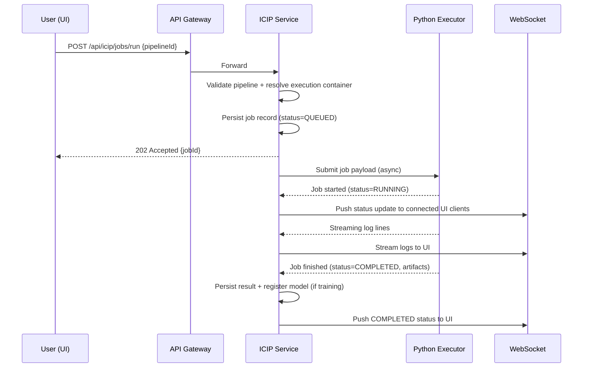
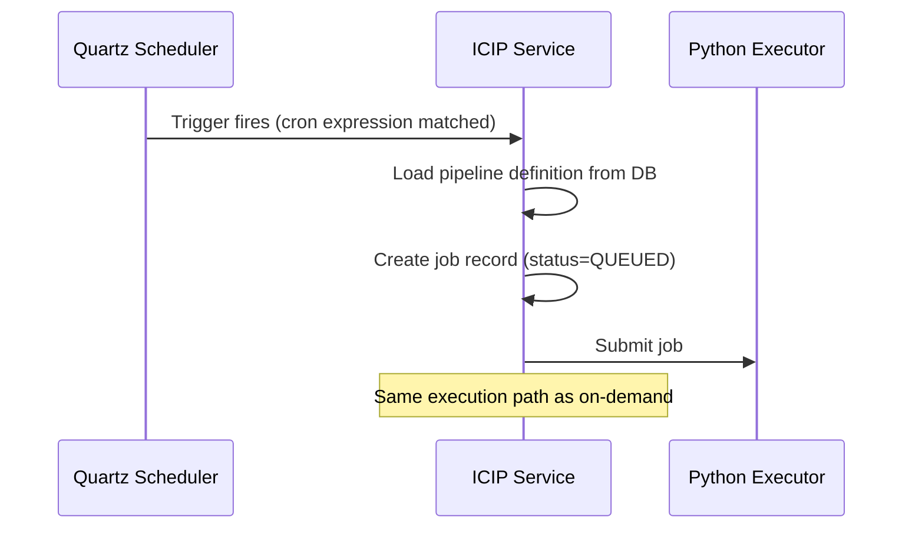
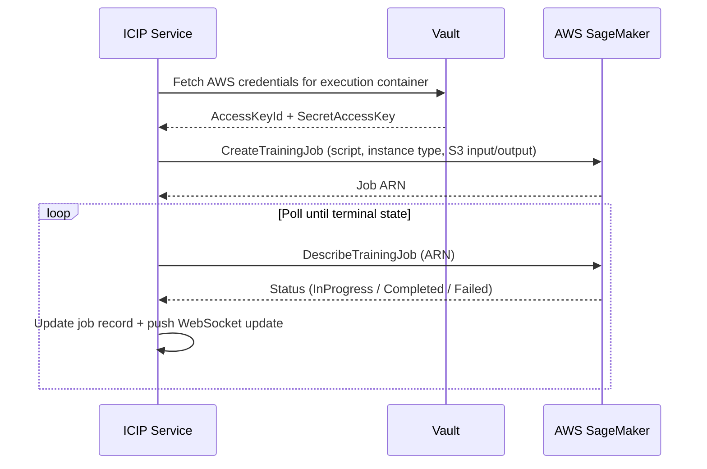

# ICIP Service — Architecture

> **OpenAPI Spec:** [`docs/openapi.yaml`](openapi.yaml) — generate by running `curl http://<host>:8082/v3/api-docs.yaml -o sv/icip-service/docs/openapi.yaml` against a running instance, then commit. Swagger UI available at `/swagger-ui/index.html`.

---

## 1. Service Architecture

ICIP is the most complex service. It combines a standard REST layer with an **asynchronous job execution engine**, a **scheduler**, and **real-time streaming**. Jobs submitted via REST are handed off to an execution subsystem; the REST call returns immediately while execution proceeds asynchronously.

**Key internal subsystems:**
- **Job Execution Engine** — dispatches jobs to the correct executor (local Python process or cloud ML platform). Tracks state transitions (queued → running → completed/failed).
- **Quartz Scheduler** — manages timed and recurring job triggers using a clustered, database-backed store.
- **Event Manager** — maps platform events (e.g., file uploaded, dataset updated) to job triggers.
- **WebSocket Handler** — maintains open connections to UI clients and pushes state changes the moment they occur.
- **Plugin System** — allows new job types to be registered without modifying core execution logic.

---

## 2. Dependency Map

| Dependency | Type | Purpose |
|---|---|---|
| MySQL (`essedum_core`) | Internal DB | Pipelines, jobs, events, agents, plugins, execution history |
| MySQL (Quartz DB) | Internal DB | Quartz job scheduler state — triggers, misfire records |
| MySQL (Model DB) | Internal DB | Model registry, model versions, deployed endpoints |
| Python Executors | Internal services | Run the actual Python pipeline code in isolated processes |
| AWS SageMaker | External (HTTP) | Submit and monitor cloud training/inference jobs |
| GCP Vertex AI | External (HTTP) | Submit and monitor cloud training/inference jobs |
| Azure ML | External (HTTP) | Submit and monitor cloud training/inference jobs |
| LLM APIs (OpenAI, Bedrock, Gemini) | External (HTTP) | AI code generation |
| Kafka | Messaging | Publish job lifecycle events; consume stream inputs |
| RabbitMQ | Messaging | Publish job lifecycle events; consume stream inputs |

ICIP has **no dependency on USM, Data, or Vibe services** at runtime.

---

## 3. Architectural Decisions

### AD-ICIP1 — Asynchronous job execution via task queue
Job submission returns immediately (HTTP 202). Execution happens asynchronously. The client tracks progress via WebSocket. This prevents HTTP timeouts on long-running ML jobs (which can run for hours) and decouples submission from execution throughput.

### AD-ICIP2 — Quartz with a clustered database-backed store
Quartz is configured with a JDBC job store (not in-memory). Scheduled triggers survive pod restarts and are not duplicated when multiple instances run. This is critical for exactly-once scheduled execution in Kubernetes where pods can be evicted at any time.

### AD-ICIP3 — Python execution in separate processes, not the JVM
Python ML libraries (PyTorch, scikit-learn, etc.) cannot run inside a Java process. Python executors are separate microservices. ICIP communicates with them over HTTP. A runaway Python job cannot consume the Java heap or crash the ICIP service.

### AD-ICIP4 — Plugin system for extensible job types
New job types (e.g., a new ML framework or data processing step) are added as plugins that implement a standard interface. Core execution logic does not change. This keeps the service open for extension without modifying tested code paths.

### AD-ICIP5 — Events published to message queues, not direct service calls
When a job completes or fails, ICIP publishes an event to Kafka / RabbitMQ. Downstream consumers (e.g., notification service, audit log) subscribe independently. ICIP does not know or care who is listening. This avoids tight coupling to consumers that may not exist yet.

---

## 4. Architecturally Significant Flows

### Flow 1 — Pipeline Execution (On-Demand)

### Flow 2 — Scheduled Job Trigger

### Flow 3 — Cloud ML Job Submission (SageMaker)

