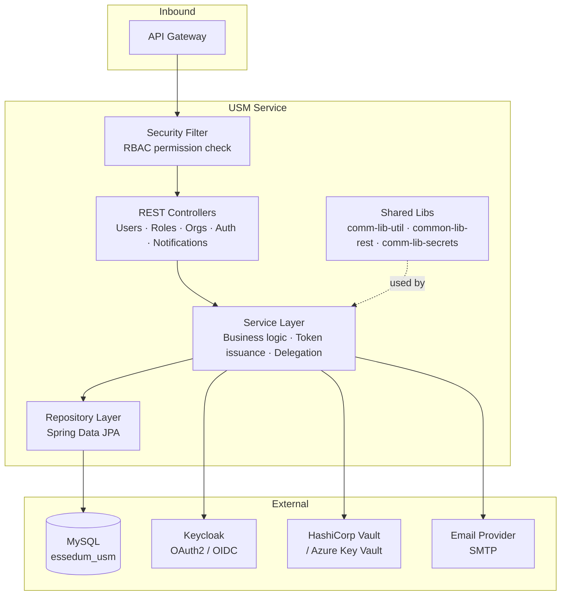
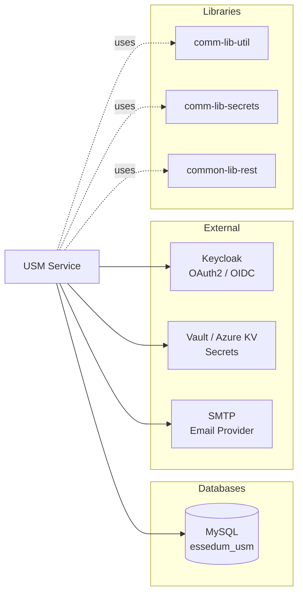
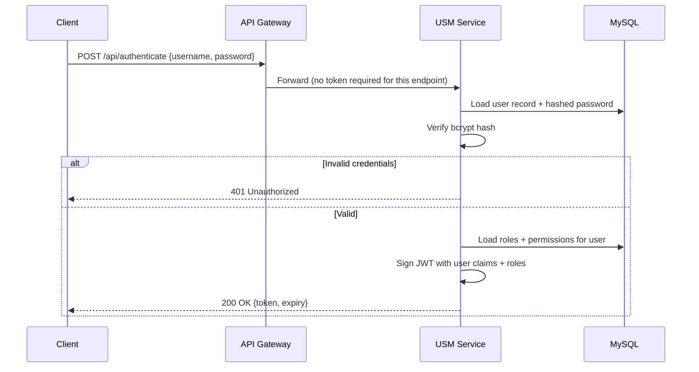
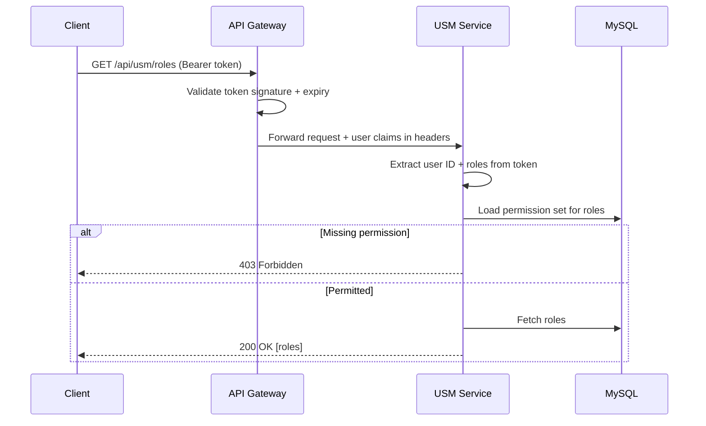
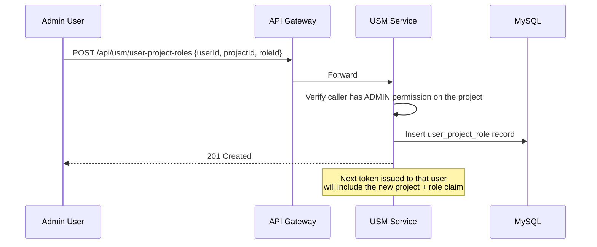

# USM Service — Architecture

---

## 1. Service Architecture

USM is a **standard layered Spring Boot service**. Requests arrive from the gateway, pass through security filters, reach a REST controller, and flow down through the service and repository layers to the database.

**Layer responsibilities:**
- **Security Filter** — verifies the JWT, resolves the user's roles, and checks permissions against the requested endpoint before the controller is reached.
- **Controllers** — parse HTTP requests, validate inputs, delegate to services, return responses. No business logic.
- **Service Layer** — owns all business rules: token issuance, RBAC evaluation, delegation logic, notification dispatch.
- **Repository Layer** — JPA-based persistence. One repository per aggregate root (User, Role, Organisation, Project, etc.).

---

## 2. Dependency Map

 Stores users, roles, permissions, organisations, projects, notifications |
| Keycloak | External (HTTP) | OAuth2 / OIDC token exchange; federates external IdPs (LDAP, SAML) |
| HashiCorp Vault / Azure KV | External (HTTP) | Read and write secrets (API keys, cloud credentials) |
| Email Provider (SMTP) | External | Send password-reset and account-invite emails |
| `comm-lib-util` | Shared library | Logging, common utilities |
| `comm-lib-secrets` | Shared library | Vault / Key Vault client abstraction |
| `common-lib-rest` | Shared library | Error response format, REST helpers |

USM has **no dependency on any other domain service** (ICIP, Data, Vibe).

---

## 3. Architectural Decisions

### AD-USM1 — RBAC enforced in the service layer, not just the UI
Permission checks run server-side on every API call. The UI can hide buttons, but access is ultimately controlled by the server. This prevents privilege escalation via direct API calls.

### AD-USM2 — JWT issued by USM, validated by the gateway
USM mints tokens for DB-JWT auth mode. For OAuth2 mode, Keycloak mints the token and USM validates it. In both cases, the gateway is the single validation point — USM does not re-validate tokens arriving from the gateway.

### AD-USM3 — Project as the isolation boundary
All data in the platform (files, pipelines, models) is scoped to a project. USM owns the project definition and user-project-role assignment. Other services enforce the boundary by checking the project claim in the token.

### AD-USM4 — Secrets stored in Vault, not the database
Credentials and API keys referenced by users or pipelines are stored in Vault / Azure Key Vault. The database holds only a reference (path/key name). This ensures secrets are never exposed in a database dump.

### AD-USM5 — Auth mode switchable via Spring profile
The service supports `dbjwt` (self-issued JWT) and `oauth2` (Keycloak) auth modes, toggled by the active Spring profile. The same binary runs in both modes; no code branching.

---

## 4. Architecturally Significant Flows

### Flow 1 — User Login (DB JWT mode)

### Flow 2 — Permission Check on Protected Endpoint

### Flow 3 — User-Project-Role Assignment

