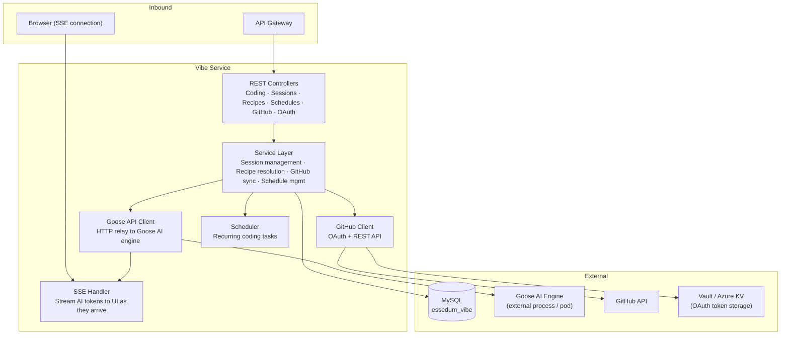
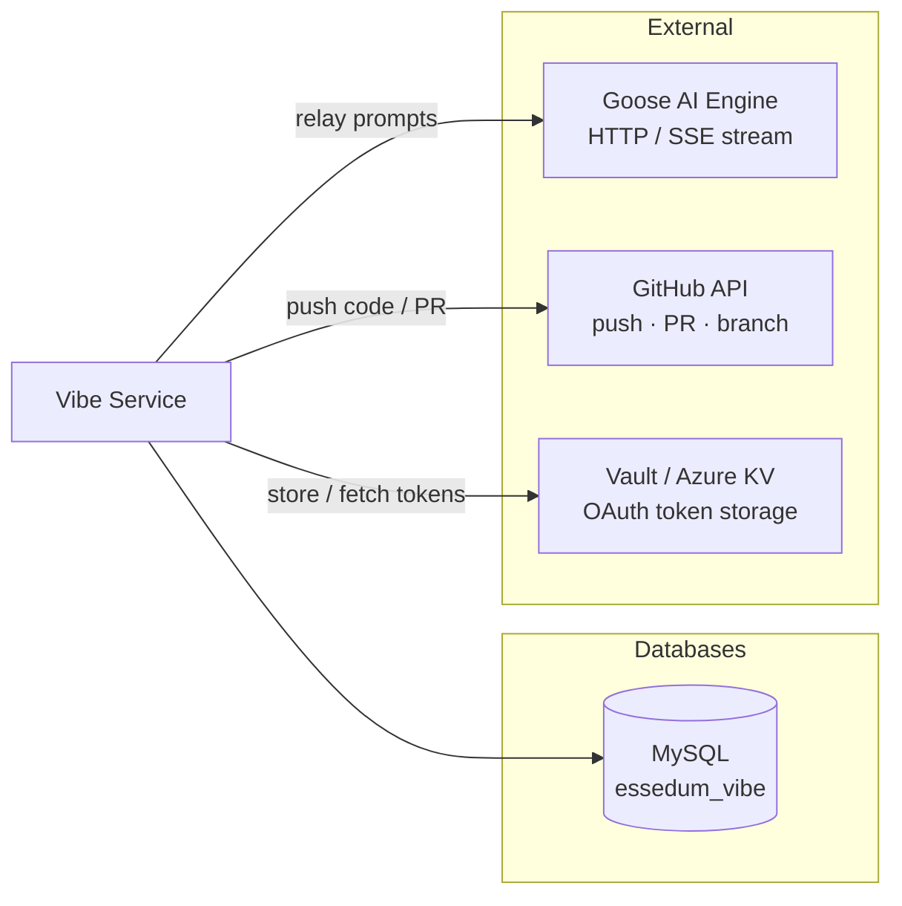
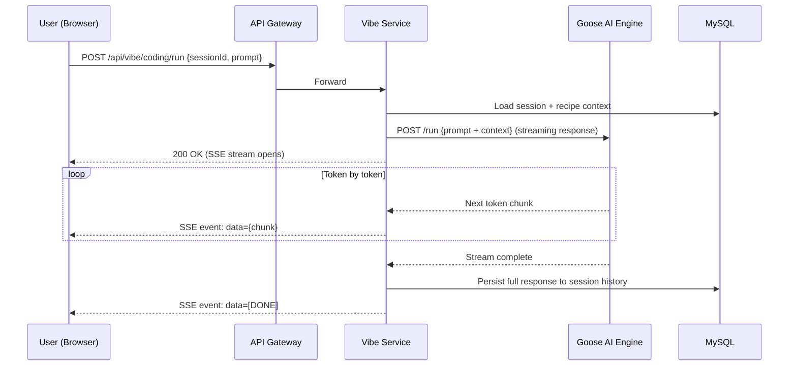
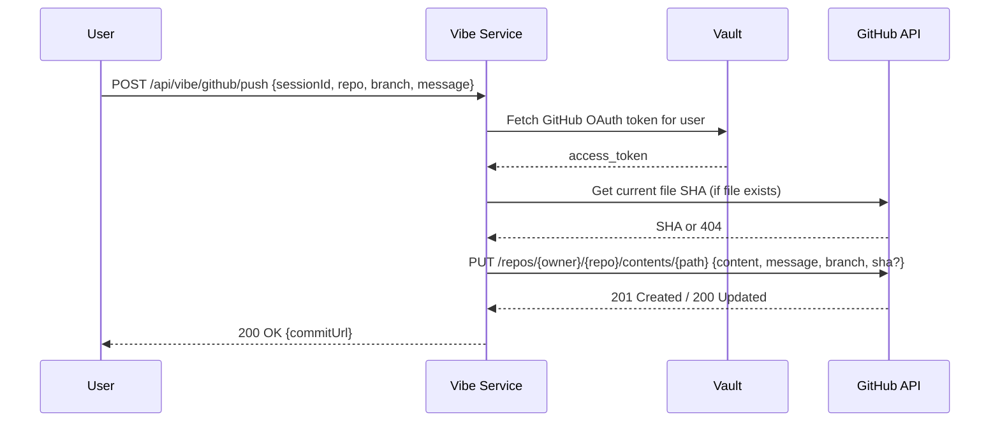
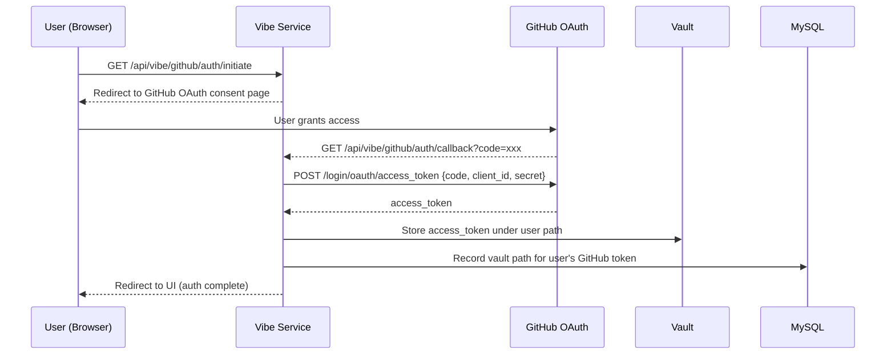

# Vibe Service — Architecture

---

## 1. Service Architecture

Vibe Service is a **relay and session manager**. It does not generate code itself — it forwards requests to the Goose AI engine and streams the response back to the UI via SSE. All state (sessions, recipes, schedules) is persisted in its own database so any service instance can serve any session.

**Key internal subsystems:**
- **SSE Handler** — holds open HTTP connections to browser clients. As Goose AI streams tokens, the handler pushes each chunk to the correct client connection identified by session ID.
- **Goose API Client** — wraps the HTTP call to the Goose AI engine. It reads the streaming response and feeds chunks to the SSE handler in real time.
- **GitHub Client** — handles OAuth token exchange and all GitHub REST operations (push, PR creation, branch listing).
- **Scheduler** — triggers recurring coding tasks using a lightweight internal scheduler backed by the `essedum_vibe` database.

---

## 2. Dependency Map

 Sessions, recipes, schedules, system config, GitHub OAuth token references |
| Goose AI Engine | External (HTTP/Stream) | Receives coding prompts; streams back generated code and explanations |
| GitHub API | External (HTTP) | Push code, create branches, open pull requests, list repos |
| Vault / Azure Key Vault | External (HTTP) | Store and retrieve GitHub OAuth access tokens |

Vibe Service has **no dependency on USM, ICIP, or Data services** at runtime.

---

## 3. Architectural Decisions

### AD-VIBE1 — Vibe is a relay, not a code generator
Vibe does not embed an LLM or run inference. It proxies requests to the Goose AI engine. This separation keeps Vibe lightweight and means the AI model can be upgraded or swapped (different Goose version, different engine) without changing the Vibe service.

### AD-VIBE2 — SSE for streaming over WebSocket
SSE (Server-Sent Events) is used instead of WebSocket for streaming AI responses. SSE is unidirectional (server → client), works over standard HTTP, and does not require a persistent bidirectional socket. For the use case of streaming text tokens, SSE is simpler and equally effective.

### AD-VIBE3 — Sessions are stateless across instances
Session state (conversation history, status) is persisted in MySQL. Any Vibe instance can resume any session. The SSE connection is the only in-memory state, and it re-attaches to the session record on reconnect.

### AD-VIBE4 — GitHub OAuth tokens stored in Vault, not in MySQL
After the OAuth callback, the GitHub access token is written to Vault. MySQL stores only the Vault path. This prevents token exposure in a database dump and centralises token lifecycle management.

### AD-VIBE5 — One OAuth token per user, not a shared platform credential
Each user connects their own GitHub account. Vibe uses the per-user token for all GitHub operations on their behalf. The platform never has a shared GitHub token, eliminating the risk of one user's action affecting another's repositories.

---

## 4. Architecturally Significant Flows

### Flow 1 — AI Coding Request with SSE Streaming

### Flow 2 — Push Generated Code to GitHub

### Flow 3 — GitHub OAuth Authorisation Flow

