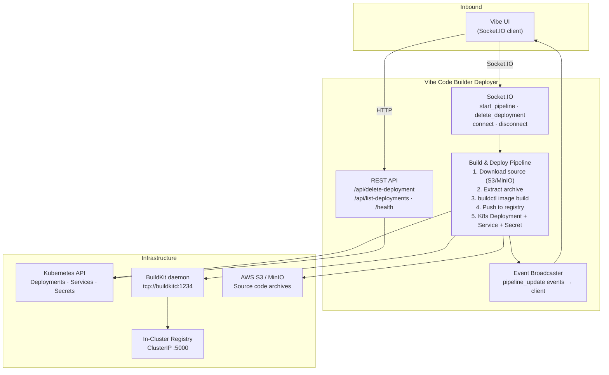
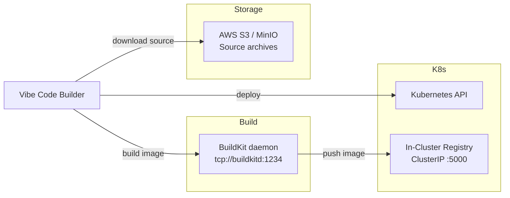
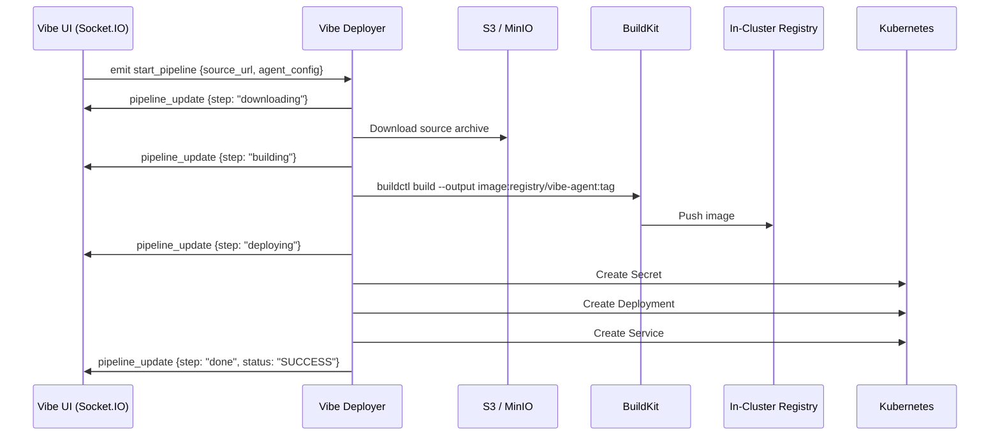

# Vibe Code Builder Deployer — Architecture

---

## 1. Service Architecture

Identical in pattern to the ADK Code Builder Deployer — Flask + Socket.IO with a long-running pipeline handler. The key differences: Kubernetes-only (no Docker mode), uses a ClusterIP registry URL configured for containerd compatibility, and targets Vibe coding session workloads.

---

## 2. Dependency Map

| Dependency | Type | Purpose |
|---|---|---|
| Kubernetes API | Internal (in-cluster) | Create/delete Deployments, Services, Secrets |
| BuildKit daemon | Internal (TCP) | Build container images from source |
| In-cluster registry (ClusterIP) | Internal (HTTP) | Store and serve built images |
| AWS S3 / MinIO | External (HTTP/SDK) | Download Vibe agent source code archives |

---

## 3. Architectural Decisions

### AD-VCB1 — ClusterIP registry for containerd compatibility
**Decision:** The in-cluster registry is addressed by its ClusterIP (e.g., `10.104.220.183:5000`) rather than a DNS service name.
**Reason:** containerd, used as the Kubernetes container runtime, requires the registry URL to match exactly what is configured in its `registries.conf`. ClusterIP is stable and avoids containerd's DNS resolution timing issues during image pull at pod startup.

### AD-VCB2 — Kubernetes-only (no Docker mode)
**Decision:** Unlike the ADK deployer, this service has no Docker fallback mode.
**Reason:** Vibe coding sessions are always deployed to Kubernetes. The Docker mode complexity is not needed, and removing it reduces the code surface and eliminates a potential configuration error path.

---

## 4. Architecturally Significant Flows

### Flow 1 — Build and Deploy Vibe Agent Container

