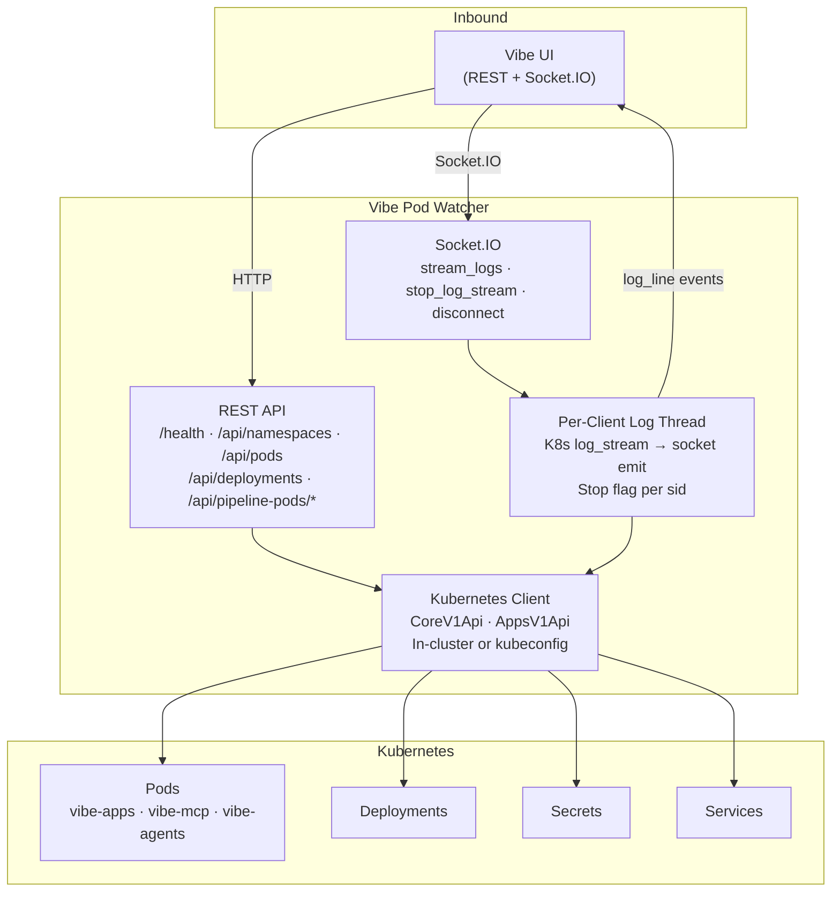
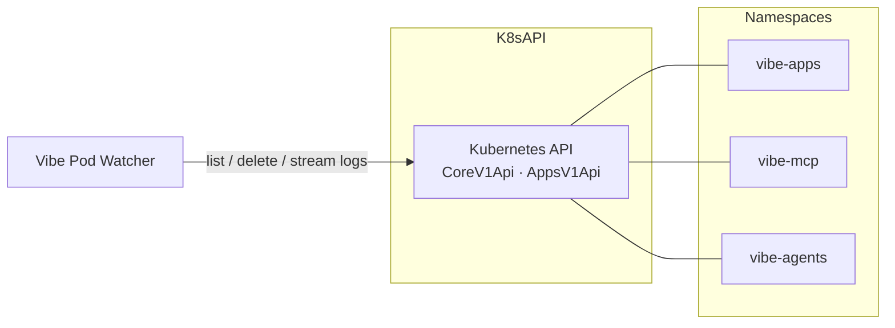
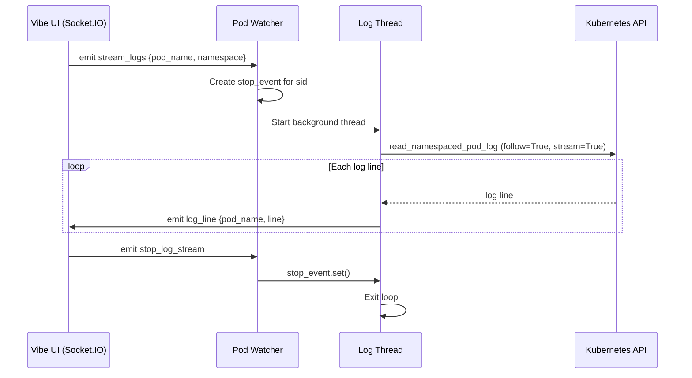
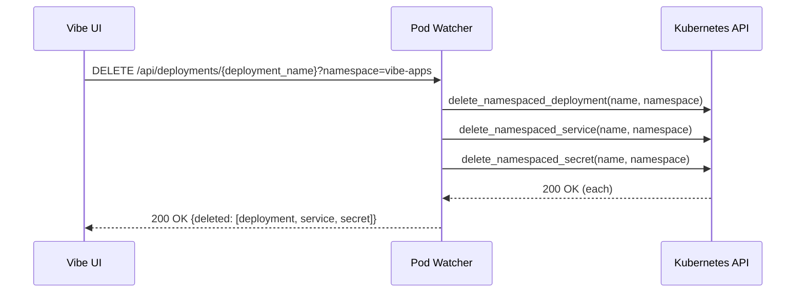

# Vibe Pod Watcher — Architecture

---

## 1. Service Architecture

A Flask + Socket.IO service that bridges the Kubernetes API to the Vibe UI. REST endpoints call the K8s API synchronously; log streaming uses a dedicated background thread per Socket.IO connection to tail pod logs and push lines as events.

---

## 2. Dependency Map

 List/get/delete pods and deployments, stream pod logs |
| Kubernetes namespaces (`vibe-apps`, `vibe-mcp`, `vibe-agents`) | Internal | Target namespaces for all K8s operations |

No external services or databases. All state is read from the Kubernetes API.

---

## 3. Architectural Decisions

### AD-VPW1 — Per-client log streaming thread with stop flag
**Decision:** Each Socket.IO client that subscribes to pod logs gets a dedicated background thread. A `threading.Event` stop flag is keyed by `socket.sid` and signals the thread to exit when the client disconnects or emits `stop_log_stream`.
**Reason:** The Kubernetes Python SDK's `log_stream` is a blocking iterator. Running it in a background thread prevents it from blocking the event loop. The per-sid stop flag ensures clean thread shutdown without joining threads on every frame.

### AD-VPW2 — In-cluster config with kubeconfig fallback
**Decision:** The service calls `load_incluster_config()` at startup; if it fails (i.e., running outside a cluster), it falls back to `load_kube_config()`.
**Reason:** In production the service runs as a Kubernetes pod with a mounted ServiceAccount token. The fallback supports local development without changing any code or configuration.

---

## 4. Architecturally Significant Flows

### Flow 1 — Real-Time Pod Log Streaming

### Flow 2 — Deployment Deletion

