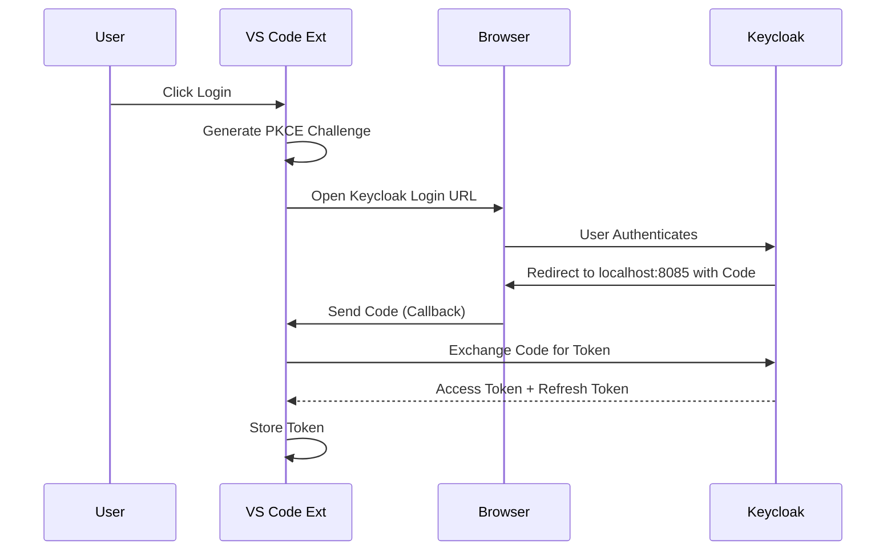

# Essedum AI Platform — VS Code Extension

> Architecture & design decisions: [docs/ARCHITECTURE.md](docs/ARCHITECTURE.md)

Integrates VS Code with the Essedum AI Platform: OAuth 2.0/PKCE authentication, pipeline browsing, job submission, and real-time execution monitoring.

## Features

- **OAuth 2.0 / PKCE Authentication** — one-click login via Keycloak, no manual token copying
- **Pipeline Browsing** — view available pipelines from the Activity Bar sidebar
- **Job Submission** — submit and monitor pipeline executions without leaving the editor
- **Automatic Token Refresh** — seamless session management

## Requirements

- VS Code 1.103.0+
- Active Essedum Platform account
- Port 8085 available (OAuth callback — configurable)

## Installation

1. Install the extension via VS Code Extensions Marketplace
2. Reload VS Code
3. The Essedum icon will appear in the Activity Bar

## Design and Architecture

The extension acts as a client for the Essedum Platform.

### Architecture Overview

1.  **Extension Host**: Runs in the VS Code process.
    *   **Sidebar Provider**: Renders the UI for managing platform resources.
    *   **Command Palette**: Exposes commands for quick access.
2.  **Authentication Module**:
    *   Implements PKCE (Proof Key for Code Exchange) flow.
    *   Launches system browser for login.
    *   Listens on a local port for the callback code.
3.  **API Client**:
    *   Communicates with the Essedum Backend (e.g., `https://aiplatform...`).
    *   Attaches Bearer tokens to requests. 

### Authentication Flow

