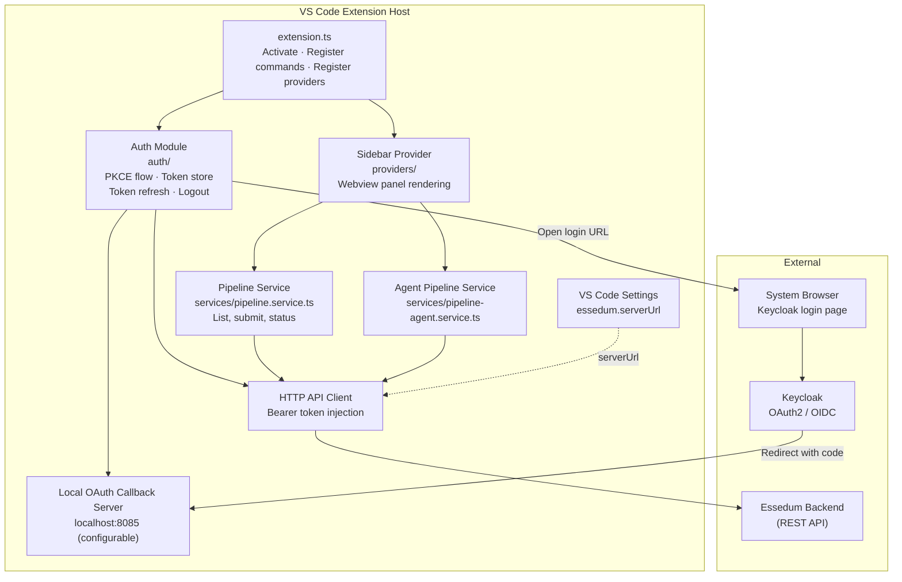
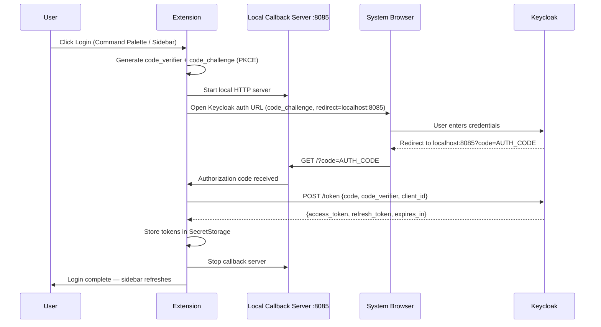
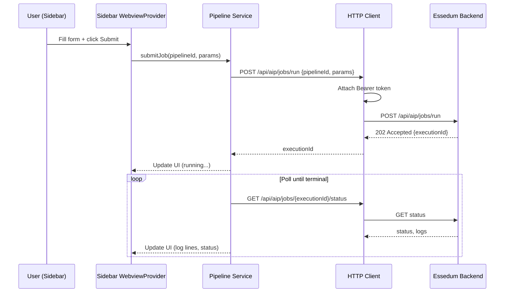

# VS Code Extension — Architecture

---

## 1. Service Architecture

The extension runs entirely inside the **VS Code extension host** process. It has three main concerns: an OAuth module that handles the PKCE flow with a local HTTP callback server, a sidebar WebviewProvider that renders the UI, and a service layer that calls the Essedum backend REST API.

**Component responsibilities:**

- **Auth Module** — generates PKCE code verifier/challenge, opens the Keycloak login URL in the system browser, starts the local callback server, exchanges the authorization code for tokens, stores tokens in `SecretStorage`, and schedules automatic token refresh.
- **Local Callback Server** — a lightweight HTTP server listening on a configurable port. It receives the OAuth redirect from the browser, extracts the authorization code, and hands it to the auth module to complete the token exchange.
- **Sidebar Provider** — registers a VS Code WebviewProvider that renders the Essedum UI panel in the Activity Bar. Communicates with the extension host via VS Code's `postMessage` API.
- **Pipeline / Agent Service** — thin service layer wrapping the Essedum REST API with typed methods for listing, submitting, and monitoring pipelines.
- **HTTP API Client** — attaches the current Bearer token to every outbound request. Triggers token refresh if a 401 is received.

---

## 2. Dependency Map

| Dependency | Type | Purpose |
|---|---|---|
| Essedum Backend | External (HTTPS) | Pipeline list, job submission, execution status and logs |
| Keycloak | External (HTTPS) | OAuth 2.0 authorization endpoint and token endpoint |
| VS Code `SecretStorage` | VS Code API | Secure token persistence — survives VS Code restarts |
| VS Code `WebviewProvider` | VS Code API | Sidebar UI rendering |
| Local HTTP server (port 8085) | Local | OAuth PKCE callback receiver |

---

## 3. Architectural Decisions

### AD-EXT1 — PKCE flow (no client secret)
**Decision:** Authentication uses OAuth 2.0 Authorization Code flow with PKCE. No client secret is embedded in the extension.
**Reason:** VS Code extensions are distributed as VSIX packages and run on user machines — a client secret would be visible to anyone who unpacks the extension. PKCE allows a public client to authenticate securely without a secret, using a per-session code verifier/challenge pair.

### AD-EXT2 — Local HTTP callback server for OAuth redirect
**Decision:** The extension starts a local HTTP server to receive the OAuth redirect instead of using a custom URI scheme.
**Reason:** Custom URI scheme redirects (`vscode://...`) require OS-level registration which is not reliably available across all platforms. A local HTTP server on a configurable port (`localhost:8085`) works universally and is explicitly allowed by Keycloak's redirect URI configuration.

### AD-EXT3 — Tokens stored in VS Code SecretStorage
**Decision:** Access tokens and refresh tokens are stored using VS Code's `SecretStorage` API, not in `globalState` or workspace settings.
**Reason:** `SecretStorage` uses the OS credential manager (Keychain on macOS, Credential Vault on Windows, libsecret on Linux), providing encrypted at-rest storage. Storing tokens in `globalState` or settings would write them as plaintext to disk.

---

## 4. Architecturally Significant Flows

### Flow 1 — OAuth 2.0 PKCE Authentication

### Flow 2 — Pipeline Job Submission

